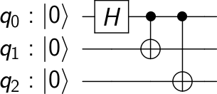
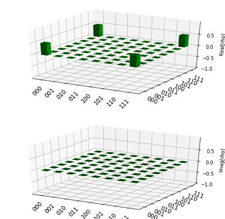
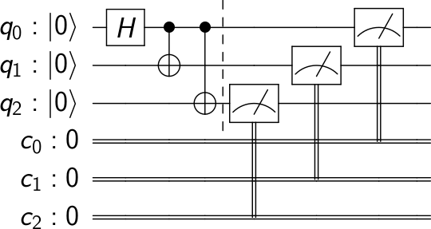
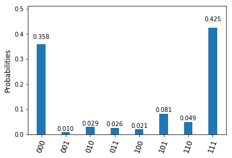
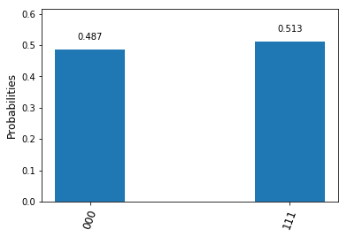

Getting Started with Qiskit Terra
=================================

First let’s start by importing some basic features of Qiskit Terra.

.. code:: ipython3

    import numpy as np
    from qiskit import QuantumCircuit, ClassicalRegister, QuantumRegister
    from qiskit import execute 

The basic concept of Qiskit Terra is an array of quantum circuits. The
workflow consists of two stages: Build, and Execute. Build allows you to
make different quantum circuits that represent the problem you are
solving; Execute allows you to run them on different backends.  After
the jobs have been run, the data is collected. There are methods for
putting this data together, depending on the program. This either gives
you the answer you wanted, or allows you to make a better program for
the next instance.

Building the circuit 
---------------------

The basic elements needed for your first program are the QuantumCircuit,
and QuantumRegister.

.. code:: ipython3

    # Create a Quantum Register with 3 qubits.
    q = QuantumRegister(3, 'q')
    
    # Create a Quantum Circuit acting on the q register
    circ = QuantumCircuit(q)

.. note::

    Naming the QuantumRegister is optional and not required..

After you create the circuit with its registers, you can add gates to
manipulate the registers. As you proceed through the documentation you
will find more gates and circuits but the below is an example of a
quantum circuit that makes a GHZ state, :math:`(|000>+|111>)/\sqrt{2}`.
The circuit that does this consists of a quantum register of three
qubits and a gate sequence :math:`H` on qubit 0 (making a
superposition), followed by :math:`C_X` between qubit 0 and 1 and a
:math:`C_X` between qubit 0 and 2. In Qiskit Terra this is done using

.. code:: ipython3

    # Add a H gate on qubit 0, putting this qubit in superposition.
    circ.h(q[0])
    # Add a CX (CNOT) gate on control qubit 0 and target qubit 1, putting
    # the qubits in a Bell state.
    circ.cx(q[0], q[1])
    # Add a CX (CNOT) gate on control qubit 0 and target qubit 2, putting
    # the qubits in a GHZ state.
    circ.cx(q[0], q[2])

Visualize Circuit
-----------------

You can visualize your circuit using Qiskit Terra ``circuit_drawer``,
which plots circuit in the form found in many textbooks.

.. code:: ipython3

    from qiskit.tools.visualization import circuit_drawer
    
    circuit_drawer(circ)

Qiskit Aer backends
-------------------

Statevector backend
~~~~~~~~~~~~~~~~~~~

In Qiskit Aer we have many simulator backends that allow the simulation
of quantum circuits. The most common is the ``statevector_simulator``.
This simulator returns the quantum state which is a complex vector of
dimensions :math:`2^n` where :math:`n` is the number of qubits (so be
careful using this as it will quickly get too large to run on your
machine).

.. note::

    The tensor order used in qiskit goes
    :math:`Q_n\otimes \cdots \otimes Q_1\otimes Q_0` which is not the
    standard used in many physics textbooks and results is the :math:`C_X`
    between the control qubit 0 and target qubit 1 having the form

    .. math:: C_X = \begin{pmatrix} 1 & 0 & 0 & 0 \\  0 & 0 & 0 & 1 \\ 0 & 0 & 1 & 0 \\ 0 & 1 & 0 & 0 \\\end{pmatrix}

To run the above circuit using the statevector simulator first you need
to import Aer and then set the backend to ``statevector_simulator``.

.. code:: ipython3

    # Import Aer
    from qiskit import Aer
    
    # Run the quantum circuit on a statevector simulator backend
    backend = Aer.get_backend('statevector_simulator')

Now we have chosen the backend its time to compile and run the quantum
circuit. In Qiskit Terra we provide the ``execute`` function for this
which returns a job object

.. note:: 

    You can obtain the above parameters in Jupyter. Simply place the
    text cursor on a function and press Shift+Tab.

.. code:: ipython3

    # Create a Quantum Program for execution 
    job = execute(circ, backend)

When you run a program a job object is made that has the following two
useful methods ``job.status()`` and ``job.result()`` which returns the
status of the job a result object respectiviely.

.. note:: 

    Jobs run asynchronous but when the result method is called it
    switches to synchronous and waits for it to finish before moving on to
    another task.

.. code:: ipython3

    result = job.result()

The results object contains the data and Qiskit Terra provides the
method ``result.get_statevector(circ)`` to return the statevector for
the quantum circuit.

.. code:: ipython3

    outputstate = result.get_statevector(circ)
    print("simulation: ", result )
    print(np.around(outputstate,3))

.. code-block:: text

    simulation:  COMPLETED
    [0.707+0.j 0.   +0.j 0.   +0.j 0.   +0.j 0.   +0.j 0.   +0.j 0.   +0.j
     0.707+0.j]

Qiskit Terra also provides a visualization toolbox to allow you to view
these results.

.. code:: ipython3

    from qiskit.tools.visualization import plot_state
    plot_state(outputstate)

Unitary backend
~~~~~~~~~~~~~~~

Qiskit Aer also includes a ``unitary_simulator`` that works provided all
the elements in the circuit are unitary operations. This backend
calculates the :math:`2^n \times 2^n` matrix representing the gates in
the quantum circuit.

.. code:: ipython3

    # Run the quantum circuit on a unitary simulator backend
    backend = Aer.get_backend('unitary_simulator')
    job = execute(circ, backend)
    result = job.result()
    
    # Show the results
    print("simulation: ", result )
    print(np.around(result.get_unitary(circ), 3))

.. code-block:: text

    simulation:  COMPLETED
    [[ 0.707+0.j  0.707-0.j  0.   +0.j  0.   +0.j  0.   +0.j  0.   +0.j
       0.   +0.j  0.   +0.j]
     [ 0.   +0.j  0.   +0.j  0.   +0.j  0.   +0.j  0.   +0.j  0.   +0.j
       0.707+0.j -0.707+0.j]
     [ 0.   +0.j  0.   +0.j  0.707+0.j  0.707-0.j  0.   +0.j  0.   +0.j
       0.   +0.j  0.   +0.j]
     [ 0.   +0.j  0.   +0.j  0.   +0.j  0.   +0.j  0.707+0.j -0.707+0.j
       0.   +0.j  0.   +0.j]
     [ 0.   +0.j  0.   +0.j  0.   +0.j  0.   +0.j  0.707+0.j  0.707-0.j
       0.   +0.j  0.   +0.j]
     [ 0.   +0.j  0.   +0.j  0.707+0.j -0.707+0.j  0.   +0.j  0.   +0.j
       0.   +0.j  0.   +0.j]
     [ 0.   +0.j  0.   +0.j  0.   +0.j  0.   +0.j  0.   +0.j  0.   +0.j
       0.707+0.j  0.707-0.j]
     [ 0.707+0.j -0.707+0.j  0.   +0.j  0.   +0.j  0.   +0.j  0.   +0.j
       0.   +0.j  0.   +0.j]]

OpenQASM backend
~~~~~~~~~~~~~~~~

The above while useful for understanding a quantum circuit scales
exponential with the number of qubits and as such is not physical
(cannot be obtained from a single shot in a real quantum experiment). In
a real device we need to have a measurement otherwise no information is
extracted from the quantum computer and the above is simply internal
representations. The measurements cause the quantum system to collapse
into classical bits. For example, when independent measurements are made
on each qubit the GHZ state :math:`(|000>+|111>)/\sqrt{2}`. will
collapse into either :math:`|000>` or :math:`|111>` with equal
probability.

To see this, we can make a second circuit representing the measurements
and use the addion operation to add these circuits together.

.. code:: ipython3

    # Create a Classical Register with 3 bits.
    c = ClassicalRegister(3, 'c')
    # Create a Quantum Circuit
    meas = QuantumCircuit(q, c)
    meas.barrier(q)
    # map the quantum measurement to the classical bits
    meas.measure(q,c)
    
    # combining the circuits
    qc = circ+meas
    
    #drawing the circuit
    circuit_drawer(qc)

This circuit consists of an additional classical register and three
measurements that are used to map the outcome of qubits to this
classical bits.

.. note::  

    The classical bits are ordered so that the MSB is to the left
    and the LSB is to the right. This is the standard binary sequence order.
    For example in 01 the MSB is 0 and the LSB is 1 and is why in Qiskit we
    use the non-standard tensor product order.

To simulate this circuit Qiskit Aer has a ``qasm_simulator`` which is
designed to mimic an ideal quantum device.

.. code:: ipython3

    backend_sim = Aer.get_backend('qasm_simulator')
    job_sim = execute(qc, backend_sim)
    result_sim = job_sim.result()

Once you have a result object you can access the counts via the function
``get_counts(circuit)``. This gives you the binary outcomes of the
circuit you have run.

.. code:: ipython3

    counts = result_sim.get_counts(qc)
    print(counts)

.. code-block:: text

    {'111': 524, '000': 500}

Here we see that approximately 50 percent of the time it is in the 000
state and 111. Qiskit Terra also provides a function ``plot_histogram``
which allows you to view the outcomes.

.. code:: ipython3

    from qiskit.tools.visualization import plot_histogram
    plot_histogram(counts)

IBMQ Backends
-------------

Real devices
~~~~~~~~~~~~

This is the important part of Qiskit. You can use it to run your
circuits on real quantum computers using the IBMQ provider. They are
small and noisy but are advancing at a fast pace. In the next section we
will go into more details about the provider but for now we will outline
the basic functions.

To access IBMQ devices, you’ll need an API token. For the public IBM Q
devices, you can generate an API token
`here <https://quantumexperience.ng.bluemix.net/qx/account/advanced>`__
(create an account if you don’t already have one). For Q Network
devices, login to the q-console, click your hub, group, and project, and
expand “Get Access” to generate your API token and access url.

.. code:: ipython3

    from qiskit import IBMQ

After generating your API token, call,
``IBMQ.save_account('MY_TOKEN')``. For Q Network users, you’ll also need
to include your access url: ``IBMQ.save_account('MY_TOKEN', 'URL')``

This will store your IBMQ credentials in a local file. Unless your
registration information has changed, you only need to do this once. You
may now load your accounts by calling,

.. code:: ipython3

    IBMQ.load_accounts()

Now view the list of backends available to you.

.. code:: ipython3

    print("Available backends:")
    IBMQ.backends()

.. code-block:: text

    Available backends:

    [<IBMQBackend('ibmqx4') from IBMQ()>,
     <IBMQBackend('ibmqx5') from IBMQ()>,
     <IBMQBackend('ibmqx2') from IBMQ()>,
     <IBMQBackend('ibmq_16_melbourne') from IBMQ()>,
     <IBMQBackend('ibmq_qasm_simulator') from IBMQ()>]

We now choose a device with the least busy queue which can support our
program (has at least 3 qubits).

.. code:: ipython3

    from qiskit.backends.ibmq import least_busy
    
    large_enough_devices = IBMQ.backends(
        filters=lambda x: x.configuration()['n_qubits'] > 3 and
            not x.configuration()['simulator'])
    backend = least_busy(large_enough_devices)
    print("The best backend is " + backend.name())

.. code-block:: text

    The best backend is ibmqx4

.. code:: ipython3

    shots = 1024           # Number of shots to run the program (experiment); maximum is 8192 shots.
    max_credits = 3        # Maximum number of credits to spend on executions. 
    
    job_exp = execute(qc, backend=backend, shots=shots, max_credits=max_credits)

.. code:: ipython3

    result_exp = job_exp.result()

Like before, the counts from the execution can be obtained using
``get_counts(qc)``

.. code:: ipython3

    counts_exp = result_exp.get_counts(qc)
    plot_histogram(counts_exp)

HPC Simulator
~~~~~~~~~~~~~

The IBMQ provider also comes with a remote optimized simulator called
``ibmq_qasm_simulator``. This remote simulator is capable of simulating
up to 32 qubits. It can be used the same way as the remote real
backends.

.. code:: ipython3

    backend = IBMQ.get_backend('ibmq_qasm_simulator')

.. code:: ipython3

    shots = 1024           # Number of shots to run the program (experiment); maximum is 8192 shots.
    max_credits = 3        # Maximum number of credits to spend on executions. 
    
    job_hpc = execute(qc, backend=backend, shots=shots, max_credits=max_credits)

.. code:: ipython3

    result_hpc = job_hpc.result()

.. code:: ipython3

    counts_hpc = result_hpc.get_counts(qc)
    plot_histogram(counts_hpc)

Retrieving a previously ran job
-------------------------------

If your experiment takes longer to run then you have time to wait
around, or if you simply want to retrieve old jobs back, the IBMQ
backends allow you to do that. First you would need to save your job’s
ID:

.. code:: ipython3

    jobID = job_exp.job_id()
    
    print('JOB ID: {}'.format(jobID))        

.. code-block:: text

    JOB ID: 5be8ae5e17436b0052751909

Given a job ID, that job object can be later reconstructed from the
backend using retrieve_job:

.. code:: ipython3

    job_get=backend.retrieve_job(jobID)

and then the results can be obtained from the new job object.

.. code:: ipython3

    job_get.result().get_counts(qc)

.. code-block:: text

    {'00000': 367,
     '00001': 10,
     '00010': 30,
     '00011': 27,
     '00100': 22,
     '00101': 83,
     '00110': 50,
     '00111': 435}
