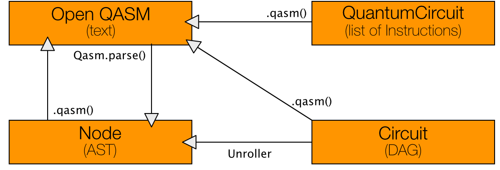
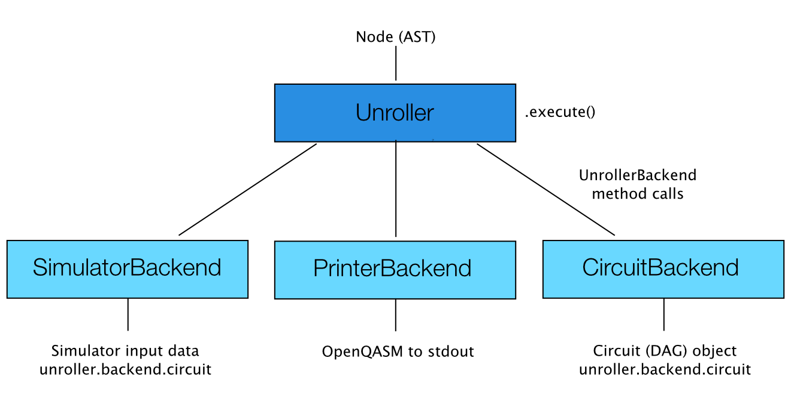

ライブラリの構成
================

プログラミング インターフェース
-------------------------------

*qiskit* ディレクトリがメインのPythonモジュールで
:py:class:`QuantumProgram <qiskit.QuantumProgram>`,
:py:class:`QuantumRegister <qiskit.QuantumRegister>`,
:py:class:`ClassicalRegister <qiskit.ClassicalRegister>`,
:py:class:`QuantumCircuit <qiskit.QuantumCircuit>` のインターフェースを含みます。

実行手順は次の通りです。ユーザーは *QuantumProgram* （量子プログラム）を作成しそれに
複数の量子回路の生成、変更、コンパイル、と実行ができます。
各 *QuantumCircuit* （量子回路）には *QuantumRegister* （量子レジスター）か
*ClassicalRegister* （古典レジスター）があります。
これらのオブジェクトのメソッドを通じて、量子ゲートを適用して量子回路を定義します。
*QuantumCircuit* は **OpenQASM** コードを出力することができます。
このコードは *qiskit* ディレクトリの他のコンポーネントに流すことができます。

:py:mod:`extensions <qiskit.extensions>` ディレクトリは他の量子ゲートやアルゴリズムのサポートに必要な
量子回路の拡張のモジュールを含みます。
現在は典型的な量子ゲートを定義した :py:mod:`standard <qiskit.extensions.standard>` 拡張が存在します。

内部モジュール
--------------

以下のディレクトリは開発中の内部モジュールを含みます:

- :py:mod:`qasm <qiskit.qasm>` モジュールは **OpenQASM** ファイルを解析します。
- :py:mod:`unroll <qiskit.unroll>` モジュールはターゲットのゲートに応じて **OpenQASM** の翻訳と展開(unroll)を行います。
  (ゲート文のサブルーチンやループの展開も必要に応じて行います)
- :py:mod:`dagcircuit <qiskit.dagcircuit>` モジュールは量子回路をグラフとして処理します。
- :py:mod:`mapper <qiskit.mapper>` モジュールは、量子回路をカップリング（直接操作可能な量子ビットのペア）の制限がないバックエンドから制限のある実機で実行するために量子回路の変換を行います。
- :py:mod:`backends <qiskit.backends>` モジュールは量子回路のシミュレーターを含みます。
- *tools* ディレクトリはアプリケーション、分析、可視化のメソッドを含みます。

量子回路は以下の様にコンポーネントの間を流れます。
プログラミングインターフェースを用いて生成した **OpenQASM** 量子回路はテキストか *QuantumCircuit* オブジェクトです。
**OpenQASM** ソースコードはファイルか文字列で、 *Qasm* オブジェクトに渡されます。
そして、ソースコードはparseメソッドで分析されて抽象構文木(abstract syntax tree, **AST**)が生成されます。
**AST** は *Unroller* に渡されます。*Unroller* は異なる *UnrollerBackend* のいずれかを取り付けることができます。
テキストを出力する *PrinterBackend*、シミュレーターと実機のバックエンドの入力を生成する *JsonBackend*、
*DAGCircuit* を生成する *DAGBackend*、 *QuantumCircuit* オブジェクトを生成する *CircuitBackend* があります。
*DAGCircuit* は「展開された」 **OpenQASM** の回路を有向非巡回グラフ(directed acyclic graph, DAG)として持ちます。
*DAGCircuit* は回路構成の表現、変換、性質の計算、結果を **OpenQASM** で出力するメソッドがあります。
この全体の流れは *mapper* モジュールが量子回路を、 *CouplingGraph* で定義されたカップリング（直接操作可能な量子ビットのペア）の実機で実行するために変換するために行われます。
このコンポーネントの構成は将来的に変更の可能性があります。

量子回路が現在のモジュールでどのように変換されるかを以下の図にまとめます。

いくつかのunrollerバックエンドとその出力を以下にまとめます:

