Ploting Data in Qiskit
======================

To use this notebook you need to ensure that you have
`maptlotlib <https://matplotlib.org/>`__ installed on your system

.. code:: ipython3

    from qiskit.tools.visualization import plot_histogram

.. code:: ipython3

    from qiskit import QuantumCircuit, ClassicalRegister, QuantumRegister
    from qiskit import execute, BasicAer

Plot histogram
--------------

To visualize the data from a quantum circuit run on a real device or
``qasm_simulator`` we have made a simple function

``plot_histogram(data)``

As an example we make a 2 qubit Bell state

.. code:: ipython3

    q = QuantumRegister(2)
    c = ClassicalRegister(2)
    
    # quantum circuit to make a Bell state 
    bell = QuantumCircuit(q,c)
    bell.h(q[0])
    bell.cx(q[0],q[1])
    
    meas = QuantumCircuit(q,c)
    meas.measure(q, c)
    
    # execute the quantum circuit 
    backend = BasicAer.get_backend('qasm_simulator') # the device to run on
    circ = bell+meas
    result = execute(circ, backend, shots=1000).result()
    counts  = result.get_counts(circ)
    print(counts)

.. parsed-literal::

    {'00': 509, '11': 491}

.. code:: ipython3

    plot_histogram(counts)

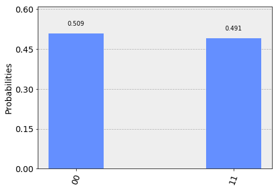

Options when plotting a histogram
~~~~~~~~~~~~~~~~~~~~~~~~~~~~~~~~~

The ``plot_histogram()`` has a few options to adjust the output graph.
The first option is the ``legend`` kwarg. This is used to provide a
label for the executions. It takes a list of strings use to label each
execution’s results. This is mostly useful when plotting multiple
execution results in the same histogram. The ``sort`` kwarg is used to
adjust the order the bars in the histogram are rendered. It can be set
to either ascending order with ``asc`` or descending order with ``dsc``.
The ``number_to_keep`` kwarg takes an integer for the number of terms to
show, the rest are grouped together in a single bar called rest. You can
adjust the color of the bars with the ``color`` kwarg which either takes
a string or a list of strings for the colors to use for the bars for
each execution. You can adjust whether labels are printed above the bars
or not with the ``bar_labels`` kwarg. The last option available is the
``figsize`` kwarg which takes a tuple of the size in inches to make the
output figure.

.. code:: ipython3

    # Execute 2 qubit Bell state again
    second_result = execute(circ, backend, shots=1000).result()
    second_counts  = second_result.get_counts(circ)
    # Plot results with legend
    legend = ['First execution', 'Second execution']
    plot_histogram([counts, second_counts], legend=legend)

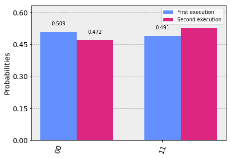

.. code:: ipython3

    plot_histogram([counts, second_counts], legend=legend, sort='desc', figsize=(15,12), color=['orange', 'black'], bar_labels=False)

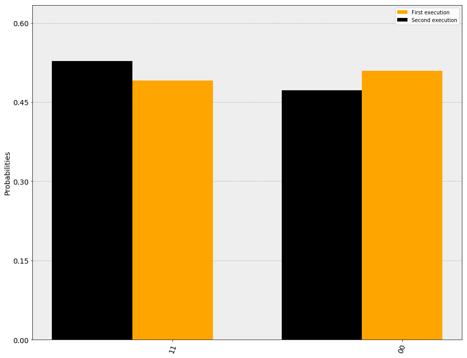

Using the output from plot_histogram()
~~~~~~~~~~~~~~~~~~~~~~~~~~~~~~~~~~~~~~

When using the plot_histogram() function it returns a
``matplotlib.Figure`` for the rendered visualization. Jupyter notebooks
understand this return type and renders it for us in this tutorial, but
when running outside of jupyter you do not have this feature
automatically. However, ``matplotlib.Figure`` class natively has methods
to both display and save the visualization. You can call ``.show()`` on
the returned object from ``plot_histogram()`` to open the image in a new
window (assuming your configured matplotlib backend is interactive). Or
alternatively you can call ``.savefig(out.png)`` to save the figure to
``out.png``. The ``savefig()`` takes a path so you can just the location
and filename where you’re saving the output.

Interactive histogram plots for Jupyter Notebooks.
--------------------------------------------------

There is an alternate function for plotting histograms when running in a
Jupyter notebook. This function ``iplot_histogram()`` is made using an
externally hosted JS library for use in Jupyter notebooks. The
interactive plot can only be used if you’re running inside a jupyter
notebook and only if you have external connectivity to the host with the
JS library. If you use ``iplot_histogram()`` outside of a jupyter
notebook it will fail.

.. code:: ipython3

    from qiskit.tools.visualization import iplot_histogram

.. code:: ipython3

    # Run in interactive mode
    iplot_histogram(counts)

.. raw:: html

    
        

            

        

        
        
        

Plot State
----------

In many situations you want to see the state of a quantum computer. This
could be for debugging. Here we assume you have this state (either from
simulation or state tomography) and the goal is to visualize the quantum
state. This requires exponential resources, so we advise to only view
the state of small quantum systems. There are several functions for
generating different types of visualization of a quantum state

::

   plot_state_city(quantum_state)
   plot_state_paulivec(quantum_state)
   plot_state_qsphere(quantum_state)
   plot_state_hinton(quantum_state)
   plot_bloch_multivector(quantum_state)

A quantum state is either a state matrix :math:`\rho` (Hermitian matrix)
or statevector :math:`|\psi\rangle` (complex vector). The state matrix
is related to the statevector by

.. math:: \rho = |\psi\rangle\langle \psi|.

And is more general as it can represent mixed states (positive sum of
statevectors)

.. math:: \rho = \sum_k p_k |\psi_k\rangle\langle \psi_k |.

| The visualizations generated by the functions are: -
  ``'plot_state_city'``: The standard view for quantum states where the
  real and imaginary (imag) parts of the state matrix are plotted like a
  city - ``'plot_state_qsphere'``: The Qiskit unique view of a quantum
  state where the amplitude and phase of the state vector are plotted in
  a spherical ball. The amplitude is the thickness of the arrow and the
  phase is the color. For mixed states it will show different
  ``'qsphere'`` for each component. - ``'plot_state_paulivec'``: The
  representation of the state matrix using Pauli operators as the basis
  :math:`\rho=\sum_{q=0}^{d^2-1}p_jP_j/d` - ``'plot_state_hinton'``:
  Same as ``'city'`` but with the size of the element represents the
  value of the matrix element.
| - ``'plot_bloch_multivector'``: The projection of the quantum state
  onto the single qubit space and plotting on a bloch sphere.

.. code:: ipython3

    from qiskit.tools.visualization import plot_state_city, plot_bloch_multivector, plot_state_paulivec, plot_state_hinton, plot_state_qsphere

.. code:: ipython3

    # execute the quantum circuit 
    backend = BasicAer.get_backend('statevector_simulator') # the device to run on
    result = execute(bell, backend).result()
    psi  = result.get_statevector(bell)

.. code:: ipython3

    plot_state_city(psi)

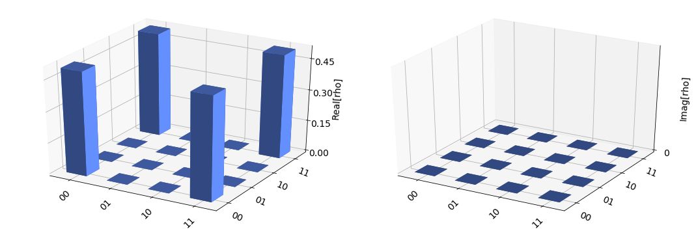

.. code:: ipython3

    plot_state_hinton(psi)

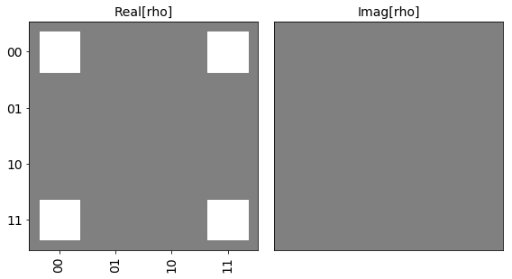

.. code:: ipython3

    plot_state_qsphere(psi)

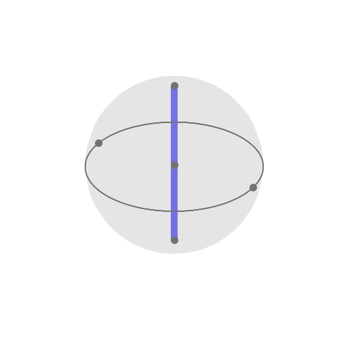

.. code:: ipython3

    plot_state_paulivec(psi)

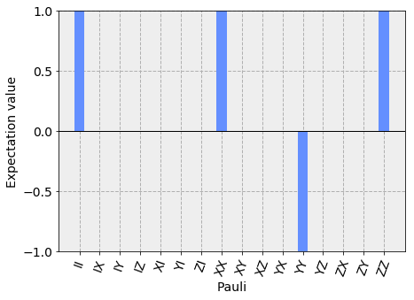

.. code:: ipython3

    plot_bloch_multivector(psi)

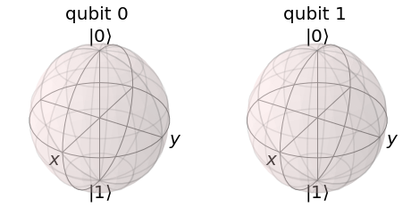

Here we see that there is no information about the quantum state in the
single qubit space as all vectors are zero.

Options when using state plotting functions
~~~~~~~~~~~~~~~~~~~~~~~~~~~~~~~~~~~~~~~~~~~

The various functions for plotting quantum state provide a number of
options to adjust the how the plots are rendered. Which options depend
on the function being used.

**plot_state_city()** options

-  **title** (str): a string that represents the plot title
-  **figsize** (tuple): figure size in inches (width, height).
-  **color** (list): a list of len=2 giving colors for real and
   imaginary components of matrix elements.

.. code:: ipython3

    plot_state_city(psi, title="My City", color=['black', 'orange'])

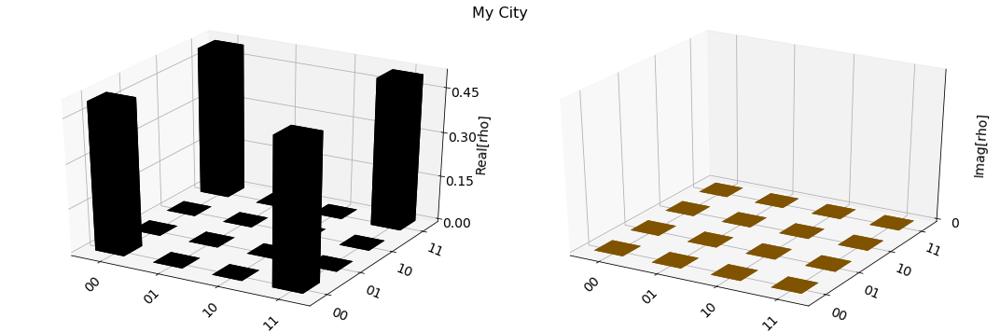

**plot_state_hinton()** options

-  **title** (str): a string that represents the plot title
-  **figsize** (tuple): figure size in inches (width, height).

.. code:: ipython3

    plot_state_hinton(psi, title="My Hinton")

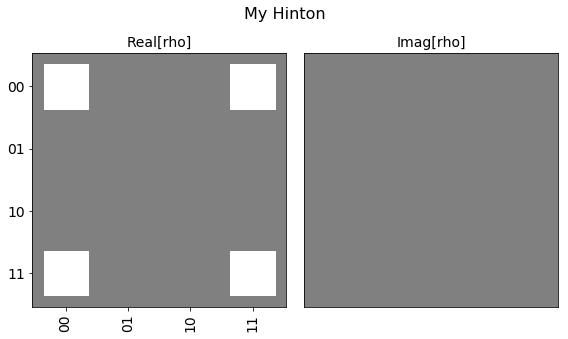

**plot_state_paulivec()** options

-  **title** (str): a string that represents the plot title
-  **figsize** (tuple): figure size in inches (width, height).
-  **color** (list or str): color of the expectation value bars.

.. code:: ipython3

    plot_state_paulivec(psi, title="My Paulivec", color=['purple', 'orange', 'green'])

.. image:: plotting_data_in_qiskit_files/plotting_data_in_qiskit_30_0.png

**plot_state_qsphere()** options

-  **figsize** (tuple): figure size in inches (width, height).

**plot_bloch_multivector()** options

-  **title** (str): a string that represents the plot title
-  **figsize** (tuple): figure size in inches (width, height).

.. code:: ipython3

    plot_bloch_multivector(psi, title="My Bloch Spheres")

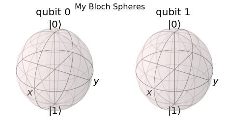

Using the output from state plotting functions
~~~~~~~~~~~~~~~~~~~~~~~~~~~~~~~~~~~~~~~~~~~~~~

When using the any of the state plotting functions it returns a
``matplotlib.Figure`` for the rendered visualization. Jupyter notebooks
understand this return type and renders it for us in this tutorial, but
when running outside of jupyter you do not have this feature
automatically. However, ``matplotlib.Figure`` class natively has methods
to both display and save the visualization. You can call ``.show()`` on
the returned object to open the image in a new window (assuming your
configured matplotlib backend is interactive). Or alternatively you can
call ``.savefig(out.png)`` to save the figure to ``out.png`` in the
current working directory. The ``savefig()`` takes a path so you can
just the location and filename where you’re saving the output.

Interactive State Plots for Jupyter Notebooks
---------------------------------------------

Just like with ``plot_histogram()`` there is a second set of functions
for each of the functions to plot the quantum state. These functions
have the same name but with a prepended ``i``:

::

   iplot_state_city(quantum_state)
   iplot_state_paulivec(quantum_state)
   iplot_state_qsphere(quantum_state)
   iplot_state_hinton(quantum_state)
   iplot_bloch_multivector(quantum_state)

these functions are made using an externally hosted JS library for use
in Jupyter notebooks. The interactive plot can only be used if you’re
running inside a jupyter notebook and only if you have external
connectivity to the host with the JS library. If you use these functions
outside of a jupyter notebook it will fail.

.. code:: ipython3

    from qiskit.tools.visualization import iplot_state_paulivec

.. code:: ipython3

    # Generate an interactive pauli vector plot
    iplot_state_paulivec(psi)

.. raw:: html

    
        

            

        

        
        
        

Plot Bloch Vector
-----------------

A standard way of plotting a quantum system is using the Bloch vector.
This only works for a single qubit and takes as inputs the Bloch vector.

The Bloch vector is defined as
:math:`[x = \mathrm{Tr}[X \rho], y = \mathrm{Tr}[Y \rho], z = \mathrm{Tr}[Z \rho]]`,
where :math:`X`, :math:`Y`, and :math:`Z` are the Pauli operators for a
single qubit and :math:`\rho` is the state matrix.

.. code:: ipython3

    from qiskit.tools.visualization import plot_bloch_vector

.. code:: ipython3

    plot_bloch_vector([0,1,0])

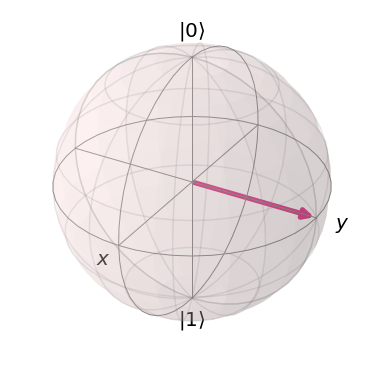

Options for plot_bloch_vector()
~~~~~~~~~~~~~~~~~~~~~~~~~~~~~~~

-  **title** (str): a string that represents the plot title
-  **figsize** (tuple): Figure size in inches (width, height).

.. code:: ipython3

    plot_bloch_vector([0,1,0], title='My Bloch Sphere')

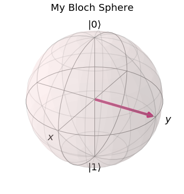

Adjusting the output from plot_bloch_vector()
~~~~~~~~~~~~~~~~~~~~~~~~~~~~~~~~~~~~~~~~~~~~~

When using the ``plot_bloch_vector`` function it returns a
``matplotlib.Figure`` for the rendered visualization. Jupyter notebooks
understand this return type and renders it for us in this tutorial, but
when running outside of jupyter you do not have this feature
automatically. However, ``matplotlib.Figure`` class natively has methods
to both display and save the visualization. You can call ``.show()`` on
the returned object to open the image in a new window (assuming your
configured matplotlib backend is interactive). Or alternatively you can
call ``.savefig(out.png)`` to save the figure to ``out.png`` in the
current working directory. The ``savefig()`` takes a path so you can
just the location and filename where you’re saving the output.
