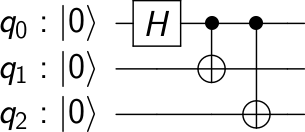
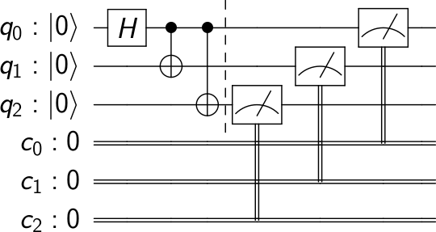

========================
Running Quantum Circuits
========================

Qiskit Terra makes it simple to run quantum circuits on local or remote backends. As a simple example 
we consider a quantum circuit that makes a GHZ state, :math:`(|000>+|111>)/\sqrt(2)`. 

.. code-block:: python

    # Import Qiskit Terra
    from qiskit import QuantumCircuit, ClassicalRegister, QuantumRegister
    from qiskit import execute

    # Create a Quantum Register with 3 qubits.
    q = QuantumRegister(3)
    # Create a Quantum Circuit
    qc = QuantumCircuit(q)

    # Add a H gate on qubit 0, putting this qubit in superposition.
    qc.h(q[0])
    # Add a CX (CNOT) gate on control qubit 0 and target qubit 1, putting
    # the qubits in a Bell state.
    qc.cx(q[0], q[1])
    # Add a CX (CNOT) gate on control qubit 0 and target qubit 2, putting
    # the qubits in a GHZ state.
    qc.cx(q[0], q[2])

This circuit consist of a quantum register of three qubits and a gate 
sequence :math:`H` on qubit 0, :math:`C_X` between qubit 0 and 1 and :math:`C_X` 
between qubit 0 and 2. This is simple to visualize using the `circuit_drawer`

.. code-block:: python

    from qiskit.tools.visualization import circuit_drawer
    circuit_drawer(qc)

-------------------
Qiskit Aer backends
-------------------

In Qiskit Aer we have many simulator backends that allow the simulation of quantum circuits. 
The most common is the `statevector_simulator`. This simulator returns the quantum 
state which is a complex vector of dimensions :math:`2^n` where :math:`n` is the number of qubits 
(so be careful using this as it will 
quickly get too large to run on your machine).

.. note::

    The tensor order used in qiskit goes :math:`Q_n\otimes \cdots  \otimes  Q_1\otimes Q_0` which is not standard 
    used in many physics textbooks and result is the :math:`C_X` between the control qubit 0 and target qubit 
    1 having the form 

    .. math:: 
        
        C_X = \begin{pmatrix} 1 & 0 & 0 & 0 \\  0 & 0 & 0 & 1 \\ 0 & 0 & 1 & 0 \\ 0 & 1 & 0 & 0 \\\end{pmatrix}

To run the above circuit using the statevector simulator use

.. code-block:: python

    # Import Aer
    from qiskit import Aer
    import numpy as np

    # Run the quantum circuit on a statevector simulator backend
    backend_sim = Aer.get_backend('statevector_simulator')
    job_sim = execute(qc, backend_sim)
    result_sim = job_sim.result()

    # Show the results
    print("simulation: ", result_sim )
    print(np.around(result_sim.get_statevector(qc),4))

which returns the statevector 

.. code-block:: python
    
    [0.7071+0.j 0.+0.j 0.+0.j 0.+0.j 0.+0.j 0.+0.j 0.+0.j 0.7071+0.j]

Qiskit Aer also includes a `unitary_simulator` which will not work for circuits that have 
measurements, results, or classical operations (and it also ignores the input states). This backend 
calculates the :math:`2^n x 2^n` matrix representing that gates in the quantum circuit. To use it using Qiskit 
Aer we run the following

.. code-block:: python

    # Run the quantum circuit on a unitary simulator backend
    backend_sim = Aer.get_backend('unitary_simulator')
    job_sim = execute(qc, backend_sim)
    result_sim = job_sim.result()

    # Show the results
    print("simulation: ", result_sim )
    print(np.around(result_sim.get_unitary(qc), 4))

which returns the unitary 

.. code-block:: python

    [[ 0.7071+0.j  0.7071-0.j  0.+0.j  0.+0.j  0.+0.j  0.+0.j 0.+0.j  0.+0.j]
    [ 0.+0.j  0.+0.j  0.+0.j  0.+0.j  0.+0.j  0.+0.j 0.7071+0.j -0.7071+0.j]
    [ 0.+0.j  0.+0.j  0.7071+0.j  0.7071-0.j  0.+0.j  0.+0.j 0.+0.j  0.+0.j]
    [ 0.+0.j  0.+0.j  0.+0.j  0.+0.j  0.7071+0.j -0.7071+0.j 0.+0.j  0.+0.j]
    [ 0.+0.j  0.+0.j  0.+0.j  0.+0.j  0.7071+0.j  0.7071-0.j 0.+0.j  0.+0.j]
    [ 0.+0.j  0.+0.j  0.7071+0.j -0.7071+0.j  0.+0.j  0.+0.j 0.+0.j  0.+0.j]
    [ 0.+0.j  0.+0.j  0.+0.j  0.+0.j  0.+0.j  0.+0.j 0.7071+0.j  0.7071-0.j]
    [ 0.7071+0.j -0.7071+0.j  0.+0.j  0.+0.j  0.+0.j  0.+0.j 0.+0.j  0.+0.j]]

For a complete list of gates see the  qiskit tutorial `using different gates 
<https://nbviewer.jupyter.org/github/Qiskit/qiskit-tutorial/blob/master/qiskit/terra/using_different_gates.ipynb>`_.

The above while useful for understanding a quantum circuit but it scales exponential and 
cannot be obtained from a single shot in a real quantum experiment. In a device we need
to have a measurement. This measurement causes the quantum system to collapse into classical bits. 
For example, when independent measurements are made two each qubit the GHZ state :math:`(|000>+|111>)/\sqrt(2)`. 
will collapse into either :math:`|000>` or :math:`|111>` with equal probability. 

To see this, we can add measurements to the quantum circuit using 

.. code-block:: python

    # Create a Classical Register with 3 bits.
    c = ClassicalRegister(3)
    # Create a Quantum Circuit
    meas = QuantumCircuit(q, c)
    meas.barrier(q)
    # map the quantum measurement to the classical bits
    meas.measure(q,c)

    # combining the circuits
    qc_meas = qc+meas

    #drawing the circuit
    circuit_drawer(qc_meas)

This circuit consists of an additional classical register and a measurement that is used to map the outcome of 
qubits to this classical register. This circuit_drawer gives

The classical bits are ordered so that the MSB is to the left and the LSB is to the right.
This is the standard binary sequence order. For the case 01 the MSB is 0 and the LSB is 1. 
This means that if we map the state |01> to a classical register then it is 01 and has a 1 to 1 
relationship with the basis states of the quantum system. This is why in Qiskit we use 
the non-standard tensor product order.
 
Qiskit has a qasm_simulator which is designed to mimic an ideal quantum device 

.. code-block:: python

    # Compile and run the Quantum circuit on a simulator backend
    backend_sim = Aer.get_backend('qasm_simulator')
    job_sim = execute(qc_meas, backend_sim)
    result_sim = job_sim.result()

    # Show the results
    print("simulation: ", result_sim )
    print(result_sim.get_counts(qc_meas))

Running this gives the outcomes 

.. code-block:: python

    {'000': 520, '111': 504}

Here we see that approximately 50 percent of the time it is in the 000 state and 111. 

-------------------------
IBM Q cloud real backends
-------------------------

You can execute your circuits on a real chip by using the IBM Q cloud platform. For chip details, and 
realtime information `visit IBMQ devices page <https://www.research.ibm.com/ibm-q/technology/devices/>`_.

The following code is an example of how to execute a Quantum Program on a real
Quantum device:

.. code-block:: python

    # Import Qiskit Terra
    from qiskit import QuantumCircuit, ClassicalRegister, QuantumRegister
    from qiskit import execute, IBMQ

    # Set your API Token.
    # You can get it from https://quantumexperience.ng.bluemix.net/qx/account,
    IBMQ.enable_account("MY_API_TOKEN")

    # Create a Quantum Register with 2 qubits.
    q = QuantumRegister(2)
    # Create a Classical Register with 2 bits.
    c = ClassicalRegister(2)
    # Create a Quantum Circuit
    qc = QuantumCircuit(q, c)

    # Add a H gate on qubit 0, putting this qubit in superposition.
    qc.h(q[0])
    # Add a CX (CNOT) gate on control qubit 0 and target qubit 1, putting
    # the qubits in a Bell state.
    qc.cx(q[0], q[1])
    # Add a Measure gate to see the state.
    qc.measure(q, c)

    # Compile and run the Quantum circuit on a device.
    backend_ibmq = IBMQ.get_backend('ibmqx4')
    job_ibmq = execute(qc, backend_ibmq)
    result_ibmq = job_ibmq.result()

    # Show the results.
    print("real execution results: ", result_ibmq)
    print(result_ibmq.get_counts(qc))

-----------------------
IBM Q cloud HPC backend
-----------------------

The ``ibmq_qasm_simulator`` online backend capable of simulating up to32 qubits. It can be used the 
same way as the real chips. 

.. code-block:: python

    # Import Qiskit Terra
    from qiskit import QuantumCircuit, ClassicalRegister, QuantumRegister
    from qiskit import execute, IBMQ

    # Set your API Token.
    # You can get it from https://quantumexperience.ng.bluemix.net/qx/account,
    IBMQ.enable_account("MY_API_TOKEN")

    # Create a Quantum Register with 2 qubits.
    q = QuantumRegister(2)
    # Create a Classical Register with 2 bits.
    c = ClassicalRegister(2)
    # Create a Quantum Circuit
    qc = QuantumCircuit(q, c)

    # Add a H gate on qubit 0, putting this qubit in superposition.
    qc.h(q[0])
    # Add a CX (CNOT) gate on control qubit 0 and target qubit 1, putting
    # the qubits in a Bell state.
    qc.cx(q[0], q[1])
    # Add a Measure gate to see the state.
    qc.measure(q, c)

    # Compile and run the Quantum circuit on a device.
    backend_ibmq = IBMQ.get_backend('ibmq_qasm_simulator')
    job_ibmq_simulator = execute(qc, backend_ibmq)
    result_ibmq_simulator = job_ibmq_simulator.result()

    # Show the results.
    print("HPC simulation results: ", result_ibmq_simulator)
    print(result_ibmq_simulator.get_counts(qc))
