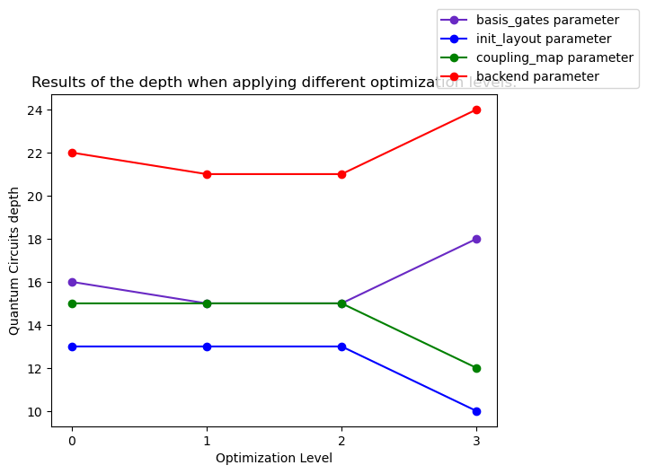

#####################################
Setting transpiler optimization level
#####################################

This guide shows you how to use the :attr:`~qiskit.transpile.optimization_level` 
parameter with :meth:`~qiskit.compiler.transpile`.
:attr:`~qiskit.transpile.optimization_level` helps you to optimize your quantum circuit.
This parameter takes an integer which can be a value between 0 and 3,
where the higher the number the more optimized the result.
You can find more information about this parameter
`here <https://qiskit.org/documentation/tutorials/circuits_advanced/04_transpiler_passes_and_passmanager.html#Preset-Pass-Managers>`__.

Initialize the quantum circuit
==============================

It is important to consider whether you will be working with a `quantum
proccesor <https://quantum-computing.ibm.com/services/resources>`__ or a
`fake
model <https://qiskit.org/documentation/apidoc/providers_fake_provider.html>`__ as the backend. And
you should take into account that your quantum circuit must be decomposed into one and two qubit gates. 
For example, the `CSWAP <https://qiskit.org/documentation/stubs/qiskit.circuit.QuantumCircuit.cswap.html>`__ gate, which operates on three qubits.

.. testcode::

    from qiskit import QuantumCircuit, QuantumRegister, ClassicalRegister 
    from qiskit.compiler import transpile
    from qiskit.providers.fake_provider import FakeQuito #fake model of ibmq_quito

    backend = FakeQuito() # For this example  is used the quito Fake model

    qr = QuantumRegister(3) #init a quantum register with 3 qubits
    qc = QuantumCircuit(qr) # init the quantum circuit with 3 qubits 
    
    qc.cswap(qr[0],qr[1],qr[2]) #add to the quantum circuit the cswap gate
    
    print(qc) # print the quantum circuit

.. testoutput::

    q0_0: ─■─
           │ 
    q0_1: ─X─
           │ 
    q0_2: ─X─
             
Using basis gates parameter
===========================

In :meth:`~qiskit.compiler.transpile` you can indicate different parameters as is
:attr:`~qiskit.compiler.transpile.basis_gates`. It has the property of decompose your quantum circuit, based on a list of gates.
This list is an string list and can be obtained from your backend. 
The case when :attr:`~qiskit.transpile.optimization_level` is 0 means that there is no optimization.

.. testcode::

    print(backend.configuration().basis_gates)

    qc_bg0 = transpile(qc,basis_gates = backend.configuration().basis_gates,optimization_level = 0)
    
    print(qc_bg0)

.. testoutput::

     ['id', 'rz', 'sx', 'x', 'cx', 'reset']

    global phase: 5π/8
                                                                                 »
    q0_0: ────────────────────────────────────────────────────■──────────────────»
          ┌───┐                                               │                  »
    q0_1: ┤ X ├──────────────────────────────■────────────────┼───────────────■──»
          └─┬─┘┌─────────┐┌────┐┌─────────┐┌─┴─┐┌──────────┐┌─┴─┐┌─────────┐┌─┴─┐»
    q0_2: ──■──┤ Rz(π/2) ├┤ √X ├┤ Rz(π/2) ├┤ X ├┤ Rz(-π/4) ├┤ X ├┤ Rz(π/4) ├┤ X ├»
               └─────────┘└────┘└─────────┘└───┘└──────────┘└───┘└─────────┘└───┘»
    «                                  ┌─────────┐                       
    «q0_0: ──────────────■───────■─────┤ Rz(π/4) ├───■───────────────────
    «      ┌─────────┐   │     ┌─┴─┐   ├─────────┴┐┌─┴─┐            ┌───┐
    «q0_1: ┤ Rz(π/4) ├───┼─────┤ X ├───┤ Rz(-π/4) ├┤ X ├────────────┤ X ├
    «      ├─────────┴┐┌─┴─┐┌──┴───┴──┐├─────────┬┘├───┴┐┌─────────┐└─┬─┘
    «q0_2: ┤ Rz(-π/4) ├┤ X ├┤ Rz(π/4) ├┤ Rz(π/2) ├─┤ √X ├┤ Rz(π/2) ├──■──
    «      └──────────┘└───┘└─────────┘└─────────┘ └────┘└─────────┘     

The default optimization level 1 performs a light optimization on the circuit, replacing the
 gates :math:`RZ(\pi/4)` and :math:`RZ(\pi/2)` with a single gate, :math:`RZ(3\pi/4)`.

.. testcode::

    qc_bg1 = transpile(qc,basis_gates=backend.configuration().basis_gates,optimization_level = 1)
    
    print(qc_bg1)

.. testoutput::

    global phase: 5π/8
                                                                                 »
    q0_0: ────────────────────────────────────────────────────■──────────────────»
          ┌───┐                                               │                  »
    q0_1: ┤ X ├──────────────────────────────■────────────────┼───────────────■──»
          └─┬─┘┌─────────┐┌────┐┌─────────┐┌─┴─┐┌──────────┐┌─┴─┐┌─────────┐┌─┴─┐»
    q0_2: ──■──┤ Rz(π/2) ├┤ √X ├┤ Rz(π/2) ├┤ X ├┤ Rz(-π/4) ├┤ X ├┤ Rz(π/4) ├┤ X ├»
               └─────────┘└────┘└─────────┘└───┘└──────────┘└───┘└─────────┘└───┘»
    «                                   ┌─────────┐                 
    «q0_0: ──────────────■───────■──────┤ Rz(π/4) ├──────■──────────
    «      ┌─────────┐   │     ┌─┴─┐    ├─────────┴┐   ┌─┴─┐   ┌───┐
    «q0_1: ┤ Rz(π/4) ├───┼─────┤ X ├────┤ Rz(-π/4) ├───┤ X ├───┤ X ├
    «      ├─────────┴┐┌─┴─┐┌──┴───┴───┐└──┬────┬──┘┌──┴───┴──┐└─┬─┘
    «q0_2: ┤ Rz(-π/4) ├┤ X ├┤ Rz(3π/4) ├───┤ √X ├───┤ Rz(π/2) ├──■──
    «      └──────────┘└───┘└──────────┘   └────┘   └─────────┘     

With optimization level 2, a medium optimization is applied to the quantum circuit, 
which can yield the same result as optimization level 1, depending on the circuit's complexity.

.. testcode::

    qc_bg2 = transpile(qc,basis_gates = backend.configuration().basis_gates,optimization_level = 2)
    
    print(qc_bg2)

.. testoutput::

    global phase: 5π/8
                                                                                 »
    q0_0: ────────────────────────────────────────────────────■──────────────────»
          ┌───┐                                               │                  »
    q0_1: ┤ X ├──────────────────────────────■────────────────┼───────────────■──»
          └─┬─┘┌─────────┐┌────┐┌─────────┐┌─┴─┐┌──────────┐┌─┴─┐┌─────────┐┌─┴─┐»
    q0_2: ──■──┤ Rz(π/2) ├┤ √X ├┤ Rz(π/2) ├┤ X ├┤ Rz(-π/4) ├┤ X ├┤ Rz(π/4) ├┤ X ├»
               └─────────┘└────┘└─────────┘└───┘└──────────┘└───┘└─────────┘└───┘»
    «                                   ┌─────────┐                 
    «q0_0: ──────────────■───────■──────┤ Rz(π/4) ├──────■──────────
    «      ┌─────────┐   │     ┌─┴─┐    ├─────────┴┐   ┌─┴─┐   ┌───┐
    «q0_1: ┤ Rz(π/4) ├───┼─────┤ X ├────┤ Rz(-π/4) ├───┤ X ├───┤ X ├
    «      ├─────────┴┐┌─┴─┐┌──┴───┴───┐└──┬────┬──┘┌──┴───┴──┐└─┬─┘
    «q0_2: ┤ Rz(-π/4) ├┤ X ├┤ Rz(3π/4) ├───┤ √X ├───┤ Rz(π/2) ├──■──
    «      └──────────┘└───┘└──────────┘   └────┘   └─────────┘     

Optimization level 3 performs a heavy optimization on the quantum circuit, 
striving to find the optimal solution based on the basis gates. 
This results in a reduction of one `CX <https://qiskit.org/documentation/stubs/qiskit.circuit.library.CXGate.html>`__
gate and the addition of eight one-qubit gates.

.. testcode::

    qc_bg3 = transpile(qc,basis_gates = backend.configuration().basis_gates,optimization_level = 3)
    
    print(qc_bg3)

.. testoutput::

    global phase: 3π/8
                                                                                »
    q0_0: ──────────────────────────────────────────────────────────────────────»
             ┌────────┐  ┌────┐ ┌────────┐        ┌────┐                        »
    q0_1: ───┤ Rz(-π) ├──┤ √X ├─┤ Rz(-π) ├──■─────┤ √X ├────────────────────────»
          ┌──┴────────┴─┐├────┤┌┴────────┤┌─┴─┐┌──┴────┴─┐┌────┐┌──────────────┐»
    q0_2: ┤ Rz(-2.3821) ├┤ √X ├┤ Rz(π/2) ├┤ X ├┤ Rz(π/2) ├┤ √X ├┤ Rz(-0.75949) ├»
          └─────────────┘└────┘└─────────┘└───┘└─────────┘└────┘└──────────────┘»
    «                                                                         »
    «q0_0: ───────────────────■────────────────────────────────■───────■──────»
    «                         │                  ┌─────────┐   │     ┌─┴─┐    »
    «q0_1: ───────────────────┼───────────────■──┤ Rz(π/4) ├───┼─────┤ X ├────»
    «      ┌────┐┌─────────┐┌─┴─┐┌─────────┐┌─┴─┐├─────────┴┐┌─┴─┐┌──┴───┴───┐»
    «q0_2: ┤ √X ├┤ Rz(π/4) ├┤ X ├┤ Rz(π/4) ├┤ X ├┤ Rz(-π/4) ├┤ X ├┤ Rz(3π/4) ├»
    «      └────┘└─────────┘└───┘└─────────┘└───┘└──────────┘└───┘└──────────┘»
    «      ┌─────────┐                 
    «q0_0: ┤ Rz(π/4) ├──────■──────────
    «      ├─────────┴┐   ┌─┴─┐   ┌───┐
    «q0_1: ┤ Rz(-π/4) ├───┤ X ├───┤ X ├
    «      └──┬────┬──┘┌──┴───┴──┐└─┬─┘
    «q0_2: ───┤ √X ├───┤ Rz(π/2) ├──■──
    «         └────┘   └─────────┘     

Using init layout
=================

The transpile method enables specifying the mapping of virtual to physical qubits using 
the :attr:`~qiskit.transpile.init_layout` parameter, which accepts a dictionary or a list.

The result without optimization is obtained by decomposing the circuit using physical 
qubits 0, 3, and 4, similar to the basis gates, but with qubits 1 and 2 acting as ancillas.

.. testcode::

    initial_layout = {qr[0]: 0, #assign the qr[0] to the physical qubit 0
     qr[1]: 3,   #assign the qr[1] to the physical qubit 3
     qr[2]: 4}  #assign the qr[2] to the physical qubit 4
    
    print(initial_layout)

    qc_il0 = transpile(qc,initial_layout = initial_layout, optimization_level = 0)
    
    qc_il0.draw("text")

.. testoutput::

    {Qubit(QuantumRegister(3, 'q0'), 0): 0,
     Qubit(QuantumRegister(3, 'q0'), 1): 3,
     Qubit(QuantumRegister(3, 'q0'), 2): 4}

                                                                          ┌───┐ »
         q0_0 -> 0 ────────────────────────■─────────────────────■────■───┤ T ├─»
                                           │                     │    │   └───┘ »
    ancilla_0 -> 1 ────────────────────────┼─────────────────────┼────┼─────────»
                                           │                     │    │         »
    ancilla_1 -> 2 ────────────────────────┼─────────────────────┼────┼─────────»
                   ┌───┐                   │             ┌───┐   │  ┌─┴─┐┌─────┐»
         q0_1 -> 3 ┤ X ├───────■───────────┼─────────■───┤ T ├───┼──┤ X ├┤ Tdg ├»
                   └─┬─┘┌───┐┌─┴─┐┌─────┐┌─┴─┐┌───┐┌─┴─┐┌┴───┴┐┌─┴─┐├───┤└┬───┬┘»
         q0_2 -> 4 ──■──┤ H ├┤ X ├┤ Tdg ├┤ X ├┤ T ├┤ X ├┤ Tdg ├┤ X ├┤ T ├─┤ H ├─»
                        └───┘└───┘└─────┘└───┘└───┘└───┘└─────┘└───┘└───┘ └───┘ »
    «                         
    «     q0_0 -> 0 ──■───────
    «                 │       
    «ancilla_0 -> 1 ──┼───────
    «                 │       
    «ancilla_1 -> 2 ──┼───────
    «               ┌─┴─┐┌───┐
    «     q0_1 -> 3 ┤ X ├┤ X ├
    «               └───┘└─┬─┘
    «     q0_2 -> 4 ───────■──

The default version  has the difference of one
`Hadamard <https://qiskit.org/documentation/stubs/qiskit.circuit.library.HGate.html>`__
gate less, and adding :math:`U_3(\pi/2,0,-3\pi/4)` gate.

.. testcode::

    qc_il1 = transpile(qc,initial_layout = initial_layout, optimization_level = 1)
    
    print(qc_il1)

.. testoutput::

                                                                    »
         q0_0 -> 0 ────────────────────────■─────────────────────■──»
                                           │                     │  »
    ancilla_0 -> 1 ────────────────────────┼─────────────────────┼──»
                                           │                     │  »
    ancilla_1 -> 2 ────────────────────────┼─────────────────────┼──»
                   ┌───┐                   │             ┌───┐   │  »
         q0_1 -> 3 ┤ X ├───────■───────────┼─────────■───┤ T ├───┼──»
                   └─┬─┘┌───┐┌─┴─┐┌─────┐┌─┴─┐┌───┐┌─┴─┐┌┴───┴┐┌─┴─┐»
         q0_2 -> 4 ──■──┤ H ├┤ X ├┤ Tdg ├┤ X ├┤ T ├┤ X ├┤ Tdg ├┤ X ├»
                        └───┘└───┘└─────┘└───┘└───┘└───┘└─────┘└───┘»
    «                                   ┌───┐           
    «     q0_0 -> 0 ─────────■──────────┤ T ├───■───────
    «                        │          └───┘   │       
    «ancilla_0 -> 1 ─────────┼──────────────────┼───────
    «                        │                  │       
    «ancilla_1 -> 2 ─────────┼──────────────────┼───────
    «                      ┌─┴─┐       ┌─────┐┌─┴─┐┌───┐
    «     q0_1 -> 3 ───────┤ X ├───────┤ Tdg ├┤ X ├┤ X ├
    «               ┌──────┴───┴──────┐└─────┘└───┘└─┬─┘
    «     q0_2 -> 4 ┤ U3(π/2,0,-3π/4) ├──────────────■──
    «               └─────────────────┘                 

Medium optimization in the quantum circuit can yield the same result as optimization level 1.

.. testcode::

    qc_il2 = transpile(qc,initial_layout = initial_layout, optimization_level = 2)
    
    print(qc_il2)

.. testoutput::

                                                                    »
         q0_0 -> 0 ────────────────────────■─────────────────────■──»
                                           │                     │  »
    ancilla_0 -> 1 ────────────────────────┼─────────────────────┼──»
                                           │                     │  »
    ancilla_1 -> 2 ────────────────────────┼─────────────────────┼──»
                   ┌───┐                   │             ┌───┐   │  »
         q0_1 -> 3 ┤ X ├───────■───────────┼─────────■───┤ T ├───┼──»
                   └─┬─┘┌───┐┌─┴─┐┌─────┐┌─┴─┐┌───┐┌─┴─┐┌┴───┴┐┌─┴─┐»
         q0_2 -> 4 ──■──┤ H ├┤ X ├┤ Tdg ├┤ X ├┤ T ├┤ X ├┤ Tdg ├┤ X ├»
                        └───┘└───┘└─────┘└───┘└───┘└───┘└─────┘└───┘»
    «                                   ┌───┐           
    «     q0_0 -> 0 ─────────■──────────┤ T ├───■───────
    «                        │          └───┘   │       
    «ancilla_0 -> 1 ─────────┼──────────────────┼───────
    «                        │                  │       
    «ancilla_1 -> 2 ─────────┼──────────────────┼───────
    «                      ┌─┴─┐       ┌─────┐┌─┴─┐┌───┐
    «     q0_1 -> 3 ───────┤ X ├───────┤ Tdg ├┤ X ├┤ X ├
    «               ┌──────┴───┴──────┐└─────┘└───┘└─┬─┘
    «     q0_2 -> 4 ┤ U3(π/2,0,-3π/4) ├──────────────■──
    «               └─────────────────┘                 

Heavy optimization in the quantum circuit replaces two CX gates, a Hadamard gate, and a
:math:`T^\dagger` gate with a single unitary gate. 

.. testcode::

    qc_il3 = transpile(qc,initial_layout = initial_layout, optimization_level = 3)
    
    print(qc_il3)

.. testoutput::

                                                                             »
         q0_0 -> 0 ──────────────■─────────────────────■───────────■─────────»
                                 │                     │           │         »
    ancilla_0 -> 1 ──────────────┼─────────────────────┼───────────┼─────────»
                                 │                     │           │         »
    ancilla_1 -> 2 ──────────────┼─────────────────────┼───────────┼─────────»
                   ┌──────────┐  │             ┌───┐   │         ┌─┴─┐       »
         q0_1 -> 3 ┤0         ├──┼─────────■───┤ T ├───┼─────────┤ X ├───────»
                   │  Unitary │┌─┴─┐┌───┐┌─┴─┐┌┴───┴┐┌─┴─┐┌──────┴───┴──────┐»
         q0_2 -> 4 ┤1         ├┤ X ├┤ T ├┤ X ├┤ Tdg ├┤ X ├┤ U3(π/2,0,-3π/4) ├»
                   └──────────┘└───┘└───┘└───┘└─────┘└───┘└─────────────────┘»
    «                ┌───┐           
    «     q0_0 -> 0 ─┤ T ├───■───────
    «                └───┘   │       
    «ancilla_0 -> 1 ─────────┼───────
    «                        │       
    «ancilla_1 -> 2 ─────────┼───────
    «               ┌─────┐┌─┴─┐┌───┐
    «     q0_1 -> 3 ┤ Tdg ├┤ X ├┤ X ├
    «               └─────┘└───┘└─┬─┘
    «     q0_2 -> 4 ──────────────■──
    «                                

Using coupling map
==================

Another parameter you can use in transpile is :attr:`~qiskit.transpile.coupling_map`, 
which is a list representing an adjacency matrix indicating the supported directed two-qubit 
interactions by the backend. The result considers the optimal gates to decompose your 
circuit without optimization, following the connections **[[0, 1], [1, 0], [1, 2], [2, 1]]**.

.. testcode::

    print(backend.configuration().coupling_map)

    qc_cm0 = transpile(qc,coupling_map = backend.configuration().coupling_map,optimization_level = 0)
    
    print(qc_cm0)

.. testoutput::

    [[0, 1], [1, 0], [1, 2], [1, 3], [2, 1], [3, 1], [3, 4], [4, 3]]
                                                                               »
         q0_0 -> 0 ───────────────────────────■─────────────────────■───────■──»
                   ┌───┐                    ┌─┴─┐┌───┐┌───┐┌─────┐┌─┴─┐   ┌─┴─┐»
         q0_1 -> 1 ┤ X ├───────■──────────X─┤ X ├┤ T ├┤ X ├┤ Tdg ├┤ X ├─X─┤ X ├»
                   └─┬─┘┌───┐┌─┴─┐┌─────┐ │ └───┘└───┘└─┬─┘└┬───┬┘└───┘ │ ├───┤»
         q0_2 -> 2 ──■──┤ H ├┤ X ├┤ Tdg ├─X─────────────■───┤ T ├───────X─┤ T ├»
                        └───┘└───┘└─────┘                   └───┘         └───┘»
    ancilla_0 -> 3 ────────────────────────────────────────────────────────────»
                                                                               »
    ancilla_1 -> 4 ────────────────────────────────────────────────────────────»
                                                                               »
    «                ┌───┐           
    «     q0_0 -> 0 ─┤ T ├───■───────
    «               ┌┴───┴┐┌─┴─┐┌───┐
    «     q0_1 -> 1 ┤ Tdg ├┤ X ├┤ X ├
    «               └┬───┬┘└───┘└─┬─┘
    «     q0_2 -> 2 ─┤ H ├────────■──
    «                └───┘           
    «ancilla_0 -> 3 ─────────────────
    «                                
    «ancilla_1 -> 4 ─────────────────
    «                                

The default version use the configuration equals to 1, being the same
circuit but with four
`SWAP <https://qiskit.org/documentation/stubs/qiskit.circuit.library.SwapGate.html>`__
gates less, and similar configuration that :attr:`~qiskit.transpile.init_layout` with
:attr:`~qiskit.transpile.optimization_level` = 1 and use the following connections **[[1, 3],
[2, 1], [3, 1]]**

.. testcode::

    qc_cm1 = transpile(qc,coupling_map = backend.configuration().coupling_map,optimization_level = 1)
    
    print(qc_cm1)

.. testoutput::

                                                                    »
    ancilla_0 -> 0 ─────────────────────────────────────────────────»
                        ┌───┐┌───┐┌─────┐┌───┐┌───┐┌───┐┌─────┐┌───┐»
         q0_2 -> 1 ──■──┤ H ├┤ X ├┤ Tdg ├┤ X ├┤ T ├┤ X ├┤ Tdg ├┤ X ├»
                     │  └───┘└─┬─┘└─────┘└─┬─┘└───┘└─┬─┘└─────┘└─┬─┘»
         q0_0 -> 2 ──┼─────────┼───────────■─────────┼───────────■──»
                   ┌─┴─┐       │                     │   ┌───┐      »
         q0_1 -> 3 ┤ X ├───────■─────────────────────■───┤ T ├──────»
                   └───┘                                 └───┘      »
    ancilla_1 -> 4 ─────────────────────────────────────────────────»
                                                                    »
    «                                                           
    «ancilla_0 -> 0 ────────────────────────────────────────────
    «               ┌─────────────────┐   ┌───┐┌─────┐┌───┐┌───┐
    «     q0_2 -> 1 ┤ U3(π/2,0,-3π/4) ├─X─┤ X ├┤ Tdg ├┤ X ├┤ X ├
    «               └─────────────────┘ │ └─┬─┘└┬───┬┘└─┬─┘└─┬─┘
    «     q0_0 -> 2 ────────────────────┼───■───┤ T ├───■────┼──
    «                                   │       └───┘        │  
    «     q0_1 -> 3 ────────────────────X────────────────────■──
    «                                                           
    «ancilla_1 -> 4 ────────────────────────────────────────────
    «                                                           

Medium optimization in the quantum circuit reduces the number of gates 
and can yield the same result as optimization level 1. 

.. testcode::

    qc_cm2 = transpile(qc,coupling_map = backend.configuration().coupling_map,optimization_level = 2)
    
    print(qc_cm2)

.. testoutput::

                                                                    »
    ancilla_0 -> 0 ─────────────────────────────────────────────────»
                        ┌───┐┌───┐┌─────┐┌───┐┌───┐┌───┐┌─────┐┌───┐»
         q0_2 -> 1 ──■──┤ H ├┤ X ├┤ Tdg ├┤ X ├┤ T ├┤ X ├┤ Tdg ├┤ X ├»
                   ┌─┴─┐└───┘└─┬─┘└─────┘└─┬─┘└───┘└─┬─┘└┬───┬┘└─┬─┘»
         q0_1 -> 2 ┤ X ├───────■───────────┼─────────■───┤ T ├───┼──»
                   └───┘                   │             └───┘   │  »
         q0_0 -> 3 ────────────────────────■─────────────────────■──»
                                                                    »
    ancilla_1 -> 4 ─────────────────────────────────────────────────»
                                                                    »
    «                                                           
    «ancilla_0 -> 0 ────────────────────────────────────────────
    «               ┌─────────────────┐   ┌───┐┌─────┐┌───┐┌───┐
    «     q0_2 -> 1 ┤ U3(π/2,0,-3π/4) ├─X─┤ X ├┤ Tdg ├┤ X ├┤ X ├
    «               └─────────────────┘ │ └─┬─┘└─────┘└─┬─┘└─┬─┘
    «     q0_1 -> 2 ────────────────────X───┼───────────┼────■──
    «                                       │   ┌───┐   │       
    «     q0_0 -> 3 ────────────────────────■───┤ T ├───■───────
    «                                           └───┘           
    «ancilla_1 -> 4 ────────────────────────────────────────────
    «                                                           

With heavy optimization in the quantum circuit at optimization level 3 
and using the specified connections **[[1, 3], [3, 1], [4, 3]]**,
the same result can be achieved as when applying init_layout.

.. testcode::

    qc_cm3 = transpile(qc,coupling_map = backend.configuration().coupling_map,optimization_level = 3)
    
    print(qc_cm3)

.. testoutput::

                   ┌──────────┐                ┌───┐                            »
         q0_1 -> 0 ┤0         ├────────────■───┤ T ├──────────────────────────X─»
                   │  Unitary │┌───┐┌───┐┌─┴─┐┌┴───┴┐┌───┐┌─────────────────┐ │ »
         q0_2 -> 1 ┤1         ├┤ X ├┤ T ├┤ X ├┤ Tdg ├┤ X ├┤ U3(π/2,0,-3π/4) ├─X─»
                   └──────────┘└─┬─┘└───┘└───┘└─────┘└─┬─┘└─────────────────┘   »
    ancilla_0 -> 2 ──────────────┼─────────────────────┼────────────────────────»
                                 │                     │                        »
         q0_0 -> 3 ──────────────■─────────────────────■────────────────────────»
                                                                                »
    ancilla_1 -> 4 ─────────────────────────────────────────────────────────────»
                                                                                »
    «                                     
    «     q0_1 -> 0 ───────────────────■──
    «               ┌───┐┌─────┐┌───┐┌─┴─┐
    «     q0_2 -> 1 ┤ X ├┤ Tdg ├┤ X ├┤ X ├
    «               └─┬─┘└─────┘└─┬─┘└───┘
    «ancilla_0 -> 2 ──┼───────────┼───────
    «                 │   ┌───┐   │       
    «     q0_0 -> 3 ──■───┤ T ├───■───────
    «                     └───┘           
    «ancilla_1 -> 4 ──────────────────────
    «                                     

Using backend’s information
===========================

When using :meth:`~qiskit.transpile`, you can specify your backend, which have their own unique properties.
For example, when :attr:`~qiskit.transpile.optimization_level` is set to 0, t
he coupling map is displayed as **[[0,1],[1,0],[1,2],[2,1]]**.

.. testcode::

    qc_b0 = transpile(qc,backend = backend,optimization_level = 0)
    
    print(qc_b0)

.. testoutput::

    global phase: 5π/8
                                                                               »
         q0_0 -> 0 ────────────────────────────────────────────────────────────»
                   ┌───┐                                                  ┌───┐»
         q0_1 -> 1 ┤ X ├──────────────────────────────■────────────────■──┤ X ├»
                   └─┬─┘┌─────────┐┌────┐┌─────────┐┌─┴─┐┌──────────┐┌─┴─┐└─┬─┘»
         q0_2 -> 2 ──■──┤ Rz(π/2) ├┤ √X ├┤ Rz(π/2) ├┤ X ├┤ Rz(-π/4) ├┤ X ├──■──»
                        └─────────┘└────┘└─────────┘└───┘└──────────┘└───┘     »
    ancilla_0 -> 3 ────────────────────────────────────────────────────────────»
                                                                               »
    ancilla_1 -> 4 ────────────────────────────────────────────────────────────»
                                                                               »
    «                                                                         »
    «     q0_0 -> 0 ───────■────────────────────────────────■─────────────────»
    «                    ┌─┴─┐┌─────────┐┌───┐┌──────────┐┌─┴─┐     ┌───┐     »
    «     q0_1 -> 1 ──■──┤ X ├┤ Rz(π/4) ├┤ X ├┤ Rz(-π/4) ├┤ X ├──■──┤ X ├──■──»
    «               ┌─┴─┐└───┘└─────────┘└─┬─┘├─────────┬┘└───┘┌─┴─┐└─┬─┘┌─┴─┐»
    «     q0_2 -> 2 ┤ X ├──────────────────■──┤ Rz(π/4) ├──────┤ X ├──■──┤ X ├»
    «               └───┘                     └─────────┘      └───┘     └───┘»
    «ancilla_0 -> 3 ──────────────────────────────────────────────────────────»
    «                                                                         »
    «ancilla_1 -> 4 ──────────────────────────────────────────────────────────»
    «                                                                         »
    «                          ┌─────────┐                       
    «     q0_0 -> 0 ─────■─────┤ Rz(π/4) ├───■───────────────────
    «                  ┌─┴─┐   ├─────────┴┐┌─┴─┐            ┌───┐
    «     q0_1 -> 1 ───┤ X ├───┤ Rz(-π/4) ├┤ X ├────────────┤ X ├
    «               ┌──┴───┴──┐├─────────┬┘├───┴┐┌─────────┐└─┬─┘
    «     q0_2 -> 2 ┤ Rz(π/4) ├┤ Rz(π/2) ├─┤ √X ├┤ Rz(π/2) ├──■──
    «               └─────────┘└─────────┘ └────┘└─────────┘     
    «ancilla_0 -> 3 ─────────────────────────────────────────────
    «                                                            
    «ancilla_1 -> 4 ─────────────────────────────────────────────
    «                                                            

When :attr:`~qiskit.transpile.optimization_level` is set to 1, 
there is a reduction in CX gates and changes in qubit positions, 
following the connections **[[0,1],[1,0],[2,1]]**.

.. testcode::

    qc_b1 = transpile(qc,backend = backend,optimization_level = 1)
    
    print(qc_b1)

.. testoutput::

    global phase: 5π/8
                   ┌───┐                                                  »
         q0_1 -> 0 ┤ X ├──────────────────────────────■───────────────────»
                   └─┬─┘┌─────────┐┌────┐┌─────────┐┌─┴─┐┌──────────┐┌───┐»
         q0_2 -> 1 ──■──┤ Rz(π/2) ├┤ √X ├┤ Rz(π/2) ├┤ X ├┤ Rz(-π/4) ├┤ X ├»
                        └─────────┘└────┘└─────────┘└───┘└──────────┘└─┬─┘»
         q0_0 -> 2 ────────────────────────────────────────────────────■──»
                                                                          »
    ancilla_0 -> 3 ───────────────────────────────────────────────────────»
                                                                          »
    ancilla_1 -> 4 ───────────────────────────────────────────────────────»
                                                                          »
    «                               ┌─────────┐                                   »
    «     q0_1 -> 0 ─────────────■──┤ Rz(π/4) ├───────────────────────────────────»
    «               ┌─────────┐┌─┴─┐├─────────┴┐┌───┐┌──────────┐┌────┐┌─────────┐»
    «     q0_2 -> 1 ┤ Rz(π/4) ├┤ X ├┤ Rz(-π/4) ├┤ X ├┤ Rz(3π/4) ├┤ √X ├┤ Rz(π/2) ├»
    «               └─────────┘└───┘└──────────┘└─┬─┘└──────────┘└────┘└─────────┘»
    «     q0_0 -> 2 ──────────────────────────────■───────────────────────────────»
    «                                                                             »
    «ancilla_0 -> 3 ──────────────────────────────────────────────────────────────»
    «                                                                             »
    «ancilla_1 -> 4 ──────────────────────────────────────────────────────────────»
    «                                                                             »
    «                    ┌───┐                                
    «     q0_1 -> 0 ──■──┤ X ├──■──────────────────────────■──
    «               ┌─┴─┐└─┬─┘┌─┴─┐┌───┐┌──────────┐┌───┐┌─┴─┐
    «     q0_2 -> 1 ┤ X ├──■──┤ X ├┤ X ├┤ Rz(-π/4) ├┤ X ├┤ X ├
    «               └───┘     └───┘└─┬─┘├─────────┬┘└─┬─┘└───┘
    «     q0_0 -> 2 ─────────────────■──┤ Rz(π/4) ├───■───────
    «                                   └─────────┘           
    «ancilla_0 -> 3 ──────────────────────────────────────────
    «                                                         
    «ancilla_1 -> 4 ──────────────────────────────────────────
    «                                                         

When :attr:`~qiskit.transpile.optimization_level` is equals to 2, with small quantum circuits,
 it can sometimes yield the same result as light optimization.

.. testcode::

    qc_b2 = transpile(qc,backend = backend,optimization_level = 2)
    
    print(qc_b2)

.. testoutput::

    global phase: 5π/8
                   ┌───┐                                                  »
         q0_1 -> 0 ┤ X ├──────────────────────────────■───────────────────»
                   └─┬─┘┌─────────┐┌────┐┌─────────┐┌─┴─┐┌──────────┐┌───┐»
         q0_2 -> 1 ──■──┤ Rz(π/2) ├┤ √X ├┤ Rz(π/2) ├┤ X ├┤ Rz(-π/4) ├┤ X ├»
                        └─────────┘└────┘└─────────┘└───┘└──────────┘└─┬─┘»
         q0_0 -> 2 ────────────────────────────────────────────────────■──»
                                                                          »
    ancilla_0 -> 3 ───────────────────────────────────────────────────────»
                                                                          »
    ancilla_1 -> 4 ───────────────────────────────────────────────────────»
                                                                          »
    «                               ┌─────────┐                                   »
    «     q0_1 -> 0 ─────────────■──┤ Rz(π/4) ├───────────────────────────────────»
    «               ┌─────────┐┌─┴─┐├─────────┴┐┌───┐┌──────────┐┌────┐┌─────────┐»
    «     q0_2 -> 1 ┤ Rz(π/4) ├┤ X ├┤ Rz(-π/4) ├┤ X ├┤ Rz(3π/4) ├┤ √X ├┤ Rz(π/2) ├»
    «               └─────────┘└───┘└──────────┘└─┬─┘└──────────┘└────┘└─────────┘»
    «     q0_0 -> 2 ──────────────────────────────■───────────────────────────────»
    «                                                                             »
    «ancilla_0 -> 3 ──────────────────────────────────────────────────────────────»
    «                                                                             »
    «ancilla_1 -> 4 ──────────────────────────────────────────────────────────────»
    «                                                                             »
    «                    ┌───┐                                
    «     q0_1 -> 0 ──■──┤ X ├──■──────────────────────────■──
    «               ┌─┴─┐└─┬─┘┌─┴─┐┌───┐┌──────────┐┌───┐┌─┴─┐
    «     q0_2 -> 1 ┤ X ├──■──┤ X ├┤ X ├┤ Rz(-π/4) ├┤ X ├┤ X ├
    «               └───┘     └───┘└─┬─┘├─────────┬┘└─┬─┘└───┘
    «     q0_0 -> 2 ─────────────────■──┤ Rz(π/4) ├───■───────
    «                                   └─────────┘           
    «ancilla_0 -> 3 ──────────────────────────────────────────
    «                                                         
    «ancilla_1 -> 4 ──────────────────────────────────────────
    «                                                         

When :attr:`~qiskit.transpile.optimization_level` is set to 3, 
it combines the previous parameters to reduce gates and determine 
the best coupling map connection, such as **[[0,1],[1,0],[2,1]]**.

.. testcode::

    qc_b3 = transpile(qc,backend = backend,optimization_level = 3)
    
    print(qc_b3)

.. testoutput::

    global phase: 3π/8
                      ┌────────┐  ┌────┐ ┌────────┐        ┌────┐        »
         q0_1 -> 0 ───┤ Rz(-π) ├──┤ √X ├─┤ Rz(-π) ├──■─────┤ √X ├────────»
                   ┌──┴────────┴─┐├────┤┌┴────────┤┌─┴─┐┌──┴────┴─┐┌────┐»
         q0_2 -> 1 ┤ Rz(-2.3821) ├┤ √X ├┤ Rz(π/2) ├┤ X ├┤ Rz(π/2) ├┤ √X ├»
                   └─────────────┘└────┘└─────────┘└───┘└─────────┘└────┘»
         q0_0 -> 2 ──────────────────────────────────────────────────────»
                                                                         »
    ancilla_0 -> 3 ──────────────────────────────────────────────────────»
                                                                         »
    ancilla_1 -> 4 ──────────────────────────────────────────────────────»
                                                                         »
    «                                                                     »
    «     q0_1 -> 0 ───────────────────────────────────────────────────■──»
    «               ┌──────────────┐┌────┐┌─────────┐┌───┐┌─────────┐┌─┴─┐»
    «     q0_2 -> 1 ┤ Rz(-0.75949) ├┤ √X ├┤ Rz(π/4) ├┤ X ├┤ Rz(π/4) ├┤ X ├»
    «               └──────────────┘└────┘└─────────┘└─┬─┘└─────────┘└───┘»
    «     q0_0 -> 2 ───────────────────────────────────■──────────────────»
    «                                                                     »
    «ancilla_0 -> 3 ──────────────────────────────────────────────────────»
    «                                                                     »
    «ancilla_1 -> 4 ──────────────────────────────────────────────────────»
    «                                                                     »
    «               ┌─────────┐                                        ┌───┐     »
    «     q0_1 -> 0 ┤ Rz(π/4) ├─────────────────────────────────────■──┤ X ├──■──»
    «               ├─────────┴┐┌───┐┌──────────┐┌────┐┌─────────┐┌─┴─┐└─┬─┘┌─┴─┐»
    «     q0_2 -> 1 ┤ Rz(-π/4) ├┤ X ├┤ Rz(3π/4) ├┤ √X ├┤ Rz(π/2) ├┤ X ├──■──┤ X ├»
    «               └──────────┘└─┬─┘└──────────┘└────┘└─────────┘└───┘     └───┘»
    «     q0_0 -> 2 ──────────────■──────────────────────────────────────────────»
    «                                                                            »
    «ancilla_0 -> 3 ─────────────────────────────────────────────────────────────»
    «                                                                            »
    «ancilla_1 -> 4 ─────────────────────────────────────────────────────────────»
    «                                                                            »
    «                                          
    «     q0_1 -> 0 ────────────────────────■──
    «               ┌───┐┌──────────┐┌───┐┌─┴─┐
    «     q0_2 -> 1 ┤ X ├┤ Rz(-π/4) ├┤ X ├┤ X ├
    «               └─┬─┘├─────────┬┘└─┬─┘└───┘
    «     q0_0 -> 2 ──■──┤ Rz(π/4) ├───■───────
    «                    └─────────┘           
    «ancilla_0 -> 3 ───────────────────────────
    «                                          
    «ancilla_1 -> 4 ───────────────────────────
    «                                          

Plotting the Results
====================

You can visualize the results of previous examples by plotting the depth, number of gates, 
and number of CX gates for the quantum circuits.

.. testcode::

    import matplotlib.pyplot as plt
    
    
    
    fig, ax = plt.subplots()
    my_xticks = [str(i) for i in range(4)]
    plt.xticks(range(4), my_xticks)
    ax.plot(range(4), [qc_bg0.depth(),qc_bg1.depth(),qc_bg2.depth(),qc_bg3.depth()],label = "basis_gates parameter", marker='o',color ='#6929C4')
    ax.plot(range(4), [qc_il0.depth(),qc_il1.depth(),qc_il2.depth(),qc_il3.depth()],label = "init_layout parameter", marker='o',color ='blue')
    ax.plot(range(4), [qc_cm0.depth(),qc_cm1.depth(),qc_cm2.depth(),qc_cm3.depth()],label = "coupling_map parameter", marker='o',color ='green')
    ax.plot(range(4), [qc_b0.depth(),qc_b1.depth(),qc_b2.depth(),qc_b3.depth()],label = "backend parameter", marker='o',color ='red')
    
    ax.set_title('Results of the depth when applying different optimization levels.')
    ax.set_xlabel('Optimization Level')
    ax.set_ylabel('Quantum Circuits depth')
    plt.legend(bbox_to_anchor =(0.85, 1.))
    
    
    
    fig, ax = plt.subplots()
    my_xticks = [str(i) for i in range(4)]
    plt.xticks(range(4), my_xticks)
    ax.plot(range(4), [qc_bg0.size(),qc_bg1.size(),qc_bg2.size(),qc_bg3.size()],label = "basis_gates parameter", marker='o',color ='#6929C4')
    ax.plot(range(4), [qc_il0.size(),qc_il1.size(),qc_il2.size(),qc_il3.size()],label = "init_layout parameter", marker='o',color ='blue')
    ax.plot(range(4), [qc_cm0.size(),qc_cm1.size(),qc_cm2.size(),qc_cm3.size()],label = "coupling_map parameter", marker='o',color ='green')
    ax.plot(range(4), [qc_b0.size(),qc_b1.size(),qc_b2.size(),qc_b3.size()],label = "backend parameter", marker='o',color ='red')
    
    ax.set_title('Results of the number of gates when applying different optimization levels.')
    ax.set_xlabel('Optimization Level')
    ax.set_ylabel('Number of gates')
    
    
    
    fig, ax = plt.subplots()
    my_xticks = [str(i) for i in range(4)]
    plt.xticks(range(4), my_xticks)
    ax.plot(range(4), [qc_bg0.num_nonlocal_gates(),qc_bg1.num_nonlocal_gates(),qc_bg2.num_nonlocal_gates(),qc_bg3.num_nonlocal_gates()],label = "basis_gates parameter", marker='o',color ='#6929C4')
    ax.plot(range(4), [qc_il0.num_nonlocal_gates(),qc_il1.num_nonlocal_gates(),qc_il2.num_nonlocal_gates(),qc_il3.num_nonlocal_gates()],label = "init_layout parameter", marker='o',color ='blue')
    ax.plot(range(4), [qc_cm0.num_nonlocal_gates(),qc_cm1.num_nonlocal_gates(),qc_cm2.num_nonlocal_gates(),qc_cm3.num_nonlocal_gates()],label = "coupling_map parameter", marker='o',color ='green')
    ax.plot(range(4), [qc_b0.num_nonlocal_gates(),qc_b1.num_nonlocal_gates(),qc_b2.num_nonlocal_gates(),qc_b3.num_nonlocal_gates()],label = "backend parameter", marker='o',color ='red')
    
    ax.set_title('Results of cx gates when applying different optimization levels.')
    ax.set_xlabel('Optimization Level')
    ax.set_ylabel('Number of cx gates')
    

.. testoutput::

    Text(0, 0.5, 'Number of cx gates')

.. image:: ../source_images/num_gates.png

.. image:: ../source_images/num_cx_gates.png
