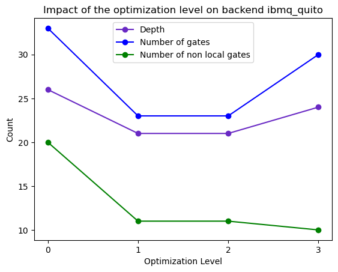

#####################################
Setting transpiler optimization level
#####################################

This guide shows you how to use the :attr:`~qiskit.transpile.optimization_level` 
parameter with :meth:`~qiskit.compiler.transpile`.
:attr:`~qiskit.transpile.optimization_level` helps you to optimize your quantum circuit.
This parameter takes an integer which can be a value between 0 and 3,
where the higher the number the more optimized the result.
You can find more information about this parameter
`here <https://qiskit.org/documentation/tutorials/circuits_advanced/04_transpiler_passes_and_passmanager.html#Preset-Pass-Managers>`__.

Initialize the quantum circuit
==============================

The effect of setting the :attr:`~qiskit.transpile.optimization_level` will differ depending on the backend you are using.
For this example you will exploring the `CSWAP <https://qiskit.org/documentation/stubs/qiskit.circuit.QuantumCircuit.cswap.html>`__ gate,
a three qubit gate which will be transpiled into one and two qubit gates.

.. testcode::

    from qiskit import QuantumCircuit, QuantumRegister, ClassicalRegister 
    from qiskit.compiler import transpile
    from qiskit.providers.fake_provider import FakeQuito #fake backend ibmq_quito

    backend = FakeQuito() # For this example the quito fake backend is used

    qc = QuantumCircuit(3) # Initialize the quantum circuit with 3 qubits
    
    qc.cswap(qr[0],qr[1],qr[2]) #add the cswap gate to the quantum circuit
    
    print(qc) #print the quantum circuit

.. testoutput::

    q0_0: ─■─
           │ 
    q0_1: ─X─
           │ 
    q0_2: ─X─
             
Using backend’s information
===========================

You should adhere to the specific configuration of your backend when utilizing :meth:`~qiskit.transpile`. 
This process entails breaking down your circuit into :attr:`~qiskit.transpile.basis_gates`` and considering the physical connections specified in the 
:attr:`~qiskit.transpile.coupling_map` for two qubit gates.
Given the presence of noise in the backend, it is crucial to optimize your circuit by adjusting the :attr:`~qiskit.transpile.optimization_level` parameter. 
This will help minimize the number of circuit operations and enhance the overall performance.

What each optimization level does
---------------------------------

When using a backend, you can access its properties through the instruction  :meth:`backend.configuration()`.
These properties, such as basis gates, coupling map, and init layout, play a crucial role in shaping the behavior of the quantum circuit.

For example, with :meth:`~qiskit.providers.fake_provider.FakeQuito`, you can learn about its qubit connections and the gates it uses to generate your quantum circuits.

.. testcode::

    print("Basis gates of your Backend: ",backend.configuration().basis_gates)

    print("Coupling map of your Backend: ",backend.configuration().coupling_map)

.. testoutput::

    Basis gates of your Backend:  ['id', 'rz', 'sx', 'x', 'cx', 'reset']
    Coupling map of your Backend:  [[0, 1], [1, 0], [1, 2], [1, 3], [2, 1], [3, 1], [3, 4], [4, 3]]

When setting the optimization_level to 0, the resulting quantum circuit is not optimized and utilizes only three qubits. 
The coupling map, represented by the subset **[[0,1],[1,0],[1,2],[2,1]]**, indicates the physical qubits available in the backend. 
In this configuration, the quantum circuit is transformed into a combination of one and two-qubit gates,
represented by the **['id', 'rz', 'sx', 'x', 'cx', 'reset']**.

.. testcode::

    qc_b0 = transpile(qc,backend = backend,optimization_level = 0)
    
    print(qc_b0)

.. testoutput::

    global phase: 5π/8
                                                                               »
         q0_0 -> 0 ────────────────────────────────────────────────────────────»
                   ┌───┐                                                  ┌───┐»
         q0_1 -> 1 ┤ X ├──────────────────────────────■────────────────■──┤ X ├»
                   └─┬─┘┌─────────┐┌────┐┌─────────┐┌─┴─┐┌──────────┐┌─┴─┐└─┬─┘»
         q0_2 -> 2 ──■──┤ Rz(π/2) ├┤ √X ├┤ Rz(π/2) ├┤ X ├┤ Rz(-π/4) ├┤ X ├──■──»
                        └─────────┘└────┘└─────────┘└───┘└──────────┘└───┘     »
    ancilla_0 -> 3 ────────────────────────────────────────────────────────────»
                                                                               »
    ancilla_1 -> 4 ────────────────────────────────────────────────────────────»
                                                                               »
    «                                                                         »
    «     q0_0 -> 0 ───────■────────────────────────────────■─────────────────»
    «                    ┌─┴─┐┌─────────┐┌───┐┌──────────┐┌─┴─┐     ┌───┐     »
    «     q0_1 -> 1 ──■──┤ X ├┤ Rz(π/4) ├┤ X ├┤ Rz(-π/4) ├┤ X ├──■──┤ X ├──■──»
    «               ┌─┴─┐└───┘└─────────┘└─┬─┘├─────────┬┘└───┘┌─┴─┐└─┬─┘┌─┴─┐»
    «     q0_2 -> 2 ┤ X ├──────────────────■──┤ Rz(π/4) ├──────┤ X ├──■──┤ X ├»
    «               └───┘                     └─────────┘      └───┘     └───┘»
    «ancilla_0 -> 3 ──────────────────────────────────────────────────────────»
    «                                                                         »
    «ancilla_1 -> 4 ──────────────────────────────────────────────────────────»
    «                                                                         »
    «                          ┌─────────┐                       
    «     q0_0 -> 0 ─────■─────┤ Rz(π/4) ├───■───────────────────
    «                  ┌─┴─┐   ├─────────┴┐┌─┴─┐            ┌───┐
    «     q0_1 -> 1 ───┤ X ├───┤ Rz(-π/4) ├┤ X ├────────────┤ X ├
    «               ┌──┴───┴──┐├─────────┬┘├───┴┐┌─────────┐└─┬─┘
    «     q0_2 -> 2 ┤ Rz(π/4) ├┤ Rz(π/2) ├─┤ √X ├┤ Rz(π/2) ├──■──
    «               └─────────┘└─────────┘ └────┘└─────────┘     
    «ancilla_0 -> 3 ─────────────────────────────────────────────
    «                                                            
    «ancilla_1 -> 4 ─────────────────────────────────────────────
    «                                                            

When you set the :attr:`~qiskit.transpile.optimization_level` to 1,the circuit undergoes a light optimization process that focuses on collapsing adjacent gates, 
improving the overall performance of the circuit. This results in a reduction in :class:`.CXGate` count and changes in the positions of qubits, 
following the connections **[[0,1],[1,0],[2,1]]**. Specifically, gates such as :math:`RZ(\pi/4)` and :math:`RZ(\pi/2)` are replaced with a single gate, :math:`RZ(3\pi/4)`. 

.. note::
    This optimization level is the default setting.

.. testcode::

    qc_b1 = transpile(qc,backend = backend,optimization_level = 1)
    
    print(qc_b1)

.. testoutput::

    global phase: 5π/8
                   ┌───┐                                                  »
         q0_1 -> 0 ┤ X ├──────────────────────────────■───────────────────»
                   └─┬─┘┌─────────┐┌────┐┌─────────┐┌─┴─┐┌──────────┐┌───┐»
         q0_2 -> 1 ──■──┤ Rz(π/2) ├┤ √X ├┤ Rz(π/2) ├┤ X ├┤ Rz(-π/4) ├┤ X ├»
                        └─────────┘└────┘└─────────┘└───┘└──────────┘└─┬─┘»
         q0_0 -> 2 ────────────────────────────────────────────────────■──»
                                                                          »
    ancilla_0 -> 3 ───────────────────────────────────────────────────────»
                                                                          »
    ancilla_1 -> 4 ───────────────────────────────────────────────────────»
                                                                          »
    «                               ┌─────────┐                                   »
    «     q0_1 -> 0 ─────────────■──┤ Rz(π/4) ├───────────────────────────────────»
    «               ┌─────────┐┌─┴─┐├─────────┴┐┌───┐┌──────────┐┌────┐┌─────────┐»
    «     q0_2 -> 1 ┤ Rz(π/4) ├┤ X ├┤ Rz(-π/4) ├┤ X ├┤ Rz(3π/4) ├┤ √X ├┤ Rz(π/2) ├»
    «               └─────────┘└───┘└──────────┘└─┬─┘└──────────┘└────┘└─────────┘»
    «     q0_0 -> 2 ──────────────────────────────■───────────────────────────────»
    «                                                                             »
    «ancilla_0 -> 3 ──────────────────────────────────────────────────────────────»
    «                                                                             »
    «ancilla_1 -> 4 ──────────────────────────────────────────────────────────────»
    «                                                                             »
    «                    ┌───┐                                
    «     q0_1 -> 0 ──■──┤ X ├──■──────────────────────────■──
    «               ┌─┴─┐└─┬─┘┌─┴─┐┌───┐┌──────────┐┌───┐┌─┴─┐
    «     q0_2 -> 1 ┤ X ├──■──┤ X ├┤ X ├┤ Rz(-π/4) ├┤ X ├┤ X ├
    «               └───┘     └───┘└─┬─┘├─────────┬┘└─┬─┘└───┘
    «     q0_0 -> 2 ─────────────────■──┤ Rz(π/4) ├───■───────
    «                                   └─────────┘           
    «ancilla_0 -> 3 ──────────────────────────────────────────
    «                                                         
    «ancilla_1 -> 4 ──────────────────────────────────────────
    «                                                         

When you set the :attr:`~qiskit.transpile.optimization_level`` to 2, the circuit undergoes a medium optimization process. 
This involves using a noise-adaptive layout and gate cancellation techniques based on commutation relationships. 
Depending on the circuit, this level of optimization can occasionally yield the same results as light optimization.

.. testcode::

    qc_b2 = transpile(qc,backend = backend,optimization_level = 2)
    
    print(qc_b2)

.. testoutput::

    global phase: 5π/8
                   ┌───┐                                                  »
         q0_1 -> 0 ┤ X ├──────────────────────────────■───────────────────»
                   └─┬─┘┌─────────┐┌────┐┌─────────┐┌─┴─┐┌──────────┐┌───┐»
         q0_2 -> 1 ──■──┤ Rz(π/2) ├┤ √X ├┤ Rz(π/2) ├┤ X ├┤ Rz(-π/4) ├┤ X ├»
                        └─────────┘└────┘└─────────┘└───┘└──────────┘└─┬─┘»
         q0_0 -> 2 ────────────────────────────────────────────────────■──»
                                                                          »
    ancilla_0 -> 3 ───────────────────────────────────────────────────────»
                                                                          »
    ancilla_1 -> 4 ───────────────────────────────────────────────────────»
                                                                          »
    «                               ┌─────────┐                                   »
    «     q0_1 -> 0 ─────────────■──┤ Rz(π/4) ├───────────────────────────────────»
    «               ┌─────────┐┌─┴─┐├─────────┴┐┌───┐┌──────────┐┌────┐┌─────────┐»
    «     q0_2 -> 1 ┤ Rz(π/4) ├┤ X ├┤ Rz(-π/4) ├┤ X ├┤ Rz(3π/4) ├┤ √X ├┤ Rz(π/2) ├»
    «               └─────────┘└───┘└──────────┘└─┬─┘└──────────┘└────┘└─────────┘»
    «     q0_0 -> 2 ──────────────────────────────■───────────────────────────────»
    «                                                                             »
    «ancilla_0 -> 3 ──────────────────────────────────────────────────────────────»
    «                                                                             »
    «ancilla_1 -> 4 ──────────────────────────────────────────────────────────────»
    «                                                                             »
    «                    ┌───┐                                
    «     q0_1 -> 0 ──■──┤ X ├──■──────────────────────────■──
    «               ┌─┴─┐└─┬─┘┌─┴─┐┌───┐┌──────────┐┌───┐┌─┴─┐
    «     q0_2 -> 1 ┤ X ├──■──┤ X ├┤ X ├┤ Rz(-π/4) ├┤ X ├┤ X ├
    «               └───┘     └───┘└─┬─┘├─────────┬┘└─┬─┘└───┘
    «     q0_0 -> 2 ─────────────────■──┤ Rz(π/4) ├───■───────
    «                                   └─────────┘           
    «ancilla_0 -> 3 ──────────────────────────────────────────
    «                                                         
    «ancilla_1 -> 4 ──────────────────────────────────────────
    «                                                         

When you set the :attr:`~qiskit.transpile.optimization_level`` to 3, it enables heavy optimization. 
This level of optimization considers previous considerations and involves the resynthesis of two qubit blocks of gates in the circuit. 
The result is a reduction in the number of quantum gates and the determination of the optimal coupling map connection, such as **[[0,1],[1,0],[2,1]]**.
Based on the basis gates, results in one less :class:`.CXGate` and the addition of eight one qubit gates.

.. testcode::

    qc_b3 = transpile(qc,backend = backend,optimization_level = 3)
    
    print(qc_b3)

.. testoutput::

    global phase: 3π/8
                      ┌────────┐  ┌────┐ ┌────────┐        ┌────┐        »
         q0_1 -> 0 ───┤ Rz(-π) ├──┤ √X ├─┤ Rz(-π) ├──■─────┤ √X ├────────»
                   ┌──┴────────┴─┐├────┤┌┴────────┤┌─┴─┐┌──┴────┴─┐┌────┐»
         q0_2 -> 1 ┤ Rz(-2.3821) ├┤ √X ├┤ Rz(π/2) ├┤ X ├┤ Rz(π/2) ├┤ √X ├»
                   └─────────────┘└────┘└─────────┘└───┘└─────────┘└────┘»
         q0_0 -> 2 ──────────────────────────────────────────────────────»
                                                                         »
    ancilla_0 -> 3 ──────────────────────────────────────────────────────»
                                                                         »
    ancilla_1 -> 4 ──────────────────────────────────────────────────────»
                                                                         »
    «                                                                     »
    «     q0_1 -> 0 ───────────────────────────────────────────────────■──»
    «               ┌──────────────┐┌────┐┌─────────┐┌───┐┌─────────┐┌─┴─┐»
    «     q0_2 -> 1 ┤ Rz(-0.75949) ├┤ √X ├┤ Rz(π/4) ├┤ X ├┤ Rz(π/4) ├┤ X ├»
    «               └──────────────┘└────┘└─────────┘└─┬─┘└─────────┘└───┘»
    «     q0_0 -> 2 ───────────────────────────────────■──────────────────»
    «                                                                     »
    «ancilla_0 -> 3 ──────────────────────────────────────────────────────»
    «                                                                     »
    «ancilla_1 -> 4 ──────────────────────────────────────────────────────»
    «                                                                     »
    «               ┌─────────┐                                        ┌───┐     »
    «     q0_1 -> 0 ┤ Rz(π/4) ├─────────────────────────────────────■──┤ X ├──■──»
    «               ├─────────┴┐┌───┐┌──────────┐┌────┐┌─────────┐┌─┴─┐└─┬─┘┌─┴─┐»
    «     q0_2 -> 1 ┤ Rz(-π/4) ├┤ X ├┤ Rz(3π/4) ├┤ √X ├┤ Rz(π/2) ├┤ X ├──■──┤ X ├»
    «               └──────────┘└─┬─┘└──────────┘└────┘└─────────┘└───┘     └───┘»
    «     q0_0 -> 2 ──────────────■──────────────────────────────────────────────»
    «                                                                            »
    «ancilla_0 -> 3 ─────────────────────────────────────────────────────────────»
    «                                                                            »
    «ancilla_1 -> 4 ─────────────────────────────────────────────────────────────»
    «                                                                            »
    «                                          
    «     q0_1 -> 0 ────────────────────────■──
    «               ┌───┐┌──────────┐┌───┐┌─┴─┐
    «     q0_2 -> 1 ┤ X ├┤ Rz(-π/4) ├┤ X ├┤ X ├
    «               └─┬─┘├─────────┬┘└─┬─┘└───┘
    «     q0_0 -> 2 ──■──┤ Rz(π/4) ├───■───────
    «                    └─────────┘           
    «ancilla_0 -> 3 ───────────────────────────
    «                                          
    «ancilla_1 -> 4 ───────────────────────────
    «                                          

Plotting the Results
====================

You can visualize the results of your previous examples by generating plot that show the depth, number of gates, and number of CX gates of your quantum circuits.

.. testcode::

    
    import matplotlib.pyplot as plt # import matplotlib to plot your result
    
    
    fig, ax = plt.subplots()
    my_xticks = [str(i) for i in range(4)]
    plt.xticks(range(4), my_xticks)
    ax.plot(range(4), [qc_b0.depth(),qc_b1.depth(),qc_b2.depth(),qc_b3.depth()],label = "Number of depth", marker='o',color ='#6929C4')
    ax.plot(range(4), [qc_b0.size(),qc_B1.size(),qc_b2.size(),qc_b3.size()],label = "Number of gates", marker='o',color ='blue')
    ax.plot(range(4), [qc_b0.num_nonlocal_gates(),qc_b1.num_nonlocal_gates(),qc_b2.num_nonlocal_gates(),qc_b3.num_nonlocal_gates()],label = "Number of non local gates", marker='o',color ='green')

    ax.set_title('Results of the optimization level using as backend ibmq_quito')
    ax.set_xlabel('Optimization Level')
    ax.set_ylabel('Values')
    plt.legend(bbox_to_anchor =(0.75, 1.))

.. testoutput::

    Text(0, 0.5, 'Number of cx gates')

