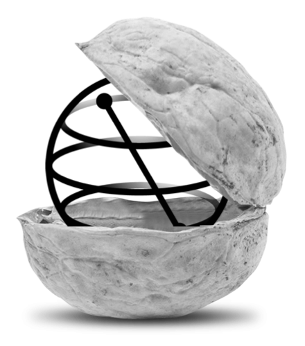
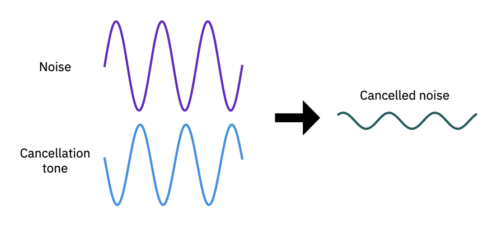
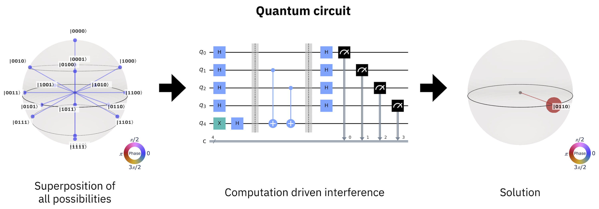
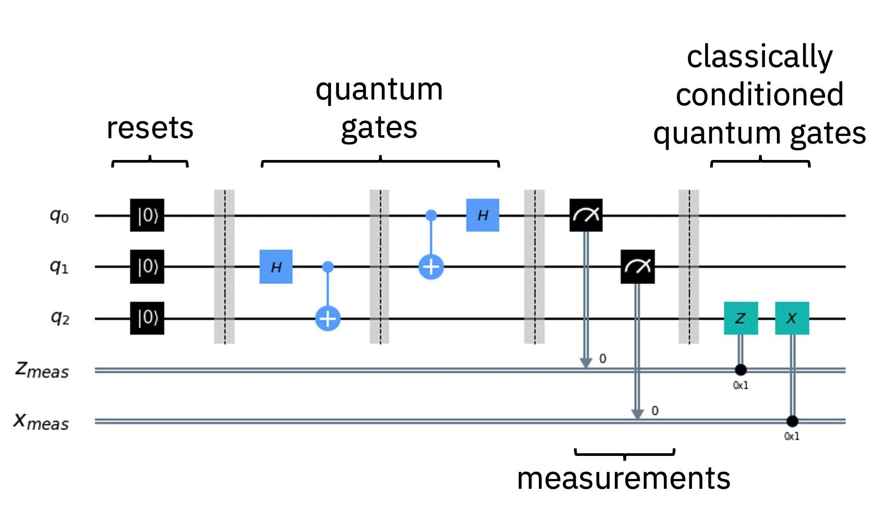
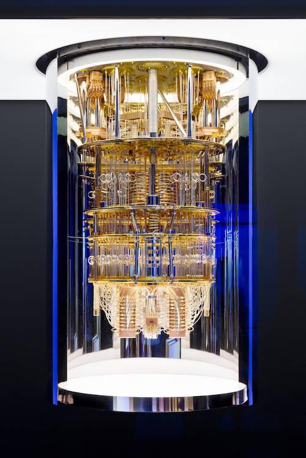
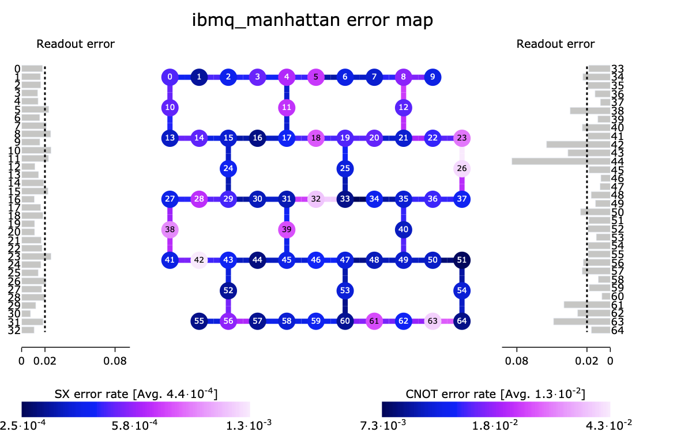

.. _qc-intro:

===============================
Quantum computing in a nutshell
===============================

Quantum computing represents a new paradigm in computation that utilizes the fundamental
principles of quantum mechanics to perform calculations.  If you are reading this then you
have undoubtedly heard that the promise of quantum computation lies in the possibility of
efficiently performing a handful of tasks such as prime factorization, quantum simulation, search,
optimization, and algebraic programs such as machine learning; computations that at size are
beyond the capabilities of even the largest of
classical computers.

The power of quantum computing rests on two cornerstones of quantum mechanics, namely
:ref:`interference <qc-intro-interference>` and
:ref:`entanglement <qc-intro-entanglement>` that highlight the wave- and particle-like aspects
of quantum computation, respectively.  Qiskit is an SDK for performing quantum computations
that utilize these quantum mechanical principles using the language of
:ref:`quantum circuits <qc-intro-circuits>`.  Comprised of quantum gates, instructions, and
classical control logic, quantum circuits allow for expressing complex algorithms
and applications in a abstract manner that can be executed on a quantum computer.  At its
core, Qiskit is a quantum circuit construction, optimization, and execution engine.
Additional algorithm and application layers leverage quantum circuits, often in concert
with classical computing resources, to solve problems in optimization, quantum chemistry,
physics, machine learning, and finance.  In what follows, we give a very brief overview
of quantum computing, and how Qiskit is used at each step.  Interested readers are
directed to additional in-depth materials for further insights.

.. _qc-intro-interference:

Interference
============

Like a classical computer, a quantum computer operates on bits.  However, while classical bits can
only be found in the states 0 and 1, a quantum bit, or qubit, can represent the values 0 and 1,
or linear combinations of both.  These linear combinations are known as superpositions
(or superposition states).

To see how this resource is utilized in quantum computation we first turn to a classical
analog: noise cancellation.  Noise cancellation, as done in noise cancelling headphones
for example, is performed by employing superposition and the principle of **interference**
to reduce the amplitude of unwanted noise by generating a tone of approximately the same
frequency and amplitude, but out of phase by a value of :math:`\pi` (or any other odd
integer of :math:`\pi`).

   Approximate cancellation of a noise signal by a tone of nearly equal amplitude
   and offset by a phase of :math:`\sim \pi`.

As shown above, when the phase difference is close to an odd multiple of :math:`\pi`,
the superposition of the two waves results in interference, and an output that is
significantly reduced compared to the original.  The result is the signal of interest
unencumbered by noise. Although this processing is done by digital circuits, the amplitude
and phase are continuous variables that can never be matched perfectly, resulting in
incomplete correction.

A general computation on a quantum computer proceeds in very much the same way as
noise cancellation. To begin, one prepares a superposition of all possible computation
states.  This is then used as an input to a :ref:`quantum circuit <qc-intro-circuits>` that
selectively interferes the components of the superposition according to a prescribed algorithm.
What remains after cancelling the relative amplitudes and phases of the input state is the
solution to the computation performed by the quantum circuit.

   Quantum computation as an interference generation process.

.. _qc-intro-entanglement:

Entanglement
============

The second principle of quantum mechanics that quantum computation can utilize is the
phenomena of **entanglement**.  Entanglement refers to states of more than one qubit
(or particles in general) in which the combined state of the qubits contains more
information than the qubits do independently.  The overwhelming majority of multi-qubit quantum
states are entangled, and represent a valuable resource.  For example, entangled states between
qubits can be used for quantum teleportation, where a shared entangled
state of two qubits can be manipulated to transfer information from one qubit to another,
regardless of the relative physical proximity of the qubits. Entangled states, as natural
states of quantum systems, are also of importance in disciplines
such as quantum chemistry and quantum simulation where the solution(s) often take the form
of entangled multi-qubit states.  One can also utilize highly-entangled quantum states
of multiple qubits to, for example, generate certifiably random numbers.  There is even a `Qiskit
package <https://qiskit-rng.readthedocs.io/en/latest/>`_ to do this!

.. _qc-intro-circuits:

Quantum circuits
================

Algorithms and applications that utilize quantum mechanical resources can be easily and efficiently
written in the language of **quantum circuits**. A quantum circuit is a
computational routine consisting of coherent quantum operations on quantum data, such as that
held in qubits, and concurrent real-time classical computation. Each horizontal line, or wire
in a circuit represents a qubit, with the left end of the wire being the
initial quantum data, and the right being the final quantum data generated by the quantum
circuit's computation. Operations on qubits can be placed on these wires, and are represented
by boxes.

   Quantum state teleportation circuit revisited.

Quantum circuits enable a quantum computer to take in classical information and output a
classical solution, leveraging quantum principles such as
:ref:`interference <qc-intro-interference>` and
:ref:`entanglement <qc-intro-entanglement>` to perform the computation.

A typical quantum algorithm workflow consists of:

- The problem we want to solve,
- A classical algorithm that generates a description of a quantum circuit,
- The quantum circuit that needs to be run on quantum hardware,
- And the output classical solution to the problem that it produces.

Quantum gates form the primitive operations on quantum data.  Quantum gates represent
information preserving, reversible transformations on the quantum data stored in qubits.
These "unitary" transformations represent the quantum mechanical core of a quantum
circuit.  Some gates such as :math:`X` (also written as :math:`\oplus`) and :math:`CX`
have classical analogs such as bit-flip and :math:`XOR` operations, respectively,
while others do not.  The Hadamand (:math:`H`) gate, along with the parameterized rotates
:math:`rX(\theta)` and :math:`rY(\theta)`, generate superposition states,
while gates such as :math:`Z`, :math:`rZ(\theta)`, :math:`S`, and :math:`T` impart phases that
can be used for interference.  Two-qubit gates like the :math:`CX` gate are used
to generate entanglement between pairs of qubits, or to "kick" the phase from
one qubit to another.   In contrast to gates, operations like "measurement", represented by
the meter symbol in a box with a line connecting to a "target" wire, extract partial
information about a qubit's state, often losing the phase, to be able to represent it as
a classical bit and write that classical bit onto the target wire (often a fully classical
wire in some readout device). This is the typical way to take information from the
quantum data into a classical device.  Note that with only :math:`H`, :math:`rZ(\theta)`,
:math:`CX`, and measurement gates, i.e. a universal gate set, we can construct any quantum circuit,
including those efficiently computing the dynamics of any physical system in nature.

Some workloads contain an extended sequence of interleaved quantum circuits and classical
computation, for example variational quantum algorithms execute quantum circuits within an
optimization loop. For these workloads, system performance increases substantially if the
quantum circuits are parameterized, and transitions between circuit execution and non-current
classical computation are made efficient.
Consequently, we define **near-time computation** to refer to computations with algorithms that make
repeated use of quantum circuits with hardware developed to speed up the computation time. In
near-time computation, the classical computation occurs on a time scale longer than the coherence
of the quantum computation. Contrast this with **real-time computation**, where the classical
computation occurs within the decoherence time of the quantum device.

Constructing complex quantum circuits with minimal effort is at the heart of Qiskit.
With only a few lines of code, is it possible to construct complex circuits like the
one above

.. jupyter-execute::
   :hide-code:

   from qiskit import *

.. jupyter-execute::
   :hide-output:

   qr = QuantumRegister(3, 'q')
   cr = ClassicalRegister(2, 'zx_meas')
   qc = QuantumCircuit(qr,cr)
   qc.reset(range(3))
   qc.barrier()
   qc.h(1)
   qc.cx([1,0],[2,1])
   qc.h(0)
   qc.barrier()
   qc.measure([0,1], [0,1])
   qc.barrier()
   qc.z(2).c_if(cr, 1)
   qc.x(2).c_if(cr, 2)

that support a rich feature set of operations, and can be passed to a range of
:ref:`quantum computers <qc-intro-computers>` or classical simulators.

.. _qc-intro-computers:

Quantum computers
=================

   A view inside the IBM Quantum System One.

Quantum computers which are programmed using quantum circuits can be constructed out of any
quantum technology that allows for defining qubit elements, and can implement
single- and multi-qubit gate operations with high-fidelity. At present, architectures
based on superconducting circuits, trapped-ions, semiconducting quantum-dots, photons, and
neutral atoms, are actively being developed, and many are accessible to users over the internet.
Qiskit is agnostic with respect to the underlying architecture of a given quantum system,
and can compile a quantum circuit to match the entangling gate topology of a quantum device,
map the circuit instructions into the native gate set of the device, and optimize the resulting
quantum circuit for enhanced fidelity.

As with the noise cancellation example above, the amplitude and phase of qubits are continuous
degrees of freedom upon which operations can never be done exactly.  These gates errors, along
with noise from the environment in which a quantum computer resides, can conspire to ruin a
computation if not accounted for in the compilation process, and may require additional
mitigation procedures in order to obtain a high-fidelity output on present day
quantum systems susceptible to noise.  Qiskit is capable of taking into account a wide range of
device calibration metrics (see figure below) in its compilation strategy, and can select an
optimal set of qubits on which to run a given quantum circuit.  In addition, Qiskit hosts a
collection of noise mitigation techniques for extracting a faithful representation of a quantum
circuits output.

   Topology and error rates for the IBM Quantum *ibmq_manhattan* system.

Where to go from here
======================

Hopefully we have given the reader a taste of what quantum computation has to offer
and you are hungry for more.  If so, there are several resources that may be of
interest:

- `Getting started with Qiskit <getting_started.html>`_ - Dive right into Qiskit.

- `Field guide to quantum computing <https://quantum-computing.ibm.com/docs/iqx/guide/>`_ : A gentle
  physics-based introduction written by some of the founders of quantum computation that makes use
  of the interactive circuit composer.

- `Qiskit textbook <https://qiskit.org/textbook>`_ : A university quantum algorithms/computation
  course supplement based on Qiskit.
