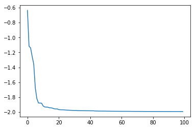
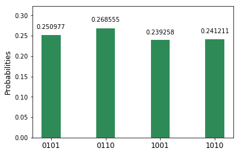
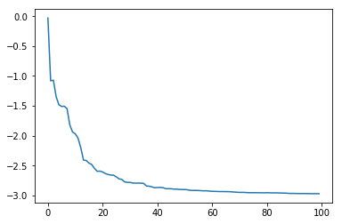
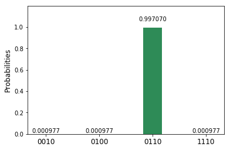
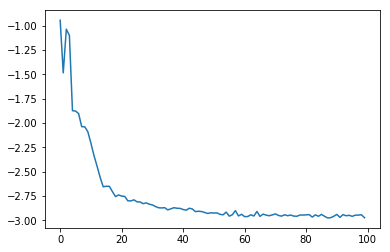
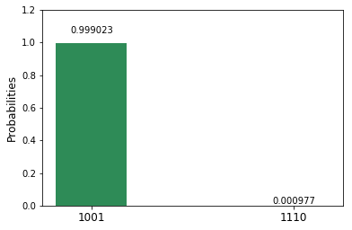

========================
Classical Optimization
========================

The latest version of this notebook is available on
https://github.com/IBM/qiskit-sdk-py/tree/master/scripts.

For more information about how to use the IBM Q Experience (QX), consult
the `Quantum Experience
tutorials <https://quantumexperience.ng.bluemix.net/qstage/#/tutorial?sectionId=c59b3710b928891a1420190148a72cce&pageIndex=0>`__,
or check out the
`community <https://quantumexperience.ng.bluemix.net/qstage/#/community>`__.

Contributors
============

Jay Gambetta, Antonio Mezzacapo, Ramis Movassagh, Kristan Temme

Introduction
============

Many problems in finance and business are optimization problems.

Optimization or combinatorial optimization means searching for an
optimal solution in a finite or countably infinite set of potential
solutions. Optimality is defined with respect to some criterion
function, which is to be minimized or maximized, which is typically
called the cost function.

**Types of optimization problems**

Minimization: cost, distance, length of a traversal, weight, processing
time, material, energy consumption, number of objects

Maximization: profit, value, output, return, yield, utility, efficiency,
capacity, number of objects.

The two problems that are consider in this notebook are:

MaxCut
======

MaxCut is an NP-Complete problem. MaxCut has applications in clustering,
network science, and statistical physics. For example consider the
problem of many different people (nodes) and how they can influence
(weight) overs, and you want to answer the question of the best
marketing stratety to maximize revenue by offering for free the product
to one subset of buyers, while determining how to approach the remaining
buyers with a particular price. MaxCut derives its importance from its
"hardness" and applications it has in aforementioned fields (SHOULD WE
ADD THAT APPROXIMATIONS ARE ALSO HARD).

Consider a :math:`n`-node undirectional graph *G(V, E)* where *\|V\| =
n* with edge weights :math:`w_{ij}>0` for :math:`(i, j)\in E`. A cut is
defined as the partitioning into two sets. We define the cost as the sum
of weights of edges crossing the cut. By assigning :math:`x_i=0` or
:math:`x=1` to each node :math:`i` depding on its location to the cut
the maximum cut is a cut that maximizes

.. math:: C(\textbf{x}) = \sum_{i,j} w_{ij} x_i (1-x_j).

An extension of the MaxCut problem is to let the nodes themselves carry
weights, which can be regarded as the nodes having a preference on their
location. Doing this the cost function becomes

.. math:: C(\textbf{x}) = \sum_i w_i x_i + \sum_{i,j} w_{ij} x_i (1-x_j).

Mapping this to a Quantum Hamiltonian is trival
:math:`x_i\rightarrow (1-Z_i)/2` where :math:`Z_i` is the Pauli Z
operator that has eigenvalues :math:`\pm 1`. Doing this we find that

.. math:: C(\textbf{Z}) = \sum_i w_i (1-Z_i)/2 + \sum_{i<j} \frac{w_{ij}}{2} (1-Z_iZ_j)= \frac{-1}{2}\left(\sum_i w_i Z_i + \sum_{i<j} w_{ij} Z_iZ_j\right)+\mathrm{const},

where const = :math:`\sum_i w_i/2 + \sum_{i<j}w_{ij}/2`. That is the
MAXCUT is equivalent to minimizing the Ising Hamiltonian

.. math::  H = \sum_i w_i Z_i + \sum_{i<j} w_{ij} Z_iZ_j.

Traveling Salesman Problem
==========================

In addition to being a notorious NP-complete problem that has drawn the
attention of computer scientists and mathematician for over two
centuries, as the name suggests, the Traveling Salesman Problem (TSP)
has important bearings on finance and marketing. Colloquially, the
traveling salesman is one who goes from city to city to sell a
merchandise. His/her objective (TSP) is to find the shortest path that
would enable them to visit all the cities and return to their hometown
(i.e., the city where he started). This way he/she gets to maximize
their potential sales in the least amount of time.

The problem derives its importance from its "hardness" and ubiquitous
equivalence to other relevant combinatorial optimization problems that
arise in practice.

The mathematical formulation with some early analysis was proposed by
W.R. Hamilton in early 19th century. Mathematically the problem is best
abstracted in terms of graphs. The TSP on the nodes of a graph asks for
the shortest Hamiltonian cycle that can be taken through each of the
nodes. The general solution is unknown and finding an efficient solution
(e.g., a polynomial time algorithm) is expected to not exists.

Find the shortest Hamiltonian cycle in a given complete graph
:math:`G=(V,E)` with :math:`n=|V|` vertices and distances,
:math:`w_{ij} =` distance from vertex :math:`i` to vertex :math:`j`. The
decission variable :math:`x_{ij}` = 1 if the cycle goes along arc
:math:`i\rightarrow j` or 0 otherwise.

Approximate Universal Quantum Computing for Optimization problems
=================================================================

Recently there has been interest in investgating approximate algorithims
for optimization [ADD REFS]. Here we show a slight variation to them
which we have been looking at under the general concept of approximate
quantum computing. In general we dont expect this to have a exponential
speed up but due to the nature and importance of these problems it is
worth investigating Heuristic approaches on a quantum computer. The hope
is that that due to the large space of a quantum computer we can explore
the problem by exploiting entanglement to trade exponential calls for
quantum depth.

The Algorithm works as follows: 1. Choose a Ising problem (can have
higher powers of Z). 2. Choose the maximum depth of the quantum circuit
(this could be done adaptively. 3. Choos a set of controls
:math:`\theta` and make a trial function :math:`|\psi(\theta)\rangle`.
4. Evaluate
:math:`C = \langle\psi~|H|~\psi\rangle = \sum_i w_i \langle\psi~|Z_i|~\psi\rangle+ \sum_{i<j} w_{ij} \langle\psi~|Z_iZ_j|~\psi\rangle`
by sampling the outcome of the circuit and adding the expectation values
together. 5. Use a classical optimizer to choose a new set of controls.
6. Continue until the C has reach a minimium and return
:math:`|\langle z~|\psi\rangle|^2`.

Not some benifits on this over making this is real hardware is we are
not limited to the connectivity of the device and it is trival to map
optimize problems to the virtual Hamiltonain which we make though
simulation. Getting higher orders such as :math:`Z_iZ_jZ_k` is simple
which in real hardware is generally possible. The noise is mainly due to
the gates and if the depth is small enough we can perform this high
fidelity.

It is our belief the difficult of finding good Heuristic algorithms will
come down ot the trial funciton. Do we choose a trial function that has
entanglement in a way that best aligns with the problem (as indicated in
[REF]). or do we make the amount of entanglement a variable [REF]. These
questions are beyond our goals here and we will consider only the
simplie trial functions

.. math:: |\psi(\theta)\rangle  = [U_\mathrm{single}(\theta) U_\mathrm{entangler}]^m |+\rangle

where :math:`U_\mathrm{entangler}` is a function of cPhase gates (fully
entangling), and
:math:`U_\mathrm{single}(\theta) = Y(\theta)^{\otimes n}`, where
:math:`n` is the number of qubits and :math:`m` is the depth of the
quantum circuit. The motivation for this choice is that for these
classical problems this choice allows us to search over the space of
states that have only real superpostions and dont have to worry about
refocusing out all the complex phases but still can exploit the
entanglment to search for solutions.

.. code:: python

    # Checking the version of PYTHON; we only support 3 at the moment
    import sys
    if sys.version_info < (3,0):
        raise Exception("Please use Python version 3 or greater.")
        
    # useful additional packages 
    import matplotlib.pyplot as plt
    %matplotlib inline
    import numpy as np
    from scipy import linalg as la
    
    import sys
    sys.path.append("../../")
    # importing the QISKit
    from qiskit import QuantumCircuit, QuantumProgram
    import Qconfig
    
    # import basic plot tools
    from qiskit.basicplotter import plot_histogram
    
    # import optimization tools
    from tools.optimizationtools import trial_circuit_ryrz,trial_circuit_ry, SPSA_optimization
    from tools.optimizationtools import Energy_Estimate, Measure_pauli_z, Hamiltonian_from_file, make_Hamiltonian

MaxCut on 4 Qubits
==================

::

    Graph:   
             X---X 
             | \ |
             X---X
           

The ground state is degenerate and is either :math:`|0110\rangle` or
:math:`|1001\rangle`.

.. code:: python

    n=2
    m=
    device='local_qasm_simulator'
    SPSA_params=[1,.1,.602,.101,0]
    theta=np.zeros(2*n*m)
    entangler_map={0: [1]} # the map of two-qubit gates with control at key and target at values
    shots=1000
    max_trials=25
    
    #Exact Energy
    pauli_list=Hamiltonian_from_file('H2/H2Equilibrium.txt')
    eigen=la.eig(make_Hamiltonian(pauli_list))
    exact=np.amin(eigen[0])
            
    # Optimization
    eval_hamiltonian_partial=partial(eval_hamiltonian,n,m,'H2/H2Equilibrium.txt',device,shots)
    output=SPSA_optimization(eval_hamiltonian_partial,theta,SPSA_params,max_trials,1);
    plt.plot(output[2],label='E(theta_plus)')
    plt.plot(output[3],label='E(theta_minus)')
    plt.plot(np.ones(max_trials)*output[0],label='Final Energy')
    plt.plot(np.ones(max_trials)*exact,label='Exact Energy')
    plt.legend()

.. code:: python

    # cost function H = alpha_i z_i + beta_ij z_i z_j
    n =4
    alpha = np.zeros(n)
    beta = np.zeros((n, n))
    beta[0, 1] = 1
    beta[0, 2] = 1
    beta[1, 2] = 1
    beta[1, 3] = 1
    beta[2, 3] = 1

.. code:: python

    #Setting up a quantum program and connecting to the Quantum Experience API
    Q_program = QuantumProgram()
    # set the APIToken and API url
    Q_program.set_api(Qconfig.APItoken, Qconfig.config["url"])

.. code:: python

    #Making the Hamiltonian in its full form and getting the lowest eigenvalue and egienvector
    H = make_Hamiltonian(n,alpha,beta)
    w, v = la.eigh(H, eigvals=(0, 1))
    print(w)
    v

.. code:: python

    # Quantum circuit parameters
    device = 'local_qasm_simulator' # the device to run on
    shots = 8192    # the number of shots in the experiment. 
    entangler_map = {0: [1], 1: [2], 2: [3]} # the map of two-qubit gates with control at key and target at values
    
    # Numerical parameters 
    SPSA_parameters = np.array([.3,0.602,0,.1,0.101]) #[a, alpha, A, c, gamma]
    max_trials = 100;
    max_depth = 3
    
    cost, data_save, cost_save = SPSA_Minimization(Q_program, alpha, beta, n, device, shots, entangler_map, SPSA_parameters, max_trials, max_depth)
    
    print('m = 1 ' + str(cost[0]) + ' m = 2 ' + str(cost[1]) + 'm = 3 ' + str(cost[2]))

.. code:: python

    # plotting data
    plt.plot(range(max_trials), cost_save[0])
    plot_histogram(data_save[0])
    
    plt.plot(range(max_trials), cost_save[1])
    plot_histogram(data_save[1])
    
    plt.plot(range(max_trials), cost_save[2])
    plot_histogram(data_save[2])

Four Qubits (fast) 
==================

::

    Graph:   
             X---X 
             | \ |
             X---X
           

The ground state is degenerate and is either :math:`|100\rangle`,
:math:`|010\rangle` and :math:`|001\rangle`.

.. code:: python

    # cost function H = alpha_i z_i + beta_ij z_i z_j
    n =4
    alpha = np.zeros(n)
    beta = np.zeros((n, n))
    beta[0, 1] = 1
    beta[0, 2] = 1
    beta[1, 2] = 1
    beta[1, 3] = 1
    beta[2, 3] = 1

.. code:: python

    #Setting up a quantum program and connecting to the Quantum Experience API
    Q_program = QuantumProgram()
    # set the APIToken and API url
    Q_program.set_api(Qconfig.APItoken, Qconfig.config["url"])

.. parsed-literal::

    ---- Error: Exception connect to servers ----

.. parsed-literal::

    False

.. code:: python

    # Quantum circuit parameters
    entangler_map = {0: [1], 1: [2], 2: [3]} # the map of two-qubit gates with control at key and target at values
    
    # Numerical parameters 
    SPSA_parameters = np.array([.3,0.602,0,.1,0.101]) #[a, alpha, A, c, gamma]
    max_trials = 100;
    max_depth = 3
    
    cost, data_save, cost_save = SPSA_Minimization_fast(Q_program, alpha, beta, n, entangler_map, SPSA_parameters, max_trials, max_depth)
    
    print('m = 1 ' + str(cost[0]) + ' m = 2 ' + str(cost[1]) + 'm = 3 ' + str(cost[2]))

.. parsed-literal::

    trial 0 of 100 cost -0.943257454022
    trial 10 of 100 cost -2.20629876865
    trial 20 of 100 cost -2.7499512609
    trial 30 of 100 cost -2.84118948435
    trial 40 of 100 cost -2.88829727076
    trial 50 of 100 cost -2.9242398834
    trial 60 of 100 cost -2.96130416407
    trial 70 of 100 cost -2.93303732352
    trial 80 of 100 cost -2.94302575557
    trial 90 of 100 cost -2.93854780452
    m = 1 -2.015625 m = 2 -2.9921875m = 3 -2.99609375

.. code:: python

    # plotting data
    plt.plot(range(max_trials), cost_save[0])
    plot_histogram(data_save[0])
    
    plt.plot(range(max_trials), cost_save[1])
    plot_histogram(data_save[1])
    
    plt.plot(range(max_trials), cost_save[2])
    plot_histogram(data_save[2])

10 qubits
=========

.. code:: python

    n = 10
    
    # cost function H = alpha_i z_i + beta_ij z_i z_j
    alpha = np.zeros(n)
    beta = np.random.choice([0, 0.5], size=(n,n), p=[1./3, 2./3])

.. code:: python

    # quantum circuit parameters
    device = 'simulator' # the device to run on
    shots = 8192    # the number of shots in the experiment 
    entangler_map = {0: [1], 1: [2], 2: [3], 3: [4], 4: [5], 5: [6], 6: [7], 7: [8], 8: [9]} # the map of two-qubit gates with control at key and target at values
    
    # Numerical parameters 
    SPSA_parameters = np.array([.3,0.602,0,.1,0.101]) # [a, alpha, A, c, gamma]
    max_trials = 100;
    theta_depth_1 = np.random.randn(1*n) # initial controls 
    theta_depth_2 = np.random.randn(2*n) # initial controls 
    theta_depth_3 = np.random.randn(3*n) # initial controls 
    
    
    
    trial_circuit_depth_1 =  trial_funtion_optimization(n,1,theta_depth_1,entangler_map) 
    trial_circuit_depth_2 =  trial_funtion_optimization(n,2,theta_depth_2,entangler_map) 
    trial_circuit_depth_3 =  trial_funtion_optimization(n,3,theta_depth_3,entangler_map) 
    
    program = [trial_circuit_depth_1,trial_circuit_depth_2,trial_circuit_depth_3]
    out = run_program(program,api,device,shots,max_credits=3)
    results=combine_jobs([out['id']], api, wait=20, timeout=440)  
    cost_depth_1 = cost_classical(get_data(results,0),n,alpha,beta)
    cost_depth_2 = cost_classical(get_data(results,1),n,alpha,beta)
    cost_depth_3 = cost_classical(get_data(results,2),n,alpha,beta)
    print('m=1 ' + str(cost_depth_1) + ' m=2 ' + str(cost_depth_2) + 'm=3 ' + str(cost_depth_3))

.. code:: python

    # plotting data
    plt.plot(range(max_trials), cost_plus_depth_1, range(max_trials), cost_minus_depth_1)
    plot_histogram(get_data(results,0),n)
    plt.plot(range(max_trials), cost_plus_depth_2, range(max_trials), cost_minus_depth_2)
    plot_histogram(get_data(results,1),n)
    plt.plot(range(max_trials), cost_plus_depth_3, range(max_trials), cost_minus_depth_3)
    plot_histogram(get_data(results,2),n)

.. code:: python

    # cost function H = alpha_i z_i + beta_ij z_i z_j
    n = 10
    alpha = np.zeros(n)
    beta = np.random.choice([0, 0.5], size=(n,n), p=[1./3, 2./3])
    for i in range(n):
        for j in range(i):
            beta[j,i]=beta[i,j]
    for i in range(n):
        beta[i,i]=0;

.. code:: python

    # quantum circuit parameters
    device = 'simulator' # the device to run on
    shots = 8192    # the number of shots in the experiment 
    entangler_map = {0: [1], 1: [2], 2: [3], 3: [4], 4: [5], 5: [6], 6: [7], 7: [8], 8: [9]} # the map of two-qubit gates with control at key and target at values
    
    # Numerical parameters 
    SPSA_parameters = np.array([.3,0.602,0,.1,0.101]) #[a, alpha, A, c, gamma]
    max_trials = 100;
    theta_depth_1 = np.random.randn(1*n) # initial controls 
    theta_depth_2 = np.random.randn(2*n) # initial controls 
    theta_depth_3 = np.random.randn(3*n) # initial controls 
    
    cost_plus_depth_1=np.zeros(max_trials)
    cost_minus_depth_1=np.zeros(max_trials)
    cost_plus_depth_2=np.zeros(max_trials)
    cost_minus_depth_2=np.zeros(max_trials)
    cost_plus_depth_3=np.zeros(max_trials)
    cost_minus_depth_3=np.zeros(max_trials)
    
    for k in range(max_trials):
        print('trial ' + str(k) + " of " + str(max_trials))
        a_spsa = float(SPSA_parameters[0])/np.power(k+1+SPSA_parameters[2], SPSA_parameters[1])
        c_spsa = float(SPSA_parameters[3])/np.power(k+1, SPSA_parameters[4])
    
        Delta_depth_1 = 2*np.random.randint(2,size=n*1)-1 # \pm 1 random distribution 
        Delta_depth_2 = 2*np.random.randint(2,size=n*2)-1 # \pm 1 random distribution 
        Delta_depth_3 = 2*np.random.randint(2,size=n*3)-1 # \pm 1 random distribution 
        
        theta_plus_depth_1 = theta_depth_1 + c_spsa*Delta_depth_1
        theta_minus_depth_1 = theta_depth_1 - c_spsa*Delta_depth_1
        theta_plus_depth_2 = theta_depth_2 + c_spsa*Delta_depth_2
        theta_minus_depth_2 = theta_depth_2 - c_spsa*Delta_depth_2
        theta_plus_depth_3 = theta_depth_3 + c_spsa*Delta_depth_3
        theta_minus_depth_3 = theta_depth_3 - c_spsa*Delta_depth_3
    
        trial_circuit_plus_depth_1 = trial_funtion_optimization(n,1,theta_plus_depth_3,entangler_map) 
        trial_circuit_minus_depth_1 = trial_funtion_optimization(n,1,theta_minus_depth_1,entangler_map) 
        trial_circuit_plus_depth_2 = trial_funtion_optimization(n,2,theta_plus_depth_3,entangler_map) 
        trial_circuit_minus_depth_2 = trial_funtion_optimization(n,2,theta_minus_depth_2,entangler_map)
        trial_circuit_plus_depth_3 = trial_funtion_optimization(n,3,theta_plus_depth_3,entangler_map) 
        trial_circuit_minus_depth_3 = trial_funtion_optimization(n,3,theta_minus_depth_3,entangler_map)
        
        program = [trial_circuit_plus_depth_1,trial_circuit_minus_depth_1,trial_circuit_plus_depth_2
                   ,trial_circuit_minus_depth_2,trial_circuit_plus_depth_3,trial_circuit_minus_depth_3]
        out = run_program(program,api,device,shots,max_credits=3)
        results=combine_jobs([out['id']], api, wait=20, timeout=440)
        
        cost_plus_depth_1[k] = cost_classical(get_data(results,0),n,alpha,beta)
        cost_minus_depth_1[k] = cost_classical(get_data(results,1),n,alpha,beta)
        cost_plus_depth_2[k] = cost_classical(get_data(results,2),n,alpha,beta)
        cost_minus_depth_2[k] = cost_classical(get_data(results,3),n,alpha,beta)
        cost_plus_depth_3[k] = cost_classical(get_data(results,4),n,alpha,beta)
        cost_minus_depth_3[k] = cost_classical(get_data(results,5),n,alpha,beta)
        
        g_spsa_depth_1 = (cost_plus_depth_1[k]-cost_minus_depth_1[k])*Delta_depth_1/(2.0*c_spsa)
        g_spsa_depth_2 = (cost_plus_depth_2[k]-cost_minus_depth_2[k])*Delta_depth_2/(2.0*c_spsa)
        g_spsa_depth_3 = (cost_plus_depth_3[k]-cost_minus_depth_3[k])*Delta_depth_3/(2.0*c_spsa)
    
        theta_depth_1 = theta_depth_1 - a_spsa*g_spsa_depth_1
        theta_depth_2 = theta_depth_2 - a_spsa*g_spsa_depth_2
        theta_depth_3 = theta_depth_3 - a_spsa*g_spsa_depth_3
        print(cost_minus_depth_3[k] +   cost_plus_depth_3[k])
    
    trial_circuit_depth_1 =  trial_funtion_optimization(n,1,theta_depth_1,entangler_map) 
    trial_circuit_depth_2 =  trial_funtion_optimization(n,2,theta_depth_2,entangler_map) 
    trial_circuit_depth_3 =  trial_funtion_optimization(n,3,theta_depth_3,entangler_map) 
    
    program = [trial_circuit_depth_1,trial_circuit_depth_2,trial_circuit_depth_3]
    out = run_program(program,api,device,shots,max_credits=3)
    results=combine_jobs([out['id']], api, wait=20, timeout=440)  
    cost_depth_1 = cost_classical(get_data(results,0),n,alpha,beta)
    cost_depth_2 = cost_classical(get_data(results,1),n,alpha,beta)
    cost_depth_3 = cost_classical(get_data(results,2),n,alpha,beta)
    print('m=1 ' + str(cost_depth_1) + ' m=2 ' + str(cost_depth_2) + 'm=3 ' + str(cost_depth_3))

.. code:: python

    # plotting data
    plt.plot(range(max_trials), cost_plus_depth_1, range(max_trials), cost_minus_depth_1)
    plot_histogram(get_data(results,0),n)
    plt.plot(range(max_trials), cost_plus_depth_2, range(max_trials), cost_minus_depth_2)
    plot_histogram(get_data(results,1),n)
    plt.plot(range(max_trials), cost_plus_depth_3, range(max_trials), cost_minus_depth_3)
    plot_histogram(get_data(results,2),n)

Max Cut (DONNA)
===============

.. code:: python

    # cost function H = alpha_i z_i + beta_ij z_i z_j
    n = 6
    alpha = np.zeros(n)
    beta = np.zeros((n, n))
    beta[0, 1] = 93/2
    beta[0, 4] = 17/2
    beta[0, 5] = 51/2
    beta[1, 0] = 93/2
    beta[1, 5] = 13/2
    beta[1, 2] = 77/2
    beta[2, 1] = 77/2
    beta[2, 3] = 31/2
    beta[2, 5] = 23/2
    beta[3,2] = 31/2
    beta[3,4] = 7/2
    beta[3,5] = 46/2
    beta[4,3] = 7/2
    beta[4,5] = 65/2
    beta[4,0] = 17/2
    
    beta[5,0] = 51/2
    beta[5,1] = 13/2
    beta[5,2] = 23/2
    beta[5,3] = 46/2
    beta[5,4] = 65/2

.. code:: python

    # quantum circuit parameters
    device = 'simulator' # the device to run on
    shots = 8192    # the number of shots in the experiment 
    entangler_map = {0: [1], 1: [2], 2: [3], 3: [4]} # the map of two-qubit gates with control at key and target at values
    
    # Numerical parameters 
    SPSA_parameters = np.array([3,0.602,0,.3,0.101]) #[a, alpha, A, c, gamma]
    max_trials = 100;
    theta_depth_1 = np.random.randn(1*n) # initial controls 
    theta_depth_2 = np.random.randn(2*n) # initial controls 
    theta_depth_3 = np.random.randn(3*n) # initial controls 
    
    cost_plus_depth_1=np.zeros(max_trials)
    cost_minus_depth_1=np.zeros(max_trials)
    cost_plus_depth_2=np.zeros(max_trials)
    cost_minus_depth_2=np.zeros(max_trials)
    cost_plus_depth_3=np.zeros(max_trials)
    cost_minus_depth_3=np.zeros(max_trials)
    
    for k in range(max_trials):
        print('trial ' + str(k) + " of " + str(max_trials))
        a_spsa = float(SPSA_parameters[0])/np.power(k+1+SPSA_parameters[2], SPSA_parameters[1])
        c_spsa = float(SPSA_parameters[3])/np.power(k+1, SPSA_parameters[4])
    
        Delta_depth_1 = 2*np.random.randint(2,size=n*1)-1 # \pm 1 random distribution 
        Delta_depth_2 = 2*np.random.randint(2,size=n*2)-1 # \pm 1 random distribution 
        Delta_depth_3 = 2*np.random.randint(2,size=n*3)-1 # \pm 1 random distribution 
        
        theta_plus_depth_1 = theta_depth_1 + c_spsa*Delta_depth_1
        theta_minus_depth_1 = theta_depth_1 - c_spsa*Delta_depth_1
        theta_plus_depth_2 = theta_depth_2 + c_spsa*Delta_depth_2
        theta_minus_depth_2 = theta_depth_2 - c_spsa*Delta_depth_2
        theta_plus_depth_3 = theta_depth_3 + c_spsa*Delta_depth_3
        theta_minus_depth_3 = theta_depth_3 - c_spsa*Delta_depth_3
    
        trial_circuit_plus_depth_1 = trial_funtion_optimization(n,1,theta_plus_depth_3,entangler_map) 
        trial_circuit_minus_depth_1 = trial_funtion_optimization(n,1,theta_minus_depth_1,entangler_map) 
        trial_circuit_plus_depth_2 = trial_funtion_optimization(n,2,theta_plus_depth_3,entangler_map) 
        trial_circuit_minus_depth_2 = trial_funtion_optimization(n,2,theta_minus_depth_2,entangler_map)
        trial_circuit_plus_depth_3 = trial_funtion_optimization(n,3,theta_plus_depth_3,entangler_map) 
        trial_circuit_minus_depth_3 = trial_funtion_optimization(n,3,theta_minus_depth_3,entangler_map)
        
        program = [trial_circuit_plus_depth_1,trial_circuit_minus_depth_1,trial_circuit_plus_depth_2
                   ,trial_circuit_minus_depth_2,trial_circuit_plus_depth_3,trial_circuit_minus_depth_3]
        out = run_program(program,api,device,shots,max_credits=3)
        results=combine_jobs([out['id']], api, wait=20, timeout=440)
        
        cost_plus_depth_1[k] = cost_classical(get_data(results,0),n,alpha,beta)
        cost_minus_depth_1[k] = cost_classical(get_data(results,1),n,alpha,beta)
        cost_plus_depth_2[k] = cost_classical(get_data(results,2),n,alpha,beta)
        cost_minus_depth_2[k] = cost_classical(get_data(results,3),n,alpha,beta)
        cost_plus_depth_3[k] = cost_classical(get_data(results,4),n,alpha,beta)
        cost_minus_depth_3[k] = cost_classical(get_data(results,5),n,alpha,beta)
        
        g_spsa_depth_1 = (cost_plus_depth_1[k]-cost_minus_depth_1[k])*Delta_depth_1/(2.0*c_spsa)
        g_spsa_depth_2 = (cost_plus_depth_2[k]-cost_minus_depth_2[k])*Delta_depth_2/(2.0*c_spsa)
        g_spsa_depth_3 = (cost_plus_depth_3[k]-cost_minus_depth_3[k])*Delta_depth_3/(2.0*c_spsa)
    
        theta_depth_1 = theta_depth_1 - a_spsa*g_spsa_depth_1
        theta_depth_2 = theta_depth_2 - a_spsa*g_spsa_depth_2
        theta_depth_3 = theta_depth_3 - a_spsa*g_spsa_depth_3
    
    trial_circuit_depth_1 =  trial_funtion_optimization(n,1,theta_depth_1,entangler_map) 
    trial_circuit_depth_2 =  trial_funtion_optimization(n,2,theta_depth_2,entangler_map) 
    trial_circuit_depth_3 =  trial_funtion_optimization(n,3,theta_depth_3,entangler_map) 
    
    program = [trial_circuit_depth_1,trial_circuit_depth_2,trial_circuit_depth_3]
    out = run_program(program,api,device,shots,max_credits=3)
    results=combine_jobs([out['id']], api, wait=20, timeout=440)  
    cost_depth_1 = cost_classical(get_data(results,0),n,alpha,beta)
    cost_depth_2 = cost_classical(get_data(results,1),n,alpha,beta)
    cost_depth_3 = cost_classical(get_data(results,2),n,alpha,beta)
    print('m=1 ' + str(cost_depth_1) + ' m=2 ' + str(cost_depth_2) + 'm=3 ' + str(cost_depth_3))

.. code:: python

    # plotting data
    plt.plot(range(max_trials), cost_plus_depth_1, range(max_trials), cost_minus_depth_1)
    plot_histogram(get_data(results,0),n)
    plt.plot(range(max_trials), cost_plus_depth_2, range(max_trials), cost_minus_depth_2)
    plot_histogram(get_data(results,1),n)
    plt.plot(range(max_trials), cost_plus_depth_3, range(max_trials), cost_minus_depth_3)
    plot_histogram(get_data(results,2),n)

REAL
====

.. code:: python

    # quantum circuit parameters
    device = 'real' # the device to run on
    shots = 8192    # the number of shots in the experiment
    n = 2
    entangler_map = {0: [1]} # the map of two-qubit gates with control at key and target at values
    
    # Numerical parameters 
    SPSA_parameters = np.array([.3,0.602,0,.3,0.101]) #[a, alpha, A, c, gamma]
    max_trials = 100;
    theta_depth_1 = np.random.randn(1*n) # initial controls 
    theta_depth_2 = np.random.randn(2*n) # initial controls 
    theta_depth_3 = np.random.randn(3*n) # initial controls 
    
    cost_plus_depth_1=np.zeros(max_trials)
    cost_minus_depth_1=np.zeros(max_trials)
    cost_plus_depth_2=np.zeros(max_trials)
    cost_minus_depth_2=np.zeros(max_trials)
    cost_plus_depth_3=np.zeros(max_trials)
    cost_minus_depth_3=np.zeros(max_trials)
    
    for k in range(max_trials):
        print('trial ' + str(k) + " of " + str(max_trials))
        a_spsa = float(SPSA_parameters[0])/np.power(k+1+SPSA_parameters[2], SPSA_parameters[1])
        c_spsa = float(SPSA_parameters[3])/np.power(k+1, SPSA_parameters[4])
    
        Delta_depth_1 = 2*np.random.randint(2,size=n*1)-1 # \pm 1 random distribution 
        Delta_depth_2 = 2*np.random.randint(2,size=n*2)-1 # \pm 1 random distribution 
        Delta_depth_3 = 2*np.random.randint(2,size=n*3)-1 # \pm 1 random distribution 
        
        theta_plus_depth_1 = theta_depth_1 + c_spsa*Delta_depth_1
        theta_minus_depth_1 = theta_depth_1 - c_spsa*Delta_depth_1
        theta_plus_depth_2 = theta_depth_2 + c_spsa*Delta_depth_2
        theta_minus_depth_2 = theta_depth_2 - c_spsa*Delta_depth_2
        theta_plus_depth_3 = theta_depth_3 + c_spsa*Delta_depth_3
        theta_minus_depth_3 = theta_depth_3 - c_spsa*Delta_depth_3
    
        trial_circuit_plus_depth_1 = trial_funtion_optimization(n,1,theta_plus_depth_3,entangler_map) 
        trial_circuit_minus_depth_1 = trial_funtion_optimization(n,1,theta_minus_depth_1,entangler_map) 
        trial_circuit_plus_depth_2 = trial_funtion_optimization(n,2,theta_plus_depth_3,entangler_map) 
        trial_circuit_minus_depth_2 = trial_funtion_optimization(n,2,theta_minus_depth_2,entangler_map)
        trial_circuit_plus_depth_3 = trial_funtion_optimization(n,3,theta_plus_depth_3,entangler_map) 
        trial_circuit_minus_depth_3 = trial_funtion_optimization(n,3,theta_minus_depth_3,entangler_map)
        
        program = [trial_circuit_plus_depth_1,trial_circuit_minus_depth_1,trial_circuit_plus_depth_2
                   ,trial_circuit_minus_depth_2,trial_circuit_plus_depth_3,trial_circuit_minus_depth_3]
        out = run_program(program,api,device,shots,max_credits=5)
        results=combine_jobs([out['id']], api, wait=20, timeout=480)
        
        cost_plus_depth_1[k] = cost_classical(get_data(results,0),n,alpha,beta)
        cost_minus_depth_1[k] = cost_classical(get_data(results,1),n,alpha,beta)
        cost_plus_depth_2[k] = cost_classical(get_data(results,2),n,alpha,beta)
        cost_minus_depth_2[k] = cost_classical(get_data(results,3),n,alpha,beta)
        cost_plus_depth_3[k] = cost_classical(get_data(results,4),n,alpha,beta)
        cost_minus_depth_3[k] = cost_classical(get_data(results,5),n,alpha,beta)
        
        g_spsa_depth_1 = (cost_plus_depth_1[k]-cost_minus_depth_1[k])*Delta_depth_1/(2.0*c_spsa)
        g_spsa_depth_2 = (cost_plus_depth_2[k]-cost_minus_depth_2[k])*Delta_depth_2/(2.0*c_spsa)
        g_spsa_depth_3 = (cost_plus_depth_3[k]-cost_minus_depth_3[k])*Delta_depth_3/(2.0*c_spsa)
    
        theta_depth_1 = theta_depth_1 - a_spsa*g_spsa_depth_1
        theta_depth_2 = theta_depth_2 - a_spsa*g_spsa_depth_2
        theta_depth_3 = theta_depth_3 - a_spsa*g_spsa_depth_3
    
    trial_circuit_depth_1 =  trial_funtion_optimization(n,1,theta_depth_1,entangler_map) 
    trial_circuit_depth_2 =  trial_funtion_optimization(n,2,theta_depth_2,entangler_map) 
    trial_circuit_depth_3 =  trial_funtion_optimization(n,3,theta_depth_3,entangler_map) 
    
    program = [trial_circuit_depth_1,trial_circuit_depth_2,trial_circuit_depth_3]
    out = run_program(program,api,device,shots,max_credits=5)
    results=combine_jobs([out['id']], api, wait=20, timeout=240)  
    cost_depth_1 = cost_classical(get_data(results,0),n,alpha,beta)
    cost_depth_2 = cost_classical(get_data(results,1),n,alpha,beta)
    cost_depth_3 = cost_classical(get_data(results,2),n,alpha,beta)
    print('m=1 ' + str(cost_depth_1) + ' m=2 ' + str(cost_depth_2) + 'm=3 ' + str(cost_depth_3))

.. code:: python

    # plotting data
    plt.plot(range(max_trials), cost_plus_depth_1, range(max_trials), cost_minus_depth_1)
    plot_histogram(get_data(results,0),n)
    plt.plot(range(max_trials), cost_plus_depth_2, range(max_trials), cost_minus_depth_2)
    plot_histogram(get_data(results,1),n)
    plt.plot(range(max_trials), cost_plus_depth_3, range(max_trials), cost_minus_depth_3)
    plot_histogram(get_data(results,2),n)

