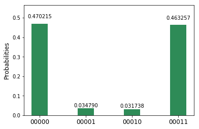
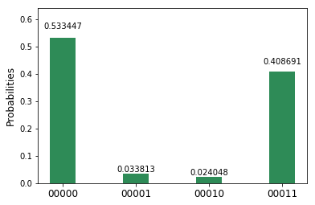
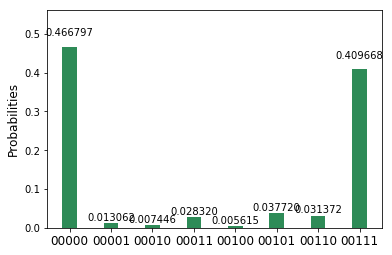
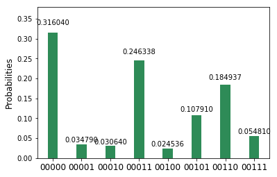
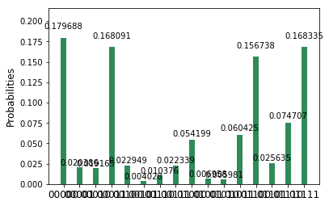
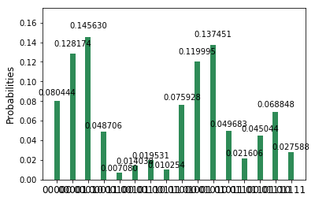
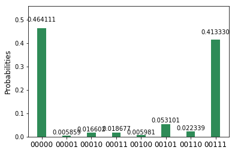

==========================
Entanglement Revisited
==========================

For more information about how to use the IBM Q experience (QX), consult
the
`tutorials <https://quantumexperience.ng.bluemix.net/qstage/#/tutorial?sectionId=c59b3710b928891a1420190148a72cce&pageIndex=0>`__,
or check out the
`community <https://quantumexperience.ng.bluemix.net/qstage/#/community>`__.

Contributors
============

Jay Gambetta, Antonio Córcoles

Entanglement
============

In :doc:`superposition and entanglement
<superposition_and_entanglement>`, we introduced you to the quantum
concept of entanglement. We made the quantum state
:math:`|\psi\rangle= (|00\rangle+|11\rangle)/\sqrt{2}` and showed that
(accounting for experimental noise) the system has perfect
correlations in both the computational and the superposition
bases. This means if :math:`q_0` is measured in state
:math:`|0\rangle`, we know :math:`q_1` is in the same state; likewise,
if :math:`q_0` is measured in state :math:`|+\rangle`, we know
:math:`q_1` is also in the same state.

To understand the implications of this in more detail, we will look at
the following topics in this notebook: \* `Two-Qubit Correlated
Observables <#section1>`__ \* `CHSH Inequality <#section2>`__ \* `Two-,
Three-, and Four-Qubit GHZ States <#section3>`__ \* `Mermin's Test and
the Three Box Game <#section4>`__

Two-Qubit Correlated Observables
================================

An observable is a Hermitian matrix where the real eigenvalues represent
the outcome of the experiment, and the eigenvectors are the states to
which the system is projected under measurement. That is, an observable
:math:`A` is given by

.. math::   A = \sum_j a_j|a_j\rangle\langle a_j|

where :math:`|a_j\rangle` is the eigenvector of the observable with
result :math:`a_j`. The expectation value of this observable is given by

.. math:: \langle  A \rangle  = \sum_j a_j |\langle \psi  |a_j\rangle|^2  = \sum_j a_j \mathrm{Pr}(a_j|\psi).

We can see there is the standard relationship between average
(expectation value) and probability.

For a two-qubit system, the following are important two-outcome
(:math:`\pm1`) single-qubit observables:

.. math::  Z= |0\rangle\langle 0| - |1\rangle\langle 1|

.. math::  X= |+\rangle\langle +| - |-\rangle\langle -|

These are also commonly referred to as the Pauli :math:`Z` and :math:`X`
operators. These can be further extended to the two-qubit space to give

.. math:: \langle  I\otimes  Z\rangle =\mathrm{Pr}(00|\psi) - \mathrm{Pr}(01|\psi) +  \mathrm{Pr}(10|\psi)- \mathrm{Pr}(11|\psi)

.. math:: \langle  Z\otimes  I\rangle =\mathrm{Pr}(00|\psi) + \mathrm{Pr}(01|\psi) -  \mathrm{Pr}(10|\psi)- \mathrm{Pr}(11|\psi)

.. math:: \langle  Z\otimes  Z\rangle =\mathrm{Pr}(00|\psi) - \mathrm{Pr}(01|\psi) -  \mathrm{Pr}(10|\psi)+ \mathrm{Pr}(11|\psi)

.. math:: \langle  I\otimes  X\rangle =\mathrm{Pr}(++|\psi) - \mathrm{Pr}(+-|\psi) +  \mathrm{Pr}(-+|\psi)- \mathrm{Pr}(--|\psi)

.. math:: \langle  X\otimes  I\rangle =\mathrm{Pr}(++|\psi) + \mathrm{Pr}(+-|\psi) -  \mathrm{Pr}(-+|\psi)- \mathrm{Pr}(--|\psi)

.. math:: \langle  X\otimes  X\rangle =\mathrm{Pr}(++|\psi) - \mathrm{Pr}(+-|\psi) -  \mathrm{Pr}(-+|\psi)+ \mathrm{Pr}(--|\psi)

.. math:: \langle  Z\otimes  X\rangle =\mathrm{Pr}(0+|\psi) - \mathrm{Pr}(0-|\psi) -  \mathrm{Pr}(1+|\psi)+ \mathrm{Pr}(1-|\psi)

.. math:: \langle  X\otimes  Z\rangle =\mathrm{Pr}(+0|\psi) - \mathrm{Pr}(+1|\psi) -  \mathrm{Pr}(-0|\psi)+ \mathrm{Pr}(-1|\psi)

.. code:: ipython3

    # Checking the version of PYTHON; we only support 3 at the moment
    import sys
    if sys.version_info < (3,0):
        raise Exception("Please use Python version 3 or greater.")
        
    # useful additional packages 
    import matplotlib.pyplot as plt
    %matplotlib inline
    import numpy as np
    
    
    import sys
    sys.path.append("../../")
    # importing the QISKit
    from qiskit import QuantumCircuit, QuantumProgram
    import Qconfig
    
    # import basic plot tools
    from qiskit.basicplotter import plot_histogram

Recall that to make the Bell state
:math:`|\psi\rangle= (|00\rangle+|11\rangle)/\sqrt{2}` from the initial
state :math:`|00\rangle`, the quantum circuit first applies a Hadamard
on :math:`q_0`, followed by a CNOT from :math:`q_0` to :math:`q_1`. On
the IBM Q experience, this can done by using the script below to measure
the above expectation values; we run four different experiments with
measurements in the standard basis, superposition basis, and a
combination of both.

.. code:: ipython3

    device = 'ibmqx2' # the device to run on
    shots = 1024    # the number of shots in the experiment 
    # device = 'simulator' # the device test purpose
    
    QPS_SPECS = {
        "name": "Entanglement",
        "circuits": [{
            "name": "bell",
            "quantum_registers": [{
                "name":"q",
                "size":2
            }],
            "classical_registers": [{
                "name":"c",
                "size":2
            }]}],
    }
    
    Q_program = QuantumProgram(specs=QPS_SPECS)
    Q_program.set_api(Qconfig.APItoken, Qconfig.config["url"])
    
    # quantum circuit to make Bell state 
    bell = Q_program.get_circuit("bell")
    q = Q_program.get_quantum_registers("q")
    c = Q_program.get_classical_registers('c')
    
    bell.h(q[0])
    bell.cx(q[0],q[1])
    
    # quantum circuit to measure q in standard basis 
    measureZZ = Q_program.create_circuit("measureZZ", ["q"], ["c"])
    measureZZ.measure(q[0], c[0])
    measureZZ.measure(q[1], c[1])
    
    # quantum circuit to measure q in superposition basis 
    measureXX = Q_program.create_circuit("measureXX", ["q"], ["c"])
    measureXX.h(q[0])
    measureXX.h(q[1])
    measureXX.measure(q[0], c[0])
    measureXX.measure(q[1], c[1])
    
    # quantum circuit to measure ZX
    measureZX = Q_program.create_circuit("measureZX", ["q"], ["c"])
    measureZX.h(q[0])
    measureZX.measure(q[0], c[0])
    measureZX.measure(q[1], c[1])
    
    # quantum circuit to measure XZ
    measureXZ = Q_program.create_circuit("measureXZ", ["q"], ["c"])
    measureXZ.h(q[1])
    measureXZ.measure(q[0], c[0])
    measureXZ.measure(q[1], c[1])

.. parsed-literal::

    >> quantum_registers created: q 2
    >> classical_registers created: c 2

.. parsed-literal::

    <qiskit._measure.Measure at 0x10da47e10>

.. code:: ipython3

    Q_program.add_circuit("bell_measureZX", bell+measureZX )
    Q_program.add_circuit("bell_measureXZ", bell+measureXZ )
    Q_program.add_circuit("bell_measureZZ", bell+measureZZ )
    Q_program.add_circuit("bell_measureXX", bell+measureXX )
    
    circuits = ["bell_measureZZ", "bell_measureZX", "bell_measureXX", "bell_measureXZ"]
    Q_program.get_qasms(circuits)

.. parsed-literal::

    ['OPENQASM 2.0;\ninclude "qelib1.inc";\nqreg q[2];\ncreg c[2];\nh q[0];\ncx q[0],q[1];\nmeasure q[0] -> c[0];\nmeasure q[1] -> c[1];\n',
     'OPENQASM 2.0;\ninclude "qelib1.inc";\nqreg q[2];\ncreg c[2];\nh q[0];\ncx q[0],q[1];\nh q[0];\nmeasure q[0] -> c[0];\nmeasure q[1] -> c[1];\n',
     'OPENQASM 2.0;\ninclude "qelib1.inc";\nqreg q[2];\ncreg c[2];\nh q[0];\ncx q[0],q[1];\nh q[0];\nh q[1];\nmeasure q[0] -> c[0];\nmeasure q[1] -> c[1];\n',
     'OPENQASM 2.0;\ninclude "qelib1.inc";\nqreg q[2];\ncreg c[2];\nh q[0];\ncx q[0],q[1];\nh q[1];\nmeasure q[0] -> c[0];\nmeasure q[1] -> c[1];\n']

.. code:: ipython3

    Q_program.execute(circuits, device, shots, max_credits=3, wait=10, timeout=240)

.. parsed-literal::

    running on backend: ibmqx2
    status = RUNNING (10 seconds)
    status = RUNNING (20 seconds)

.. parsed-literal::

    {'result': 'all done', 'status': 'COMPLETED'}

.. code:: ipython3

    ### THIS IS A KNOWN BUG AND WHEN WE FIX THE RETURN FROM THE REAL DEVICE WE WILL ONLY HAVE ONE SET OF OBSERVABLES
    
    observable_first ={'00000': 1, '00001': -1, '00010': 1, '00011': -1}
    observable_second ={'00000': 1, '00001': 1, '00010': -1, '00011': -1}
    observable_correlated ={'00000': 1, '00001': -1, '00010': -1, '00011': 1}
    
    observable_first_ideal ={'00': 1, '01': -1, '10': 1, '11': -1}
    observable_second_ideal ={'00': 1, '01': 1, '10': -1, '11': -1}
    observable_correlated_ideal ={'00': 1, '01': -1, '10': -1, '11': 1}

.. code:: ipython3

    print("IZ = " + str(Q_program.average_data("bell_measureZZ",observable_first)))
    print("ZI = " + str(Q_program.average_data("bell_measureZZ",observable_second)))
    print("ZZ = " + str(Q_program.average_data("bell_measureZZ",observable_correlated)))
    
    print("IX = " + str(Q_program.average_data("bell_measureXX",observable_first)))
    print("XI = " + str(Q_program.average_data("bell_measureXX",observable_second)))
    print("XX = " + str(Q_program.average_data("bell_measureXX",observable_correlated)))
    
    print("ZX = " + str(Q_program.average_data("bell_measureZX",observable_correlated)))
    print("XZ = " + str(Q_program.average_data("bell_measureXZ",observable_correlated)))

.. parsed-literal::

    IZ = 0.025390625
    ZI = 0.015625
    ZZ = 0.857421875
    IX = 0.05859375
    XI = 0.07421875
    XX = 0.875
    ZX = 0.0
    XZ = 0.025390625

Here we see that for the state
:math:`|\psi\rangle= (|00\rangle+|11\rangle)/\sqrt{2}`, expectation
values (within experimental errors) are

+--------------+------------------+--------------+------------------+--------------+------------------+
| Observable   | Expected value   | Observable   | Expected value   | Observable   | Expected value   |
+==============+==================+==============+==================+==============+==================+
| ZZ           | 1                | XX           | 1                | ZX           | 0                |
+--------------+------------------+--------------+------------------+--------------+------------------+
| ZI           | 0                | XI           | 0                | XZ           | 0                |
+--------------+------------------+--------------+------------------+--------------+------------------+
| IZ           | 0                | IX           | 0                |              |                  |
+--------------+------------------+--------------+------------------+--------------+------------------+

How do we explain this situation? Here we introduce the concept of a
*hidden variable model*. If we assume there is a hidden variable
:math:`\lambda` and follow these two assumptions:

-  *Locality*: No information can travel faster than the speed of light.
   There is a hidden variable :math:`\lambda` that defines all the
   correlations so that

   .. math:: \langle A\otimes B\rangle = \sum_\lambda P(\lambda) A(\lambda) B(\lambda)

-  *Realism*: All observables have a definite value independent of the
   measurement (:math:`A(\lambda)=\pm1` etc.).

then can we describe these observations? --- The answer is yes!

Assume :math:`\lambda` has two bits, each occurring randomly with
probably 1/4. The following predefined table would then explain all the
above observables:

+-------------------+---------------+---------------+---------------+---------------+
| :math:`\lambda`   | Z (qubit 1)   | Z (qubit 2)   | X (qubit 1)   | X (qubit 2)   |
+===================+===============+===============+===============+===============+
| 00                | 1             | 1             | 1             | 1             |
+-------------------+---------------+---------------+---------------+---------------+
| 01                | 1             | 1             | -1            | -1            |
+-------------------+---------------+---------------+---------------+---------------+
| 10                | -1            | -1            | -1            | -1            |
+-------------------+---------------+---------------+---------------+---------------+
| 11                | -1            | -1            | 1             | 1             |
+-------------------+---------------+---------------+---------------+---------------+

Thus, with a purely classical hidden variable model, we are able to
reconcile the measured observations we had for this particular Bell
state. However, there are some states for which this model will not
hold. This was first observed by John Stewart Bell in 1964. He proposed
a theorem that suggests that there are no hidden variables in quantum
mechanics. At the core of Bell's theorem is the famous Bell inequality.
Here, we'll use a refined version of this inequality (known as the CHSH
inequality, derived by John Clauser, Michael Horne, Abner Shimony, and
Richard Holt in 1969) to demonstrate Bell's proposal.

CHSH Inequality
===============

In the CHSH inequality, we measure the correlator of four observables:
:math:`A` and :math:`A'` on :math:`q_0`, and :math:`B` and :math:`B'` on
:math:`q_1`, which have eigenvalues :math:`\pm 1`. The CHSH inequality
says that no local hidden variable theory can have

.. math:: |C|>2

where

.. math:: C = \langle B\otimes A\rangle + \langle B\otimes A'\rangle+\langle B'\otimes A'\rangle-\langle B'\otimes A\rangle.

What would this look like with some hidden variable model under the
locality and realism assumptions from above? :math:`C` then becomes

.. math:: C = \sum_\lambda P(\lambda) \{ B(\lambda) [ A(\lambda)+A'(\lambda)] + B'(\lambda) [ A'(\lambda)-A(\lambda)]

and :math:`[A(\lambda)+A'(\lambda)]=2` (or 0) while
:math:`[A'(\lambda)-A(\lambda)]=0` (or 2) respectively. That is,
:math:`|C|=2`, and noise will only make this smaller.

If we measure a number greater than 2, the above assumptions cannot be
valid. (This is a perfect example of one of those astonishing
counterintuitive ideas one must accept in the quantum world.) For
simplicity, we choose these observables to be

.. math:: C = \langle Z\otimes Z\rangle + \langle Z\otimes X\rangle+\langle X\otimes X\rangle-\langle X\otimes Z\rangle.

:math:`Z` is measured in the computational basis, and :math:`X` in the
superposition basis (:math:`H` is applied before measurement). The input
state

.. math:: |\psi(\theta)\rangle = I\otimes Y(\theta)\frac{|00\rangle + |11\rangle}{\sqrt(2)} = \frac{\cos(\theta/2)|00\rangle + \cos(\theta/2)|11\rangle+\sin(\theta/2)|01\rangle-\sin(\theta/2)|10\rangle}{\sqrt{2}}

is swept vs. :math:`\theta` (think of this as allowing us to prepare a
varying set of states varying in the angle :math:`\theta`).

Note that the following demonstration of CHSH is not loophole-free.

.. code:: ipython3

    CHSH = lambda x : x[0]+x[1]+x[2]-x[3]

.. code:: ipython3

    device = 'local_qasm_simulator'
    shots = 8192
    
    program = []
    xdata=[]
    
    program_end = [measureZZ, measureZX, measureXX, measureXZ]
    
    k = 0
    for jj in range(30):
        theta = 2.0*np.pi*jj/30
        bell_middle = QuantumCircuit(q,c)
        bell_middle.ry(theta,q[0])
        for i in range(4):
            program.append("circuit"+str(k))
            Q_program.add_circuit("circuit"+str(k), bell+bell_middle+program_end[i] )
            k += 1
            
        xdata.append(theta)

.. code:: ipython3

    Q_program.get_qasms(program[0:8])

.. parsed-literal::

    ['OPENQASM 2.0;\ninclude "qelib1.inc";\nqreg q[2];\ncreg c[2];\nh q[0];\ncx q[0],q[1];\nry(0.000000000000000) q[0];\nmeasure q[0] -> c[0];\nmeasure q[1] -> c[1];\n',
     'OPENQASM 2.0;\ninclude "qelib1.inc";\nqreg q[2];\ncreg c[2];\nh q[0];\ncx q[0],q[1];\nry(0.000000000000000) q[0];\nh q[0];\nmeasure q[0] -> c[0];\nmeasure q[1] -> c[1];\n',
     'OPENQASM 2.0;\ninclude "qelib1.inc";\nqreg q[2];\ncreg c[2];\nh q[0];\ncx q[0],q[1];\nry(0.000000000000000) q[0];\nh q[0];\nh q[1];\nmeasure q[0] -> c[0];\nmeasure q[1] -> c[1];\n',
     'OPENQASM 2.0;\ninclude "qelib1.inc";\nqreg q[2];\ncreg c[2];\nh q[0];\ncx q[0],q[1];\nry(0.000000000000000) q[0];\nh q[1];\nmeasure q[0] -> c[0];\nmeasure q[1] -> c[1];\n',
     'OPENQASM 2.0;\ninclude "qelib1.inc";\nqreg q[2];\ncreg c[2];\nh q[0];\ncx q[0],q[1];\nry(0.209439510239320) q[0];\nmeasure q[0] -> c[0];\nmeasure q[1] -> c[1];\n',
     'OPENQASM 2.0;\ninclude "qelib1.inc";\nqreg q[2];\ncreg c[2];\nh q[0];\ncx q[0],q[1];\nry(0.209439510239320) q[0];\nh q[0];\nmeasure q[0] -> c[0];\nmeasure q[1] -> c[1];\n',
     'OPENQASM 2.0;\ninclude "qelib1.inc";\nqreg q[2];\ncreg c[2];\nh q[0];\ncx q[0],q[1];\nry(0.209439510239320) q[0];\nh q[0];\nh q[1];\nmeasure q[0] -> c[0];\nmeasure q[1] -> c[1];\n',
     'OPENQASM 2.0;\ninclude "qelib1.inc";\nqreg q[2];\ncreg c[2];\nh q[0];\ncx q[0],q[1];\nry(0.209439510239320) q[0];\nh q[1];\nmeasure q[0] -> c[0];\nmeasure q[1] -> c[1];\n']

.. code:: ipython3

    Q_program.execute(program, device, shots, max_credits=3, wait=10, timeout=240)

.. parsed-literal::

    running on backend: local_qasm_simulator

.. parsed-literal::

    {'result': 'all done', 'status': 'COMPLETED'}

.. code:: ipython3

    CHSH_data_sim = []
    k = 0
    for j in range(len(xdata)):
        temp=[]
        for i in range(4): 
            temp.append(Q_program.average_data("circuit"+str(k),observable_correlated_ideal))
            k += 1
        CHSH_data_sim.append(CHSH(temp))

.. code:: ipython3

    device = 'ibmqx2'
    shots = 1024
    
    program_real = []
    xdata_real=[]
    
    k = 0
    for jj in range(10):
        theta = 2.0*np.pi*jj/10
        bell_middle = QuantumCircuit(q,c)
        bell_middle.ry(theta,q[0])
        for i in range(4):
            program_real.append("circuit_real"+str(k))
            Q_program.add_circuit("circuit_real"+str(k), bell+bell_middle+program_end[i] )
            k += 1
            
        xdata_real.append(theta)

.. code:: ipython3

    Q_program.execute(program_real, device, shots, max_credits=3, wait=10, timeout=240)

.. parsed-literal::

    running on backend: ibmqx2
    status = RUNNING (10 seconds)
    status = RUNNING (20 seconds)
    status = RUNNING (30 seconds)
    status = RUNNING (40 seconds)
    status = RUNNING (50 seconds)
    status = RUNNING (60 seconds)

.. parsed-literal::

    {'result': 'all done', 'status': 'COMPLETED'}

.. code:: ipython3

    Q_program.get_qasms(program_real[0:8])

.. parsed-literal::

    ['OPENQASM 2.0;\ninclude "qelib1.inc";\nqreg q[2];\ncreg c[2];\nh q[0];\ncx q[0],q[1];\nry(0.000000000000000) q[0];\nmeasure q[0] -> c[0];\nmeasure q[1] -> c[1];\n',
     'OPENQASM 2.0;\ninclude "qelib1.inc";\nqreg q[2];\ncreg c[2];\nh q[0];\ncx q[0],q[1];\nry(0.000000000000000) q[0];\nh q[0];\nmeasure q[0] -> c[0];\nmeasure q[1] -> c[1];\n',
     'OPENQASM 2.0;\ninclude "qelib1.inc";\nqreg q[2];\ncreg c[2];\nh q[0];\ncx q[0],q[1];\nry(0.000000000000000) q[0];\nh q[0];\nh q[1];\nmeasure q[0] -> c[0];\nmeasure q[1] -> c[1];\n',
     'OPENQASM 2.0;\ninclude "qelib1.inc";\nqreg q[2];\ncreg c[2];\nh q[0];\ncx q[0],q[1];\nry(0.000000000000000) q[0];\nh q[1];\nmeasure q[0] -> c[0];\nmeasure q[1] -> c[1];\n',
     'OPENQASM 2.0;\ninclude "qelib1.inc";\nqreg q[2];\ncreg c[2];\nh q[0];\ncx q[0],q[1];\nry(0.628318530717959) q[0];\nmeasure q[0] -> c[0];\nmeasure q[1] -> c[1];\n',
     'OPENQASM 2.0;\ninclude "qelib1.inc";\nqreg q[2];\ncreg c[2];\nh q[0];\ncx q[0],q[1];\nry(0.628318530717959) q[0];\nh q[0];\nmeasure q[0] -> c[0];\nmeasure q[1] -> c[1];\n',
     'OPENQASM 2.0;\ninclude "qelib1.inc";\nqreg q[2];\ncreg c[2];\nh q[0];\ncx q[0],q[1];\nry(0.628318530717959) q[0];\nh q[0];\nh q[1];\nmeasure q[0] -> c[0];\nmeasure q[1] -> c[1];\n',
     'OPENQASM 2.0;\ninclude "qelib1.inc";\nqreg q[2];\ncreg c[2];\nh q[0];\ncx q[0],q[1];\nry(0.628318530717959) q[0];\nh q[1];\nmeasure q[0] -> c[0];\nmeasure q[1] -> c[1];\n']

.. code:: ipython3

    CHSH_data_real = []
    k = 0
    for j in range(len(xdata_real)):
        temp=[]
        for i in range(4): 
            temp.append(Q_program.average_data("circuit_real"+str(k),observable_correlated))
            k += 1
        CHSH_data_real.append(CHSH(temp))

.. code:: ipython3

    plt.plot(xdata, CHSH_data_sim, 'r-', xdata_real, CHSH_data_real, 'bo')
    plt.plot([0, 2*np.pi], [2, 2], 'b-')
    plt.plot([0, 2*np.pi], [-2, -2], 'b-')
    plt.grid()
    plt.ylabel('CHSH', fontsize=20)
    plt.xlabel(r'$Y(\theta)$', fontsize=20)
    plt.show()

.. image:: entanglement_revisited_files/entanglement_revisited_22_0.png

The resulting graph created by running the previous cell compares the
simulated data (sinusoidal line) and the data from the real experiment.
The graph also gives lines at :math:`\pm 2` for reference. Did you
violate the hidden variable model?

Here is the saved CHSH data.

.. code:: ipython3

    print(CHSH_data_real)

.. parsed-literal::

    [1.74609375, 2.462890625, 2.138671875, 1.15234375, -0.349609375, -1.736328125, -2.39453125, -2.123046875, -1.123046875, 0.365234375]

Despite the presence of loopholes in our demonstration, we can see that
this experiment is compatible with quantum mechanics as a theory with no
local hidden variables. See the original experimental demonstrations of
this test with superconducting qubits
`here <https://arstechnica.com/science/2017/05/quantum-volume-one-number-to-benchmark-a-quantum-computer/>`__
and
`here <https://journals.aps.org/pra/abstract/10.1103/PhysRevA.81.062325>`__.

Two-, Three-, and Four-Qubit GHZ States
=======================================

What does entanglement look like beyond two qubits? An important set of
maximally entangled states are known as GHZ states (named after
Greenberger, Horne, and Zeilinger). These are the states of the form
:math:`|\psi\rangle = \left (|0...0\rangle+|1...1\rangle\right)/\sqrt{2}`.
The Bell state previously described is merely a two-qubit version of a
GHZ state. The next cells prepare GHZ states of two, three, and four
qubits.

.. code:: ipython3

    # 2 - qubits 
    shots = 8192
    device = 'ibmqx2'
    # device = 'simulator' # the device test purpose 
    
    # quantum circuit to make GHZ state
    q = Q_program.create_quantum_registers("q", 2)
    c = Q_program.create_classical_registers("c", 2)
    ghz = Q_program.create_circuit("ghz", ["q"], ["c"])
    ghz.h(q[0])
    ghz.cx(q[0],q[1])
    
    # quantum circuit to measure q in standard basis 
    measureZZ = Q_program.create_circuit("measureZZ", ["q"], ["c"])
    measureZZ.measure(q[0], c[0])
    measureZZ.measure(q[1], c[1])
    
    measureXX = Q_program.create_circuit("measureXX", ["q"], ["c"])
    measureXX.h(q[0])
    measureXX.h(q[1])
    measureXX.measure(q[0], c[0])
    measureXX.measure(q[1], c[1])
    
    Q_program.add_circuit("ghz_measureZZ", ghz+measureZZ )
    Q_program.add_circuit("ghz_measureXX", ghz+measureXX )
    circuits = ["ghz_measureZZ", "ghz_measureXX"]
    Q_program.get_qasms(circuits)
    
    Q_program.execute(circuits, device, shots, max_credits=5, wait=10, timeout=240)
    plot_histogram(Q_program.get_counts("ghz_measureZZ"))
    plot_histogram(Q_program.get_counts("ghz_measureXX"))

.. parsed-literal::

    >> quantum_registers created: q 2
    >> classical_registers created: c 2
    running on backend: ibmqx2
    status = RUNNING (10 seconds)
    status = RUNNING (20 seconds)
    status = RUNNING (30 seconds)
    status = RUNNING (40 seconds)
    status = RUNNING (50 seconds)
    status = RUNNING (60 seconds)
    status = RUNNING (70 seconds)
    status = RUNNING (80 seconds)
    status = RUNNING (90 seconds)

.. code:: ipython3

    # 3 - qubits 
    shots = 8192
    # quantum circuit to make GHZ state 
    q = Q_program.create_quantum_registers("q", 3)
    c = Q_program.create_classical_registers("c", 3)
    ghz = Q_program.create_circuit("ghz", ["q"], ["c"])
    ghz.h(q[0])
    ghz.cx(q[0],q[1])
    ghz.cx(q[1],q[2])
    
    # quantum circuit to measure q in standard basis 
    measureZZZ = Q_program.create_circuit("measureZZZ", ["q"], ["c"])
    measureZZZ.measure(q[0], c[0])
    measureZZZ.measure(q[1], c[1])
    measureZZZ.measure(q[2], c[2])
    
    measureXXX = Q_program.create_circuit("measureXXX", ["q"], ["c"])
    measureXXX.h(q[0])
    measureXXX.h(q[1])
    measureXXX.h(q[2])
    measureXXX.measure(q[0], c[0])
    measureXXX.measure(q[1], c[1])
    measureXXX.measure(q[2], c[2])
    
    Q_program.add_circuit("ghz_measureZZZ", ghz+measureZZZ )
    Q_program.add_circuit("ghz_measureXXX", ghz+measureXXX )
    circuits = ["ghz_measureZZZ", "ghz_measureXXX"]
    Q_program.get_qasms(circuits)
    Q_program.execute(circuits, device, shots, max_credits=5, wait=10, timeout=240)
    plot_histogram(Q_program.get_counts("ghz_measureZZZ"))
    plot_histogram(Q_program.get_counts("ghz_measureXXX"))

.. parsed-literal::

    >> quantum_registers created: q 3
    >> classical_registers created: c 3
    running on backend: ibmqx2
    status = RUNNING (10 seconds)
    status = RUNNING (20 seconds)
    status = RUNNING (30 seconds)
    status = RUNNING (40 seconds)
    status = RUNNING (50 seconds)
    status = RUNNING (60 seconds)
    status = RUNNING (70 seconds)
    status = RUNNING (80 seconds)
    status = RUNNING (90 seconds)
    status = RUNNING (100 seconds)
    status = RUNNING (110 seconds)
    status = RUNNING (120 seconds)

.. code:: ipython3

    # 4 - qubits 
    shots = 8192
    # quantum circuit to make GHZ state 
    q = Q_program.create_quantum_registers("q", 4)
    c = Q_program.create_classical_registers("c", 4)
    ghz = Q_program.create_circuit("ghz", ["q"], ["c"])
    ghz.h(q[0])
    ghz.cx(q[0],q[1])
    ghz.cx(q[1],q[2])
    ghz.h(q[3])
    ghz.h(q[2])
    ghz.cx(q[3],q[2])
    ghz.h(q[3])
    ghz.h(q[2])
    
    # quantum circuit to measure q in standard basis 
    measureZZZZ = Q_program.create_circuit("measureZZZZ", ["q"], ["c"])
    measureZZZZ.measure(q[0], c[0])
    measureZZZZ.measure(q[1], c[1])
    measureZZZZ.measure(q[2], c[2])
    measureZZZZ.measure(q[3], c[3])
    
    measureXXXX = Q_program.create_circuit("measureXXXX", ["q"], ["c"])
    measureXXXX.h(q[0])
    measureXXXX.h(q[1])
    measureXXXX.h(q[2])
    measureXXXX.h(q[3])
    measureXXXX.measure(q[0], c[0])
    measureXXXX.measure(q[1], c[1])
    measureXXXX.measure(q[2], c[2])
    measureXXXX.measure(q[3], c[3])
    
    Q_program.add_circuit("ghz_measureZZZZ", ghz+measureZZZZ )
    Q_program.add_circuit("ghz_measureXXXX", ghz+measureXXXX )
    circuits = ["ghz_measureZZZZ", "ghz_measureXXXX"]
    Q_program.get_qasms(circuits)
    Q_program.execute(circuits, device, shots, max_credits=5, wait=10, timeout=240)
    plot_histogram(Q_program.get_counts("ghz_measureZZZZ"))
    plot_histogram(Q_program.get_counts("ghz_measureXXXX"))

.. parsed-literal::

    >> quantum_registers created: q 4
    >> classical_registers created: c 4
    running on backend: ibmqx2
    status = RUNNING (10 seconds)
    status = RUNNING (20 seconds)
    status = RUNNING (30 seconds)
    status = RUNNING (40 seconds)
    status = RUNNING (50 seconds)
    status = RUNNING (60 seconds)
    status = RUNNING (70 seconds)
    status = RUNNING (80 seconds)
    status = RUNNING (90 seconds)
    status = RUNNING (100 seconds)
    status = RUNNING (110 seconds)
    status = RUNNING (120 seconds)
    status = RUNNING (130 seconds)
    status = RUNNING (140 seconds)
    status = RUNNING (150 seconds)
    status = RUNNING (160 seconds)
    status = RUNNING (170 seconds)
    status = RUNNING (180 seconds)
    status = RUNNING (190 seconds)

Mermin's Test and the Three Box Game
====================================

In case the violation of Bell's inequality (CHSH) by two qubits is not
enough to convince you to believe in quantum mechanics, we can
generalize to a more stringent set of tests with three qubits, which can
give a single-shot violation (rather than taking averaged statistics). A
well-known three-qubit case is Mermin's inequality, which is a test we
can perform on GHZ states.

An example of a three-qubit GHZ state is
:math:`|\psi\rangle = \left (|000\rangle+|111\rangle\right)/\sqrt{2}`.
You can see this is a further generalization of a Bell state and, if
measured, should give :math:`|000\rangle` half the time and
:math:`|111 \rangle` the other half of the time.

.. code:: ipython3

    # quantum circuit to make GHZ state 
    q = Q_program.create_quantum_registers("q", 3)
    c = Q_program.create_classical_registers("c", 3)
    ghz = Q_program.create_circuit("ghz", ["q"], ["c"])
    ghz.h(q[0])
    ghz.cx(q[0],q[1])
    ghz.cx(q[0],q[2])
    
    # quantum circuit to measure q in standard basis 
    measureZZZ = Q_program.create_circuit("measureZZZ", ["q"], ["c"])
    measureZZZ.measure(q[0], c[0])
    measureZZZ.measure(q[1], c[1])
    measureZZZ.measure(q[2], c[2])
    
    Q_program.add_circuit("ghz_measureZZZ", ghz+measureZZZ )
    circuits = ["ghz_measureZZZ"]
    Q_program.get_qasms(circuits)
    Q_program.execute(circuits, device, shots, max_credits=5, wait=10, timeout=240)
    plot_histogram(Q_program.get_counts("ghz_measureZZZ"))

.. parsed-literal::

    >> quantum_registers created: q 3
    >> classical_registers created: c 3
    running on backend: ibmqx2
    status = RUNNING (10 seconds)
    status = RUNNING (20 seconds)
    status = RUNNING (30 seconds)
    status = RUNNING (40 seconds)
    status = RUNNING (50 seconds)
    status = RUNNING (60 seconds)
    status = RUNNING (70 seconds)
    status = RUNNING (80 seconds)
    status = RUNNING (90 seconds)
    status = RUNNING (100 seconds)
    status = RUNNING (110 seconds)

Suppose we have three independent systems, :math:`\{A, B, C\}`, for
which we can query two particular questions (observables) :math:`X` and
:math:`Y`. In each case, either query can give :math:`+1` or :math:`-1`.
Consider whether it is possible to choose some state of the three boxes
such that we can satisfy the following four conditions:
:math:`X_A Y_B Y_C = 1`, :math:`Y_A X_B Y_C =1`,
:math:`Y_A Y_B X_C = 1`, and :math:`X_A X_B X_C = -1`. Classically, this
can be shown to be impossible... but a three-qubit GHZ state can in fact
satisfy all four conditions.

.. code:: ipython3

    MerminM = lambda x : x[0]*x[1]*x[2]*x[3]

.. code:: ipython3

    observable ={'00000': 1, '00001': -1, '00010': -1, '00011': 1, '00100': -1, '00101': 1, '00110': 1, '00111': -1}

.. code:: ipython3

    # quantum circuit to measure q XXX 
    measureXXX = Q_program.create_circuit("measureXXX", ["q"], ["c"])
    measureXXX.h(q[0])
    measureXXX.h(q[1])
    measureXXX.h(q[2])
    measureXXX.measure(q[0], c[0])
    measureXXX.measure(q[1], c[1])
    measureXXX.measure(q[2], c[2])
    
    # quantum circuit to measure q XYY
    measureXYY = Q_program.create_circuit("measureXYY", ["q"], ["c"])
    measureXYY.s(q[1]).inverse()
    measureXYY.s(q[2]).inverse()
    measureXYY.h(q[0])
    measureXYY.h(q[1])
    measureXYY.h(q[2])
    measureXYY.measure(q[0], c[0])
    measureXYY.measure(q[1], c[1])
    measureXYY.measure(q[2], c[2])
    
    # quantum circuit to measure q YXY
    measureYXY = Q_program.create_circuit("measureYXY", ["q"], ["c"])
    measureYXY.s(q[0]).inverse()
    measureYXY.s(q[2]).inverse()
    measureYXY.h(q[0])
    measureYXY.h(q[1])
    measureYXY.h(q[2])
    measureYXY.measure(q[0], c[0])
    measureYXY.measure(q[1], c[1])
    measureYXY.measure(q[2], c[2])
    
    # quantum circuit to measure q YYX
    measureYYX = Q_program.create_circuit("measureYYX", ["q"], ["c"])
    measureYYX.s(q[0]).inverse()
    measureYYX.s(q[1]).inverse()
    measureYYX.h(q[0])
    measureYYX.h(q[1])
    measureYYX.h(q[2])
    measureYYX.measure(q[0], c[0])
    measureYYX.measure(q[1], c[1])
    measureYYX.measure(q[2], c[2])
    
    Q_program.add_circuit("ghz_measureXXX", ghz+measureXXX )
    Q_program.add_circuit("ghz_measureYYX", ghz+measureYYX )
    Q_program.add_circuit("ghz_measureYXY", ghz+measureYXY )
    Q_program.add_circuit("ghz_measureXYY", ghz+measureXYY )
    
    circuits = ["ghz_measureXXX", "ghz_measureYYX", "ghz_measureYXY", "ghz_measureXYY"]
    Q_program.get_qasms(circuits)
    Q_program.execute(circuits, device, shots, max_credits=5, wait=10, timeout=240)

.. parsed-literal::

    running on backend: ibmqx2
    status = RUNNING (10 seconds)
    status = RUNNING (20 seconds)
    status = RUNNING (30 seconds)
    status = RUNNING (40 seconds)
    status = RUNNING (50 seconds)
    status = RUNNING (60 seconds)
    status = RUNNING (70 seconds)
    status = RUNNING (80 seconds)
    status = RUNNING (90 seconds)
    status = RUNNING (100 seconds)
    status = RUNNING (110 seconds)
    status = RUNNING (120 seconds)
    status = RUNNING (130 seconds)
    status = RUNNING (140 seconds)

.. parsed-literal::

    {'result': 'all done', 'status': 'COMPLETED'}

.. code:: ipython3

    temp=[]
    temp.append(Q_program.average_data("ghz_measureXXX",observable))
    temp.append(Q_program.average_data("ghz_measureYYX",observable))
    temp.append(Q_program.average_data("ghz_measureYXY",observable))
    temp.append(Q_program.average_data("ghz_measureXYY",observable))
    print(MerminM(temp))

.. parsed-literal::

    -0.1933898929106448

The above shows that the average statistics are not consistent with a
local hidden variable theory. To demonstrate with single shots, we can
run 50 single experiments, with each experiment chosen randomly, and the
outcomes saved. If there was a local hidden variable theory, all the
outcomes would be :math:`+1`.

