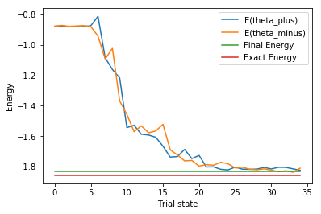
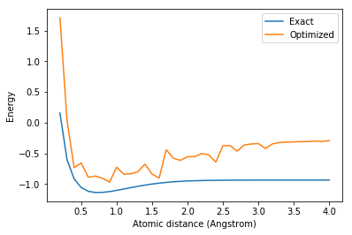

=================================================
VQE algorithm: Application to quantum chemistry
=================================================

The latest version of this notebook is available on
https://github.com/IBM/qiskit-sdk-py/tree/master/scripts.

For more information about how to use the IBM Q Experience (QX), consult
the `Quantum Experience
tutorials <https://quantumexperience.ng.bluemix.net/qstage/#/tutorial?sectionId=c59b3710b928891a1420190148a72cce&pageIndex=0>`__,
or check out the
`community <https://quantumexperience.ng.bluemix.net/qstage/#/community>`__.

Contributors
============

Antonio Mezzacapo, Jay Gambetta, others

Introduction
============

One of the earliest and most compelling applications of quantum
computation is the idea of using quantum computers to simulate other
quantum systems. Quantum simulation encompasses a range of tasks,
including most significantly

1. simulation of the time evolution of quantum systems
2. computation of thermal or ground state properties.

These tasks are useful for applications such as quantum chemistry and in
the simulation of properties of strongly correlated materials. Here we
will focus on the second one. These states encode a lot of the
information about the physical system of interest, and are highly
relevant for understanding the properties of materials and complex
molecules. The ground state is the starting point for mapping out the
phase diagram of condensed matter Hamiltonians and encodes the central
information of electronic structure problems in quantum Chemistry. The
problem asks the following:

For some physical Hamiltonian *H*, (approximately) prepare the
eigenstate :math:`|\psi_G\rangle`, i.e.
:math:`H|\psi_G\rangle=E_G|\psi_G\rangle`, where :math:`E_G` is the
smallest eigenvalue of :math:`H`.

It is known that in general this problem is intractable even on a
quantum computer. This means that we cannot expect an efficient quantum
algorithm which prepares the ground state of general local Hamiltonians.
Despite this limitation, for a specific Hamiltonian of interest it might
be possible to exploit special structure to solve the above problem
efficiently. Currently, (at least) four different methods exist to
approach this problem.

1. Quantum phase estimation: Here we assume that we can approximately
   prepare the state :math:`|\psi_G\rangle` and then this routine is
   used to give the eigenvalue.
2. Adiabatic theorem of quantum mechanics. Here we assume that the
   system can be moved from an easy prepared ground state adiabtically
   to the harder state.
3. Variational quantum eigensolver. Here we assume that ground state can
   be represented by a prameterization containing a small (e.g.,
   polynomial) number of parameters.
4. Dissipative (non-unitary) quantum operation which has the ground
   state as a fixed point. Here we assume that we can design this
   dissiapation map.

Here we are interested in the third method as this is most likely the
simplest to be realized on near term devices.

The general idea is to define a paremeterization
:math:`|\psi(\theta)\rangle` and minimize the energy

.. math:: E(\theta) = \langle \psi(\theta)| H |\psi(\theta)\rangle,

Assumption 1. The set of controls :math:`\theta^*` that minimizes this
objective funtion has a size :math:`|\theta|` that ploynomial in number
of qubits.

For any Hamiltoian (and shown below) this can be rewritten as a sum over
pauli operations

.. math:: H = \sum_i^M w_i P_i,

then E(:raw-latex:`\theta`) can be estimated by sampling

.. math:: E(\theta) = \sum_i^M w_i \langle \psi(\theta)| P_i |\psi(\theta)\rangle,

Assumption 2. The number of terms to be estimated is polynomial in the
number of qubits. In the most general case :math:`M=4^n` but for
physical interesting Hamiltonians like chemisty M = N^4 where N is the
number of orbitals.

Fermi Hamiltonian
=================

Some comments about how to get a Fermi Hamiltonian

Molecules considered
====================

H2, LiH, BeH2, Water

Approximate Universal Quantum Computing for quantum chemisty problems
=====================================================================

Recently there has been interest in investgating approximate algorithims
for optimization [ADD REFS]. Here we show a slight variation to them
which we have been looking at under the general concept of approximate
quantum computing. In general we dont expect this to have a expodential
speed up but due to the nature and importance of these problems it is
worth investigating Heuristic approaches on a quantum computer. The hope
is that that due to the large space of a quantum computer we can explore
the problem by exploiting entanglement to trade expodential calls for
quantum depth.

The Algorithm works as follows: 1. Choose a Ising problem (can have
higher powers of Z). 2. Choose the maximum depth of the quantum circuit
(this could be done adaptively. 3. Choos a set of controls
:math:`\theta` and make a trial function :math:`|\psi(\theta)\rangle`.
4. Evaluate
:math:`C = \langle\psi~|H|~\psi\rangle = \sum_i w_i \langle\psi~|Z_i|~\psi\rangle+ \sum_{i<j} w_{ij} \langle\psi~|Z_iZ_j|~\psi\rangle`
by sampling the outcome of the circuit and adding the expectation values
together. 5. Use a classical optimizer to choose a new set of controls.
6. Continue until the C has reach a minimium and return
:math:`|\langle z~|\psi\rangle|^2`.

Not some benifits on this over making this is real hardware is we are
not limited to the connectivity of the device and it is trival to map
optimize problems to the virtual Hamiltonain which we make though
simulation. Getting higher orders such as :math:`Z_iZ_jZ_k` is simple
which in real hardware is generally possible. The noise is mainly due to
the gates and if the depth is small enough we can perform this high
fidelity.

It is our belief the difficult of finding good Heuristic algorithms will
come down ot the trial funciton. Do we choose a trial function that has
entanglement in a way that best aligns with the problem (as indicated in
[REF]). or do we make the amount of entanglement a variable [REF]. These
questions are beyond our goals here and we will consider only the
simplie trial functions

.. math:: |\psi(\theta)\rangle  = [U_\mathrm{single}(\theta) U_\mathrm{entangler}]^m |+\rangle

where :math:`U_\mathrm{entangler}` is a function of cPhase gates (fully
entangling), and
:math:`U_\mathrm{single}(\theta) = Z(\theta_2)Y(\theta_1)^{\otimes n}`,
where :math:`n` is the number of qubits and :math:`m` is the depth of
the quantum circuit. The motivation for this choice is that for these
classical problems this choice allows us to search over the space of
states that have only real superpostions and dont have to worry about
refocusing out all the complex phases but still can exploit the
entanglment to search for solutions.

.. code:: python

    # Checking the version of PYTHON; we only support 3 at the moment
    import sys
    if sys.version_info < (3,0):
        raise Exception("Please use Python version 3 or greater.")
        
        
    # useful additional packages 
    import matplotlib.pyplot as plt
    %matplotlib inline
    import numpy as np
    from scipy import linalg as la
    
    
    import sys
    sys.path.append("../../")
    # importing the QISKit
    from qiskit import QuantumCircuit, QuantumProgram
    import Qconfig
    import math
    
    # import basic plot tools
    from qiskit.basicplotter import plot_histogram
    
    # import optimization tools
    from tools.optimizationtools import trial_circuit_ryrz,trial_circuit_ry, SPSA_optimization
    from tools.optimizationtools import Energy_Estimate, Measure_pauli_z, Hamiltonian_from_file, make_Hamiltonian
    from functools import partial
    

.. code:: python

    def eval_hamiltonian(n,m,file_name,device,shots,H,theta):
    
    
        file = open(file_name, 'r+')
        ham_array = file.readlines()
        ham_array = [x.strip() for x in ham_array]
        for i in range(len(ham_array)//2):
            string = ham_array[2*i]        
        
        avg_energy=0
        var_energy=0
        std_energy=0
        
        
        
        
        Q_program = QuantumProgram()
        Q_program.set_api(Qconfig.APItoken,Qconfig.config["url"])
        
        
        # STACK QUANTUM CIRCUITS ASSOCIATED TO EACH PAULI TERM AND EXECUTE THEM 
        
        if shots!=1:
            
            circuits=[]
            trial_circuit=[]
            
            for i in range(len(ham_array)//2):     
    
                trial_circuit.append(trial_circuit_ryrz(n,m,theta,entangler_map,ham_array[i*2],True))
                circuits.append("trial_circuit_label"+str(i))
                Q_program.add_circuit(circuits[i],trial_circuit[i])
    
    
            # EXECUTE THE CIRCUITS STACKED 
    
            Q_program.execute(circuits,device,shots)
        
        
        
            pauli_list=Hamiltonian_from_file(file_name)
    
            for i in range(len(ham_array)//2):#loop over Pauli terms
    
                pauli_avg=Energy_Estimate(Q_program.get_counts("trial_circuit_label"+str(i)),pauli_list[i])
                avg_energy+=pauli_avg
        
        else:
        
            circuit=['circuit']
            Q_program.add_circuit(circuit[0],trial_circuit_ryrz(n,m,theta,entangler_map,None,False))
            Q_program.execute(circuit,device,shots)
            avg_energy=(np.inner(np.conjugate(Q_program.get_data(circuit[0])['quantum_state']),np.dot(H,Q_program.get_data(circuit[0])['quantum_state']))).real
            
        
        return avg_energy,std_energy
                            

Optimization of H2 at bond length
=================================

.. code:: python

    n=2
    m=2
    device='local_qasm_simulator'
    SPSA_params=[1,.1,.602,.101,0]
    theta=np.zeros(2*n*m)
    entangler_map={0: [1]} # the map of two-qubit gates with control at key and target at values
    shots=1
    max_trials=35
    ham_name='H2/H2Equilibrium.txt'
    
    #Exact Energy
    pauli_list=Hamiltonian_from_file(ham_name)
    H=make_Hamiltonian(pauli_list)
    exact=np.amin(la.eig(H)[0]).real
            
    # Optimization
    eval_hamiltonian_partial=partial(eval_hamiltonian,n,m,ham_name,device,shots,H)
    eval_hamiltonian_partial(theta)
    
    output=SPSA_optimization(eval_hamiltonian_partial,theta,SPSA_params,max_trials,1);
    plt.plot(output[2],label='E(theta_plus)')
    plt.plot(output[3],label='E(theta_minus)')
    plt.plot(np.ones(max_trials)*output[0],label='Final Energy')
    plt.plot(np.ones(max_trials)*exact,label='Exact Energy')
    plt.legend()
    plt.xlabel('Trial state')
    plt.ylabel('Energy')

.. parsed-literal::

    Energy at theta+ for step # 0
    -0.876930129383
    Energy at theta- for step # 0
    -0.876930129383
    Energy at theta+ for step # 1
    -0.87488150809
    Energy at theta- for step # 1
    -0.87131139169
    Energy at theta+ for step # 2
    -0.879860053291
    Energy at theta- for step # 2
    -0.877608011195
    Energy at theta+ for step # 3
    -0.877101896177
    Energy at theta- for step # 3
    -0.875108478198
    Energy at theta+ for step # 4
    -0.878800399978
    Energy at theta- for step # 4
    -0.872658668461
    Energy at theta+ for step # 5
    -0.873793811768
    Energy at theta- for step # 5
    -0.878924649855
    Energy at theta+ for step # 6
    -0.811589020112
    Energy at theta- for step # 6
    -0.941700935861
    Energy at theta+ for step # 7
    -1.08466324603
    Energy at theta- for step # 7
    -1.09219811688
    Energy at theta+ for step # 8
    -1.16140461216
    Energy at theta- for step # 8
    -1.02279509336
    Energy at theta+ for step # 9
    -1.21626378946
    Energy at theta- for step # 9
    -1.36773228514
    Energy at theta+ for step # 10
    -1.54354067898
    Energy at theta- for step # 10
    -1.45691278969
    Energy at theta+ for step # 11
    -1.52792641324
    Energy at theta- for step # 11
    -1.57006894587
    Energy at theta+ for step # 12
    -1.58713152191
    Energy at theta- for step # 12
    -1.53160440953
    Energy at theta+ for step # 13
    -1.59209586284
    Energy at theta- for step # 13
    -1.57746399104
    Energy at theta+ for step # 14
    -1.60703026321
    Energy at theta- for step # 14
    -1.56556416406
    Energy at theta+ for step # 15
    -1.66546808157
    Energy at theta- for step # 15
    -1.52150155047
    Energy at theta+ for step # 16
    -1.7375658299
    Energy at theta- for step # 16
    -1.68926871085
    Energy at theta+ for step # 17
    -1.73378237948
    Energy at theta- for step # 17
    -1.72374153874
    Energy at theta+ for step # 18
    -1.68668576921
    Energy at theta- for step # 18
    -1.76231920204
    Energy at theta+ for step # 19
    -1.7472948718
    Energy at theta- for step # 19
    -1.75921711406
    Energy at theta+ for step # 20
    -1.72638726503
    Energy at theta- for step # 20
    -1.79652167069
    Energy at theta+ for step # 21
    -1.80176391935
    Energy at theta- for step # 21
    -1.78681592884
    Energy at theta+ for step # 22
    -1.80138398852
    Energy at theta- for step # 22
    -1.79076985406
    Energy at theta+ for step # 23
    -1.81754425283
    Energy at theta- for step # 23
    -1.77133258712
    Energy at theta+ for step # 24
    -1.82163276709
    Energy at theta- for step # 24
    -1.78126449233
    Energy at theta+ for step # 25
    -1.80320185585
    Energy at theta- for step # 25
    -1.80870187242
    Energy at theta+ for step # 26
    -1.81649652717
    Energy at theta- for step # 26
    -1.80369243726
    Energy at theta+ for step # 27
    -1.81768496022
    Energy at theta- for step # 27
    -1.81740068149
    Energy at theta+ for step # 28
    -1.81610980785
    Energy at theta- for step # 28
    -1.8207634873
    Energy at theta+ for step # 29
    -1.80488462583
    Energy at theta- for step # 29
    -1.81482123118
    Energy at theta+ for step # 30
    -1.81526239627
    Energy at theta- for step # 30
    -1.82291073858
    Energy at theta+ for step # 31
    -1.80410756332
    Energy at theta- for step # 31
    -1.83323777737
    Energy at theta+ for step # 32
    -1.80474171197
    Energy at theta- for step # 32
    -1.8272360943
    Energy at theta+ for step # 33
    -1.81458349278
    Energy at theta- for step # 33
    -1.83638979325
    Energy at theta+ for step # 34
    -1.82388254106
    Energy at theta- for step # 34
    -1.81022461234
    Final Energy is: -1.83300204968

.. parsed-literal::

    <matplotlib.text.Text at 0x115bcb0b8>

Optimizing the potential energy surface
---------------------------------------

.. code:: python

    # MOLECULE PARAMETERS
    
    molecule='H2' #name of the molecule: options are H2 or LiH
    
    if molecule=='H2':
        n=2 # qubits
        Z1=1
        Z2=1
        min_distance=.2
        max_distance=4
        number_of_points=39
    elif molecule=='LiH':
        n=4 # qubits
        Z1=1
        Z2=3
        min_distance=.5
        max_distance=5
        number_of_points=46
        
        
    # OPTIMIZATION PARAMETERS 
    
    run_optimization='Yes' # Choose 'Yes' or 'No'
    
    m=2 # depth (number of layers of sq gates - # entanglers is this number -1)
    device='local_qasm_simulator'
    theta=np.zeros(2*n*m)  # initial angles 
    entangler_map={0: [1]} # the map of two-qubit gates with control at key and target at values
    shots=1
    max_trials=10
    SPSA_params=[1,.1,.602,.101,0]
    
    
    
    ####################     COMPUTING FOR THE POTENTIAL ENERGY SURFACE      ###################
    
    mol_distance=np.zeros(number_of_points)
    coulomb_repulsion=np.zeros(number_of_points)
    electr_energy=np.zeros(number_of_points)
    electr_energy_optimized=np.zeros(number_of_points)
    
    for i in range(number_of_points):
    
        
        # %%%%%%%%%%%%% Coulomb Repulsion For Diatomic molecules %%%%%%%%%%%%%%%%%%%%%%
            mol_distance[i]=np.around((min_distance+(max_distance-min_distance)*i/(number_of_points-1)),2)
            
            distance=mol_distance[i]/0.529177
            coulomb_repulsion[i]=Z1*Z2/distance
            
        # exact diagonalization
            ham_text=molecule+'/PESMap'+str(i)+'atdistance'+str(mol_distance[i])+'.txt'
            pauli_list=Hamiltonian_from_file(ham_text)
            H=make_Hamiltonian(pauli_list)
            eigen=la.eig(H)
            electr_energy[i]=np.amin(eigen[0])
            
            
            
        # optimization
        
            if run_optimization=='Yes':
                print('\nOPTIMIZING HAMILTONIAN # '+str(i)+' AT INTERATOMIC DISTANCE '+str(mol_distance[i])+' ANGSTROM\n')
                eval_hamiltonian_partial=partial(eval_hamiltonian,n,m,ham_text,device,shots,H)
                electr_energy_optimized[i]=SPSA_optimization(eval_hamiltonian_partial,theta,SPSA_params,max_trials,5)[0]
                
    
    
    plt.plot(mol_distance,electr_energy+coulomb_repulsion,label='Exact')
    plt.plot(mol_distance,electr_energy_optimized+coulomb_repulsion,label='Optimized') 
    plt.xlabel('Atomic distance (Angstrom)')
    plt.ylabel('Energy')
    plt.legend()
            

.. parsed-literal::

    /Users/amezzac/anaconda/lib/python3.6/site-packages/ipykernel_launcher.py:56: ComplexWarning: Casting complex values to real discards the imaginary part

.. parsed-literal::

    
    OPTIMIZING HAMILTONIAN # 0 AT INTERATOMIC DISTANCE 0.2 ANGSTROM
    
    Energy at theta+ for step # 0
    -0.299266100503
    Energy at theta- for step # 0
    -0.668947848803
    Energy at theta+ for step # 5
    -0.679674188641
    Energy at theta- for step # 5
    -0.709632797659
    Final Energy is: -0.938968870822
    
    OPTIMIZING HAMILTONIAN # 1 AT INTERATOMIC DISTANCE 0.3 ANGSTROM
    
    Energy at theta+ for step # 0
    -0.600098525685
    Energy at theta- for step # 0
    -0.595476158079
    Energy at theta+ for step # 5
    -1.42215089781
    Energy at theta- for step # 5
    -1.3375910446
    Final Energy is: -1.7253357309
    
    OPTIMIZING HAMILTONIAN # 2 AT INTERATOMIC DISTANCE 0.4 ANGSTROM
    
    Energy at theta+ for step # 0
    -0.839652410355
    Energy at theta- for step # 0
    -0.565947972016
    Energy at theta+ for step # 5
    -1.60288009758
    Energy at theta- for step # 5
    -1.69666258511
    Final Energy is: -2.05463747843
    
    OPTIMIZING HAMILTONIAN # 3 AT INTERATOMIC DISTANCE 0.5 ANGSTROM
    
    Energy at theta+ for step # 0
    -0.787256189596
    Energy at theta- for step # 0
    -0.787256189596
    Energy at theta+ for step # 5
    -1.53095517769
    Energy at theta- for step # 5
    -1.65340505944
    Final Energy is: -1.71264080328
    
    OPTIMIZING HAMILTONIAN # 4 AT INTERATOMIC DISTANCE 0.6 ANGSTROM
    
    Energy at theta+ for step # 0
    -0.837261011725
    Energy at theta- for step # 0
    -0.833194827023
    Energy at theta+ for step # 5
    -1.42448628105
    Energy at theta- for step # 5
    -1.28429788206
    Final Energy is: -1.76909279961
    
    OPTIMIZING HAMILTONIAN # 5 AT INTERATOMIC DISTANCE 0.7 ANGSTROM
    
    Energy at theta+ for step # 0
    -0.959473259031
    Energy at theta- for step # 0
    -0.787719028276
    Energy at theta+ for step # 5
    -1.5034033005
    Energy at theta- for step # 5
    -1.40299744712
    Final Energy is: -1.62397626538
    
    OPTIMIZING HAMILTONIAN # 6 AT INTERATOMIC DISTANCE 0.8 ANGSTROM
    
    Energy at theta+ for step # 0
    -0.885944188453
    Energy at theta- for step # 0
    -0.882408107291
    Energy at theta+ for step # 5
    -1.34945671852
    Energy at theta- for step # 5
    -1.21377464712
    Final Energy is: -1.56576020726
    
    OPTIMIZING HAMILTONIAN # 7 AT INTERATOMIC DISTANCE 0.9 ANGSTROM
    
    Energy at theta+ for step # 0
    -0.883878204634
    Energy at theta- for step # 0
    -0.887061169501
    Energy at theta+ for step # 5
    -1.46141471704
    Energy at theta- for step # 5
    -1.47657783312
    Final Energy is: -1.5547275848
    
    OPTIMIZING HAMILTONIAN # 8 AT INTERATOMIC DISTANCE 1.0 ANGSTROM
    
    Energy at theta+ for step # 0
    -0.88206299646
    Energy at theta- for step # 0
    -0.882358635498
    Energy at theta+ for step # 5
    -0.998457569457
    Energy at theta- for step # 5
    -1.12859698319
    Final Energy is: -1.25241625483
    
    OPTIMIZING HAMILTONIAN # 9 AT INTERATOMIC DISTANCE 1.1 ANGSTROM
    
    Energy at theta+ for step # 0
    -0.814491824034
    Energy at theta- for step # 0
    -0.908542650074
    Energy at theta+ for step # 5
    -1.21351843752
    Energy at theta- for step # 5
    -1.23193597472
    Final Energy is: -1.31710470399
    
    OPTIMIZING HAMILTONIAN # 10 AT INTERATOMIC DISTANCE 1.2 ANGSTROM
    
    Energy at theta+ for step # 0
    -0.884652016657
    Energy at theta- for step # 0
    -0.805108682152
    Energy at theta+ for step # 5
    -1.10490183796
    Energy at theta- for step # 5
    -1.13334468815
    Final Energy is: -1.27272280069
    
    OPTIMIZING HAMILTONIAN # 11 AT INTERATOMIC DISTANCE 1.3 ANGSTROM
    
    Energy at theta+ for step # 0
    -0.829985130188
    Energy at theta- for step # 0
    -0.829985130188
    Energy at theta+ for step # 5
    -1.06435423107
    Energy at theta- for step # 5
    -1.11310305394
    Final Energy is: -1.20512732178
    
    OPTIMIZING HAMILTONIAN # 12 AT INTERATOMIC DISTANCE 1.4 ANGSTROM
    
    Energy at theta+ for step # 0
    -0.80955867956
    Energy at theta- for step # 0
    -0.80846302382
    Energy at theta+ for step # 5
    -0.979789322873
    Energy at theta- for step # 5
    -0.973308135679
    Final Energy is: -1.05211321358
    
    OPTIMIZING HAMILTONIAN # 13 AT INTERATOMIC DISTANCE 1.5 ANGSTROM
    
    Energy at theta+ for step # 0
    -0.786597805311
    Energy at theta- for step # 0
    -0.787336360247
    Energy at theta+ for step # 5
    -0.881324220742
    Energy at theta- for step # 5
    -0.927187993413
    Final Energy is: -1.18976256306
    
    OPTIMIZING HAMILTONIAN # 14 AT INTERATOMIC DISTANCE 1.6 ANGSTROM
    
    Energy at theta+ for step # 0
    -0.784907132583
    Energy at theta- for step # 0
    -0.743833580191
    Energy at theta+ for step # 5
    -0.963276632936
    Energy at theta- for step # 5
    -1.03279690829
    Final Energy is: -1.23153133447
    
    OPTIMIZING HAMILTONIAN # 15 AT INTERATOMIC DISTANCE 1.7 ANGSTROM
    
    Energy at theta+ for step # 0
    -0.741882504418
    Energy at theta- for step # 0
    -0.741882504418
    Energy at theta+ for step # 5
    -0.746136373469
    Energy at theta- for step # 5
    -0.742977615446
    Final Energy is: -0.752311286477
    
    OPTIMIZING HAMILTONIAN # 16 AT INTERATOMIC DISTANCE 1.8 ANGSTROM
    
    Energy at theta+ for step # 0
    -0.714773632831
    Energy at theta- for step # 0
    -0.714692181996
    Energy at theta+ for step # 5
    -0.753485895871
    Energy at theta- for step # 5
    -0.794209458057
    Final Energy is: -0.871058606903
    
    OPTIMIZING HAMILTONIAN # 17 AT INTERATOMIC DISTANCE 1.9 ANGSTROM
    
    Energy at theta+ for step # 0
    -0.712595065621
    Energy at theta- for step # 0
    -0.683348997579
    Energy at theta+ for step # 5
    -0.742822958505
    Energy at theta- for step # 5
    -0.798027497277
    Final Energy is: -0.891591295959
    
    OPTIMIZING HAMILTONIAN # 18 AT INTERATOMIC DISTANCE 2.0 ANGSTROM
    
    Energy at theta+ for step # 0
    -0.677350363796
    Energy at theta- for step # 0
    -0.676907312895
    Energy at theta+ for step # 5
    -0.785400097614
    Energy at theta- for step # 5
    -0.743384037759
    Final Energy is: -0.817022066446
    
    OPTIMIZING HAMILTONIAN # 19 AT INTERATOMIC DISTANCE 2.1 ANGSTROM
    
    Energy at theta+ for step # 0
    -0.646810393068
    Energy at theta- for step # 0
    -0.667416537252
    Energy at theta+ for step # 5
    -0.800083409123
    Energy at theta- for step # 5
    -0.760914302299
    Final Energy is: -0.804478652984
    
    OPTIMIZING HAMILTONIAN # 20 AT INTERATOMIC DISTANCE 2.2 ANGSTROM
    
    Energy at theta+ for step # 0
    -0.637490446293
    Energy at theta- for step # 0
    -0.649132383935
    Energy at theta+ for step # 5
    -0.664976235612
    Energy at theta- for step # 5
    -0.689740637318
    Final Energy is: -0.742231626658
    
    OPTIMIZING HAMILTONIAN # 21 AT INTERATOMIC DISTANCE 2.3 ANGSTROM
    
    Energy at theta+ for step # 0
    -0.612028046298
    Energy at theta- for step # 0
    -0.628035347822
    Energy at theta+ for step # 5
    -0.639265628251
    Energy at theta- for step # 5
    -0.661887233652
    Final Energy is: -0.752667499605
    
    OPTIMIZING HAMILTONIAN # 22 AT INTERATOMIC DISTANCE 2.4 ANGSTROM
    
    Energy at theta+ for step # 0
    -0.590576571057
    Energy at theta- for step # 0
    -0.604338987368
    Energy at theta+ for step # 5
    -0.665445621577
    Energy at theta- for step # 5
    -0.731568895949
    Final Energy is: -0.861493205487
    
    OPTIMIZING HAMILTONIAN # 23 AT INTERATOMIC DISTANCE 2.5 ANGSTROM
    
    Energy at theta+ for step # 0
    -0.586897642309
    Energy at theta- for step # 0
    -0.586897642309
    Energy at theta+ for step # 5
    -0.593700909023
    Energy at theta- for step # 5
    -0.5787261378
    Final Energy is: -0.5869374907
    
    OPTIMIZING HAMILTONIAN # 24 AT INTERATOMIC DISTANCE 2.6 ANGSTROM
    
    Energy at theta+ for step # 0
    -0.566081505822
    Energy at theta- for step # 0
    -0.566081505822
    Energy at theta+ for step # 5
    -0.575867213091
    Energy at theta- for step # 5
    -0.580687660839
    Final Energy is: -0.574587581941
    
    OPTIMIZING HAMILTONIAN # 25 AT INTERATOMIC DISTANCE 2.7 ANGSTROM
    
    Energy at theta+ for step # 0
    -0.54740274229
    Energy at theta- for step # 0
    -0.556128506796
    Energy at theta+ for step # 5
    -0.614263424819
    Energy at theta- for step # 5
    -0.568997160467
    Final Energy is: -0.658873777364
    
    OPTIMIZING HAMILTONIAN # 26 AT INTERATOMIC DISTANCE 2.8 ANGSTROM
    
    Energy at theta+ for step # 0
    -0.538317148389
    Energy at theta- for step # 0
    -0.538317148389
    Energy at theta+ for step # 5
    -0.547669935784
    Energy at theta- for step # 5
    -0.547710013104
    Final Energy is: -0.552856545932
    
    OPTIMIZING HAMILTONIAN # 27 AT INTERATOMIC DISTANCE 2.9 ANGSTROM
    
    Energy at theta+ for step # 0
    -0.53099531752
    Energy at theta- for step # 0
    -0.532104147691
    Energy at theta+ for step # 5
    -0.531098994816
    Energy at theta- for step # 5
    -0.522365278156
    Final Energy is: -0.528342258818
    
    OPTIMIZING HAMILTONIAN # 28 AT INTERATOMIC DISTANCE 3.0 ANGSTROM
    
    Energy at theta+ for step # 0
    -0.519719892602
    Energy at theta- for step # 0
    -0.519719892602
    Energy at theta+ for step # 5
    -0.522055985418
    Energy at theta- for step # 5
    -0.51445158055
    Final Energy is: -0.515537846274
    
    OPTIMIZING HAMILTONIAN # 29 AT INTERATOMIC DISTANCE 3.1 ANGSTROM
    
    Energy at theta+ for step # 0
    -0.510441315125
    Energy at theta- for step # 0
    -0.506742443482
    Energy at theta+ for step # 5
    -0.522046162727
    Energy at theta- for step # 5
    -0.537998870013
    Final Energy is: -0.588648282096
    
    OPTIMIZING HAMILTONIAN # 30 AT INTERATOMIC DISTANCE 3.2 ANGSTROM
    
    Energy at theta+ for step # 0
    -0.504040419924
    Energy at theta- for step # 0
    -0.504040419924
    Energy at theta+ for step # 5
    -0.499256441878
    Energy at theta- for step # 5
    -0.492786004431
    Final Energy is: -0.509945495085
    
    OPTIMIZING HAMILTONIAN # 31 AT INTERATOMIC DISTANCE 3.3 ANGSTROM
    
    Energy at theta+ for step # 0
    -0.487644405306
    Energy at theta- for step # 0
    -0.488851310128
    Energy at theta+ for step # 5
    -0.484793057554
    Energy at theta- for step # 5
    -0.488119278527
    Final Energy is: -0.482091547004
    
    OPTIMIZING HAMILTONIAN # 32 AT INTERATOMIC DISTANCE 3.4 ANGSTROM
    
    Energy at theta+ for step # 0
    -0.47893515265
    Energy at theta- for step # 0
    -0.47893515265
    Energy at theta+ for step # 5
    -0.475877323601
    Energy at theta- for step # 5
    -0.477352391171
    Final Energy is: -0.472118565025
    
    OPTIMIZING HAMILTONIAN # 33 AT INTERATOMIC DISTANCE 3.5 ANGSTROM
    
    Energy at theta+ for step # 0
    -0.470743990768
    Energy at theta- for step # 0
    -0.469538056135
    Energy at theta+ for step # 5
    -0.469255196385
    Energy at theta- for step # 5
    -0.469011211077
    Final Energy is: -0.463411149934
    
    OPTIMIZING HAMILTONIAN # 34 AT INTERATOMIC DISTANCE 3.6 ANGSTROM
    
    Energy at theta+ for step # 0
    -0.455603120662
    Energy at theta- for step # 0
    -0.455603120662
    Energy at theta+ for step # 5
    -0.457564119016
    Energy at theta- for step # 5
    -0.461725290593
    Final Energy is: -0.453911113175
    
    OPTIMIZING HAMILTONIAN # 35 AT INTERATOMIC DISTANCE 3.7 ANGSTROM
    
    Energy at theta+ for step # 0
    -0.454579324943
    Energy at theta- for step # 0
    -0.453330494014
    Energy at theta+ for step # 5
    -0.458319298961
    Energy at theta- for step # 5
    -0.453514831356
    Final Energy is: -0.449744132271
    
    OPTIMIZING HAMILTONIAN # 36 AT INTERATOMIC DISTANCE 3.8 ANGSTROM
    
    Energy at theta+ for step # 0
    -0.446935123284
    Energy at theta- for step # 0
    -0.446048869945
    Energy at theta+ for step # 5
    -0.439431452149
    Energy at theta- for step # 5
    -0.439455655638
    Final Energy is: -0.437613917386
    
    OPTIMIZING HAMILTONIAN # 37 AT INTERATOMIC DISTANCE 3.9 ANGSTROM
    
    Energy at theta+ for step # 0
    -0.43940897453
    Energy at theta- for step # 0
    -0.43940897453
    Energy at theta+ for step # 5
    -0.444131456155
    Energy at theta- for step # 5
    -0.433069506979
    Final Energy is: -0.440392837863
    
    OPTIMIZING HAMILTONIAN # 38 AT INTERATOMIC DISTANCE 4.0 ANGSTROM
    
    Energy at theta+ for step # 0
    -0.432334752356
    Energy at theta- for step # 0
    -0.433023372726
    Energy at theta+ for step # 5
    -0.425695245949
    Energy at theta- for step # 5
    -0.425152543262
    Final Energy is: -0.423337291841

.. parsed-literal::

    <matplotlib.legend.Legend at 0x115c089e8>

