################################
Superposition and Entanglemen
################################

For more information about how to use the IBM Q experience (QX), consult
the
`tutorials <https://quantumexperience.ng.bluemix.net/qstage/#/tutorial?sectionId=c59b3710b928891a1420190148a72cce&pageIndex=0>`__,
or check out the
`community <https://quantumexperience.ng.bluemix.net/qstage/#/community>`__.

Contributors
============

Jay Gambetta, Antonio Córcoles, Andrew Cross

Introduction
============

Many people tend to think quantum physics is hard math, but this is not
actually true. Quantum concepts are very similar to those seen in the
linear algebra classes you may have taken as a freshman in college, or
even in high school. The challenge of quantum physics is the necessity
to accept counter-intuitive ideas, and its lack of a simple underlying
theory. We believe that if you can grasp the following two Principles,
you have will have a good start:

1. :ref:`A physical system in a perfectly definite state can still behave randomly. <quantum_states-basis_states_and_superpositions>`
2. :ref:`Two systems that are too far apart to influence each other can nevertheless behave in ways that, though individually random, are somehow strongly correlated. <entanglement>`

Getting Started
===============

Please see :doc:`Getting Started with QISKit <tutorial4developer>` if
you would like to understand how to get started with the QISKit SDK. For
this script, simply work your way though the tutorial to learn about
superposition and entanglement.

.. code:: python

    # Checking the version of PYTHON; we only support 3 at the moment
    import sys
    if sys.version_info < (3,0):
        raise Exception("Please use Python version 3 or greater.")
        
    # useful additional packages 
    import matplotlib.pyplot as plt
    %matplotlib inline
    import numpy as np
    
    sys.path.append("../../")
    # importing the QISKit
    from qiskit import QuantumProgram
    import Qconfig
    
    # import basic plot tools
    from qiskit.basicplotter import plot_histogram

.. _quantum_states-basis_states_and_superpositions:

Quantum States - Basis States and Superpositions
================================================

The first Principle above tells us that the results of measuring a
quantum state may be random or deterministic, depending on what basis is
used. To demonstrate, we will first introduce the computational (or
standard) basis for a qubit.

The computational basis is the set containing the ground and excited
state :math:`\{|0\rangle,|1\rangle\}`, which also corresponds to the
following vectors:

.. math:: |0\rangle =\begin{pmatrix} 1 \\ 0 \end{pmatrix}

.. math:: |1\rangle =\begin{pmatrix} 0 \\ 1 \end{pmatrix}

In Python these are represented by

.. code:: python

    zero = np.array([[1],[0]])
    one = np.array([[0],[1]])

In our quantum processor system (and many other physical quantum
processors) it is natural for all qubits to start in the
:math:`|0\rangle` state, known as the ground state. To make the
:math:`|1\rangle` (or excited) state, we use the operator

.. math::  X =\begin{pmatrix} 0 & 1 \\ 1 & 0 \end{pmatrix}.

This :math:`X` operator is often called a bit-flip because it exactly
implements the following:

.. math:: X: |0\rangle  \rightarrow  |1\rangle

.. math:: X: |1\rangle \rightarrow |0\rangle.

In Python this can be represented by the following:

.. code:: python

    X = np.array([[0,1],[1,0]])
    print(np.dot(X,zero))
    print(np.dot(X,one))

.. parsed-literal::

    [[0]
     [1]]
    [[1]
     [0]]

Next, we give the two quantum circuits for preparing a single qubit in
the ground and excited states using the IBM Q experience. The first part
uses QISKit to make the two circuits.

.. code:: python

    device = 'ibmqx2' # the device to run on
    shots = 1024    # the number of shots in the experiment 
    
    Q_program = QuantumProgram()
    Q_program.set_api(Qconfig.APItoken, Qconfig.config["url"]) # set the APIToken and API url
    
    
    # Creating registers
    qr = Q_program.create_quantum_registers("qr", 1)
    cr = Q_program.create_classical_registers("cr", 1)
    
    # Quantum circuit ground 
    qc_ground = Q_program.create_circuit("ground", ["qr"], ["cr"])
    qc_ground.measure(qr[0], cr[0])
    
    # Quantum circuit excited 
    qc_excited = Q_program.create_circuit("excited", ["qr"], ["cr"])
    qc_excited.x(qr)
    qc_excited.measure(qr[0], cr[0])
    
    
    circuits = ['ground', 'excited']
    
    Q_program.get_qasms(circuits)

.. parsed-literal::

    >> quantum_registers created: qr 1
    >> classical_registers created: cr 1

.. parsed-literal::

    ['OPENQASM 2.0;\ninclude "qelib1.inc";\nqreg qr[1];\ncreg cr[1];\nmeasure qr[0] -> cr[0];\n',
     'OPENQASM 2.0;\ninclude "qelib1.inc";\nqreg qr[1];\ncreg cr[1];\nx qr[0];\nmeasure qr[0] -> cr[0];\n']

Here we have created two jobs with different quantum circuits; the first
to prepare the ground state, and the second to prepare the excited
state. Now we can run the batched jobs on the QX.

.. code:: python

    Q_program.execute(circuits, device, shots, max_credits=3, wait=10, timeout=240)

.. parsed-literal::

    running on backend: ibmqx2
    status = RUNNING (10 seconds)
    status = RUNNING (20 seconds)

.. parsed-literal::

    {'result': 'all done', 'status': 'COMPLETED'}

After the run has been completed, the data can be extracted from the API
output and plotted.

.. code:: python

    plot_histogram(Q_program.get_counts("ground"))

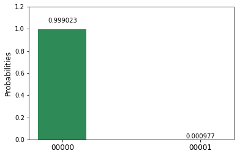

.. code:: python

    plot_histogram(Q_program.get_counts("excited"))

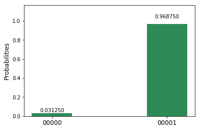

Here we see that with high probability the qubit is in the
:math:`|0\rangle` state for the first circuit and in the
:math:`|1\rangle` state for the second circuit. The difference from an
ideal perfect answer in both cases is due to a combination of
measurement error, preparation error, and gate error (for the
:math:`|1\rangle` state).

Up to this point, nothing is different from a classical system of a bit.
To go beyond, we must explore what it means to make a superposition. The
operation in the quantum circuit language for generating a superposition
is the Hadamard gate, :math:`H`. Let's assume for now that this gate is
like flipping a fair coin. The result of a flip has two possible
outcomes, heads or tails, each occurring with equal probability. If we
repeat this simple thought experiment many times, we would expect that
on average we will measure as many heads as we do tails. Let heads be
:math:`|0\rangle` and tails be :math:`|1\rangle`.

Let's run the quantum version of this experiment. First we prepare the
qubit in the ground state :math:`|0\rangle`. We then apply the Hadamard
gate (coin flip). Finally, we measure the state of the qubit. Repeat the
experiment 1024 times (shots). As you likely predicted, half the
outcomes will be in the :math:`|0\rangle` state and half will be in the
:math:`|1\rangle` state.

Try the program below.

.. code:: python

    # Quantum circuit superposition 
    qc_superposition = Q_program.create_circuit("superposition", ["qr"], ["cr"])
    qc_superposition.h(qr)
    qc_superposition.measure(qr[0], cr[0])
    
    circuits = ["superposition"]
    Q_program.execute(circuits, device, shots, max_credits=3, wait=10, timeout=240)
    
    plot_histogram(Q_program.get_counts("superposition"))

.. parsed-literal::

    running on backend: ibmqx2
    status = RUNNING (10 seconds)
    status = RUNNING (20 seconds)

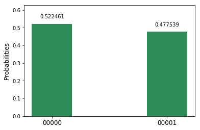

Indeed, much like a coin flip, the results are close to 50/50 with some
non-ideality due to errors (again due to state preparation, measurement,
and gate errors). So far, this is still not unexpected. Let's run the
experiment again, but this time with two :math:`H` gates in succession.
If we consider the :math:`H` gate to be analog to a coin flip, here we
would be flipping it twice, and still expecting a 50/50 distribution.

.. code:: python

    # Quantum circuit two Hadamards 
    qc_twohadamard = Q_program.create_circuit("twohadamard", ["qr"], ["cr"])
    qc_twohadamard.h(qr)
    qc_twohadamard.barrier()
    qc_twohadamard.h(qr)
    qc_twohadamard.measure(qr[0], cr[0])
    
    circuits = ["twohadamard"]
    Q_program.execute(circuits, device, shots, max_credits=3, wait=10, timeout=240)
    
    plot_histogram(Q_program.get_counts("twohadamard"))

.. parsed-literal::

    running on backend: ibmqx2
    status = RUNNING (10 seconds)
    status = RUNNING (20 seconds)

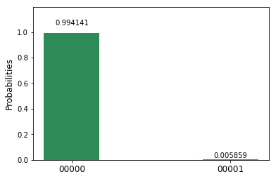

This time, the results are surprising. Unlike the classical case, with
high probability the outcome is not random, but in the :math:`|0\rangle`
state. *Quantum randomness* is not simply like a classical random coin
flip. In both of the above experiments, the system (without noise) is in
a definite state, but only in the first case does it behave randomly.
This is because, in the first case, via the :math:`H` gate, we make a
uniform superposition of the ground and excited state,
:math:`(|0\rangle+|1\rangle)/\sqrt{2}`, but then follow it with a
measurement in the computational basis. The act of measurement in the
computational basis forces the system to be in either the
:math:`|0\rangle` state or the :math:`|1\rangle` state with an equal
probability (due to the uniformity of the superposition). In the second
case, we can think of the second :math:`H` gate as being a part of the
final measurement operation; it changes the measurement basis from the
computational basis to a *superposition* basis. The following equations
illustrate the action of the :math:`H` gate on the computational basis
states:

.. math:: H: |0\rangle  \rightarrow  |+\rangle=\frac{|0\rangle+|1\rangle}{\sqrt{2}}

.. math:: H: |1\rangle \rightarrow |-\rangle=\frac{|0\rangle-|1\rangle}{\sqrt{2}}.

We can redefine this new transformed basis, the superposition basis, as
the set
{:math:`|+\rangle`, :math:`|-\rangle`}.
We now have a different
way of looking at the second experiment above. The first :math:`H` gate
prepares the system into a superposition state, namely the
:math:`|+\rangle` state. The second :math:`H` gate followed by the
standard measurement changes it into a measurement in the superposition
basis. If the measurement gives 0, we can conclude that the system was
in the :math:`|+\rangle` state before the second :math:`H` gate, and if
we obtain 1, it means the system was in the :math:`|-\rangle` state. In
the above experiment we see that the outcome is mainly 0, suggesting
that our system was in the :math:`|+\rangle` superposition state before
the second :math:`H` gate.

The math is best understood if we represent the quantum superposition
state :math:`|+\rangle` and :math:`|-\rangle` by:

.. math:: |+\rangle =\frac{1}{\sqrt{2}}\begin{pmatrix} 1 \\ 1 \end{pmatrix}

.. math:: |-\rangle =\frac{1}{\sqrt{2}}\begin{pmatrix} 1 \\ -1 \end{pmatrix}

A standard measurement, known in quantum mechanics as a projective or
von Neumann measurement, takes any superposition state of the qubit and
projects it to either the state :math:`|0\rangle` or the state
:math:`|1\rangle` with a probability determined by:

.. math:: P(i|\psi) = |\langle i|\psi\rangle|^2

where :math:`P(i|\psi)` is the probability of measuring the system in
state :math:`i` given preparation :math:`\psi`.

We have written the Python function StateOverlap to return this:

.. code:: python

    state_overlap = lambda state1, state2: np.absolute(np.dot(state1.conj().T,state2))**2

Now that we have a simple way of going from a state to the probability
distribution of a standard measurement, we can go back to the case of a
superposition made from the Hadamard gate. The Hadamard gate is defined
by the matrix:

.. math::  H =\frac{1}{\sqrt{2}}\begin{pmatrix} 1 & 1 \\ 1 & -1 \end{pmatrix}

The :math:`H` gate acting on the state :math:`|0\rangle` gives:

.. code:: python

    Hadamard = np.array([[1,1],[1,-1]],dtype=complex)/np.sqrt(2)
    psi1 = np.dot(Hadamard,zero)
    P0 = state_overlap(zero,psi1)
    P1 = state_overlap(one,psi1)
    plot_histogram({'0' : P0, '1' : P1})

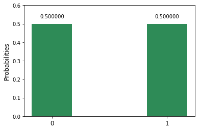

which is the ideal version of the first experiment.

The second experiment involves applying the Hadamard gate twice. While
matrix multiplication shows that the product of two Hadamards is the
identity operator (meaning that the state :math:`|0\rangle` remains
unchanged), here (as previously mentioned) we prefer to interpret this
as doing a measurement in the superposition basis. Using the above
definitions, you can show that :math:`H` transforms the computational
basis to the superposition basis.

.. code:: python

    print(np.dot(Hadamard,zero))
    print(np.dot(Hadamard,one))

.. parsed-literal::

    [[ 0.70710678+0.j]
     [ 0.70710678+0.j]]
    [[ 0.70710678+0.j]
     [-0.70710678+0.j]]

.. _entanglement:

Entanglement
============

The core idea behind the second Principle is *entanglement*. Upon
reading the Principle, one might be inclined to think that entanglement
is simply strong correlation between two entitities -- but entanglement
goes well beyond mere perfect (classical) correlation. If you and I read
the same paper, we will have learned the same information. If a third
person comes along and reads the same paper they also will have learned
this information. All three persons in this case are perfectly
correlated, and they will remain correlated even if they are separated
from each other.

The situation with quantum entanglement is a bit more subtle. In the
quantum world, you and I could read the same quantum paper, and yet we
will not learn what information is actually contained in the paper until
we get together and share our information. However, when we are
together, we find that we can unlock more information from the paper
than we initially thought possible. Thus, quantum entanglement goes much
further than perfect correlation.

To demonstrate this, we will define the controlled-NOT (CNOT) gate and
the composition of two systems. The convention we use in the Quantum
Experience is to label states by writing the first qubit's name in the
rightmost position, thereby allowing us to easily convert from binary to
decimal. As a result, we define the tensor product between operators
:math:`q_0` and :math:`q_1` by :math:`q_1\otimes q_0`.

Taking :math:`q_0` as the control and :math:`q_1` as the target, the
CNOT with this representation is given by

.. math::  CNOT =\begin{pmatrix} 1 & 0 & 0 & 0\\ 0 & 0 & 0 & 1\\0& 0& 1 & 0\\0 & 1 & 0 & 0 \end{pmatrix},

which is non-standard in the quantum community, but more easily connects
to classical computing, where the least significant bit (LSB) is
typically on the right. An entangled state of the two qubits can be made
via an :math:`H` gate on the control qubit, followed by the CNOT gate.
This generates a particular maximally entangled two-qubit state known as
a Bell state, named after John Stewart Bell (`learn more about Bell and
his contributions to quantum physics and
entanglement <https://en.wikipedia.org/wiki/John_Stewart_Bell>`__.

To explore this, we can prepare an entangled state of two qubits, and
then ask questions about the qubit states. The questions we can ask are:
\* What is the state of the first qubit in the standard basis? \* What
is the state of the first qubit in the superposition basis? \* What is
the state of the second qubit in the standard basis? \* What is the
state of the second qubit in the superposition basis? \* What is the
state of both qubits in the standard basis? \* what is the state of both
qubits in the superposition basis?

Below is a program with six such circuits for these six questions.

.. code:: python

    # Creating registers
    q2 = Q_program.create_quantum_registers("q2", 2)
    c2 = Q_program.create_classical_registers("c2", 2)
    
    # quantum circuit to make an entangled bell state 
    bell = Q_program.create_circuit("bell", ["q2"], ["c2"])
    bell.h(q2[0])
    bell.cx(q2[0], q2[1])
    
    # quantum circuit to measure q0 in the standard basis
    measureIZ = Q_program.create_circuit("measureIZ", ["q2"], ["c2"])
    measureIZ.measure(q2[0], c2[0])
    
    # quantum circuit to measure q0 in the superposition basis 
    measureIX = Q_program.create_circuit("measureIX", ["q2"], ["c2"])
    measureIX.h(q2[0])
    measureIX.measure(q2[0], c2[0])
    
    # quantum circuit to measure q1 in the standard basis
    measureZI = Q_program.create_circuit("measureZI", ["q2"], ["c2"])
    measureZI.measure(q2[1], c2[1])
    
    # quantum circuit to measure q1 in the superposition basis 
    measureXI = Q_program.create_circuit("measureXI", ["q2"], ["c2"])
    measureXI.h(q2[1])
    measureXI.measure(q2[1], c2[1])
    
    # quantum circuit to measure q in the standard basis 
    measureZZ = Q_program.create_circuit("measureZZ", ["q2"], ["c2"])
    measureZZ.measure(q2[0], c2[0])
    measureZZ.measure(q2[1], c2[1])
    
    # quantum circuit to measure q in the superposition basis 
    measureXX = Q_program.create_circuit("measureXX", ["q2"], ["c2"])
    measureXX.h(q2[0])
    measureXX.h(q2[1])
    measureXX.measure(q2[0], c2[0])
    measureXX.measure(q2[1], c2[1])

.. parsed-literal::

    >> quantum_registers created: q2 2
    >> classical_registers created: c2 2

.. parsed-literal::

    <qiskit._measure.Measure at 0x11590f3c8>

.. code:: python

    Q_program.add_circuit("bell_measureIZ", bell+measureIZ )
    Q_program.add_circuit("bell_measureIX", bell+measureIX )
    Q_program.add_circuit("bell_measureZI", bell+measureZI )
    Q_program.add_circuit("bell_measureXI", bell+measureXI )
    Q_program.add_circuit("bell_measureZZ", bell+measureZZ )
    Q_program.add_circuit("bell_measureXX", bell+measureXX )
    
    circuits = ["bell_measureIZ", "bell_measureIX", "bell_measureZI", "bell_measureXI", "bell_measureZZ", "bell_measureXX"]
    Q_program.get_qasms(circuits)

.. parsed-literal::

    ['OPENQASM 2.0;\ninclude "qelib1.inc";\nqreg q2[2];\ncreg c2[2];\nh q2[0];\ncx q2[0],q2[1];\nmeasure q2[0] -> c2[0];\n',
     'OPENQASM 2.0;\ninclude "qelib1.inc";\nqreg q2[2];\ncreg c2[2];\nh q2[0];\ncx q2[0],q2[1];\nh q2[0];\nmeasure q2[0] -> c2[0];\n',
     'OPENQASM 2.0;\ninclude "qelib1.inc";\nqreg q2[2];\ncreg c2[2];\nh q2[0];\ncx q2[0],q2[1];\nmeasure q2[1] -> c2[1];\n',
     'OPENQASM 2.0;\ninclude "qelib1.inc";\nqreg q2[2];\ncreg c2[2];\nh q2[0];\ncx q2[0],q2[1];\nh q2[1];\nmeasure q2[1] -> c2[1];\n',
     'OPENQASM 2.0;\ninclude "qelib1.inc";\nqreg q2[2];\ncreg c2[2];\nh q2[0];\ncx q2[0],q2[1];\nmeasure q2[0] -> c2[0];\nmeasure q2[1] -> c2[1];\n',
     'OPENQASM 2.0;\ninclude "qelib1.inc";\nqreg q2[2];\ncreg c2[2];\nh q2[0];\ncx q2[0],q2[1];\nh q2[0];\nh q2[1];\nmeasure q2[0] -> c2[0];\nmeasure q2[1] -> c2[1];\n']

Let's begin by running just the first two questions, looking at the
results of the first qubit (:math:`q_0`) using a computational and then
a superposition measurement.

.. code:: python

    Q_program.execute(circuits[0:2], device, shots, max_credits=3, wait=10, timeout=240)
    plot_histogram(Q_program.get_counts("bell_measureIZ"))

.. parsed-literal::

    running on backend: ibmqx2
    status = RUNNING (10 seconds)
    status = RUNNING (20 seconds)

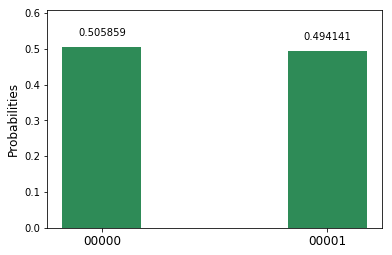

We find that the result is random. Half the time :math:`q_0` is in
:math:`|0\rangle`, and the other half it is in the :math:`|1\rangle`
state. You may wonder whether this is like the superposition from
earlier in the tutorial. Maybe the qubit has a perfectly definite state,
and we are simply measuring in another basis. What would you expect if
you did the experiment and measured in the superposition basis? Recall
we do this by adding an :math:`H` gate before the measurement...which is
exactly what we have checked with the second question.

.. code:: python

    plot_histogram(Q_program.get_counts("bell_measureIX"))

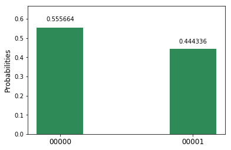

In this case, we see that the result is still random, regardless of
whether we measure in the computational or the superposition basis. This
tells us that we actually know nothing about the first qubit. What about
the second qubit, :math:`q_1`? The next lines will run experiments
measuring the second qubit in both the computational and superposition
bases.

.. code:: python

    Q_program.execute(circuits[2:4], device, shots, max_credits=3, wait=10, timeout=240)
    plot_histogram(Q_program.get_counts("bell_measureZI"))
    plot_histogram(Q_program.get_counts("bell_measureXI"))

.. parsed-literal::

    running on backend: ibmqx2
    status = RUNNING (10 seconds)
    status = RUNNING (20 seconds)

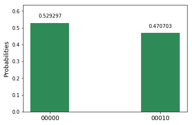

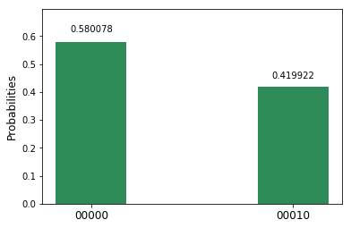

Once again, all the experiments give random outcomes. It seems we know
nothing about either qubit in our system! In our previous analogy, this
is equivalent to two readers separately reading a quantum paper and
extracting no information whatsoever from it on their own.

What do you expect, however, when the readers get together? Below we
will measure both in the joint computational basis.

.. code:: python

    Q_program.execute(circuits[4:6], device, shots, max_credits=3, wait=10, timeout=240)

.. parsed-literal::

    running on backend: ibmqx2
    status = RUNNING (10 seconds)
    status = RUNNING (20 seconds)

.. parsed-literal::

    {'result': 'all done', 'status': 'COMPLETED'}

.. code:: python

    plot_histogram(Q_program.get_counts("bell_measureZZ"))

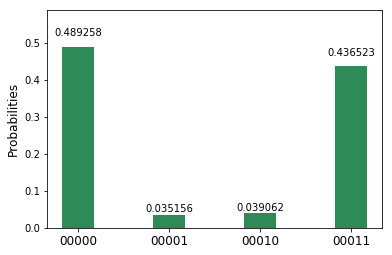

Here we see that with high probability, if :math:`q_0` is in state 0,
:math:`q_1` will be in 0 as well; the same goes if :math:`q_0` is in
state 1. They are perfectly correlated.

What about if we measure both in the superposition basis?

.. code:: python

    plot_histogram(Q_program.get_counts("bell_measureXX"))

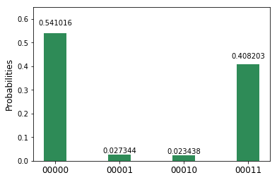

Here we see that the system **also** has perfect correlations
(accounting for experimental noise). Therefore, if :math:`q_0` is
measured in state :math:`|0\rangle`, we know :math:`q_1` is in this
state as well; likewise, if :math:`q_0` is measured in state
:math:`|+\rangle`, we know :math:`q_1` is also in this state. These
correlations have led to much confusion in science, because any attempt
to relate the unusual behavior of quantum entanglement to our everyday
experiences is a fruitless endeavor.

This is just a taste of what happens in the quantum world. Please
continue to :doc:`Entanglement revisited <entanglement_revisited>` to
explore further!

