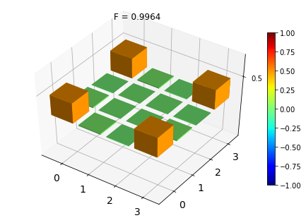
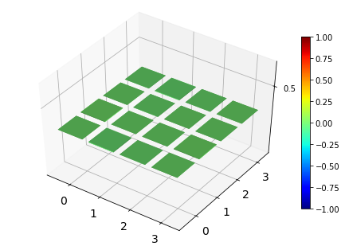
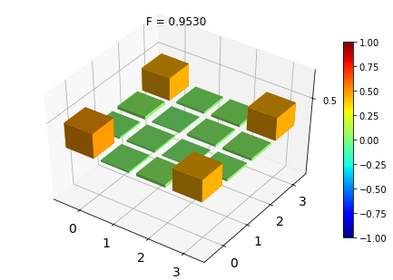
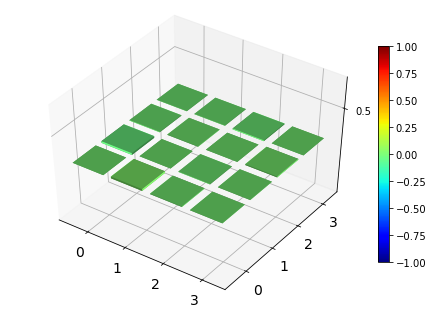

============================
Quantum State Tomography
============================

Contributors
============

Christopher J. Wood `(cjwood@us.ibm.com) <mailto:cjwood@us.ibm.com>`__

Introduction
============

In this notebook we demonstrate how to design and run experiments to
perform quantum state tomography using QISKit, and demonstrate this
using both simulators, and the IBM Quantum Experience. After going
through this notebook you may also look at additional examples of
tomgoraphy of GHZ and 5-qubit Cat-states in the
:doc:`cat-state-tomography <cat-state-tomography>` workbook.

We implement quantum state tomography using simple maximum likelihood
constrained least-squares fitting of a tomographically complete set of
measurement data. For details of this method see `J Smolin, JM Gambetta,
G Smith, Phys. Rev. Lett. 108,
070502 <https://journals.aps.org/prl/abstract/10.1103/PhysRevLett.108.070502>`__
`(open access: arXiv: 1106.5458) <https://arxiv.org/abs/1106.5458>`__.

Getting Started
===============

Please see :doc:`Getting Started with QISKit <tutorial4developer>` if
you would like to understand how to get started with the QISKit SDK.

.. code:: python

    # Checking the version of PYTHON; we only support 3 at the moment
    import sys
    if sys.version_info < (3,0):
        raise Exception("Please use Python version 3 or greater.")
        
    # useful additional packages 
    import matplotlib.pyplot as plt
    %matplotlib inline
    import numpy as np
    
    import sys
    sys.path.append("../../")
    # importing the QISKit
    from qiskit import QuantumProgram
    import Qconfig
    
    # import state tomography functions
    from statetomo import *
    
    # function using QuTip to visualize density matrices
    import qutip as qt  
    def plot_state(rho, fidelity=None):
        # plot real part of rho
        fig1, ax = qt.matrix_histogram(rho.real, limits=[-1,1])
        ax.view_init(azim=-55, elev=45)
        # Set fidelity as plot label
        if fidelity != None:
            # Fidelity to 4 decimal places
            ax.set_title("F = %.4f" %fidelity)
        # Plot imaginary part
        fig2, ax = qt.matrix_histogram(rho.imag, limits=[-1,1])
        ax.view_init(azim=-55, elev=45)
        # display plot
        plt.show()

Designing tomography experiments in QISKit
==========================================

We now demonstrate how to use the QISKit developer toolkit to design
tomography experiments. As an example we will prepare and measure a
2-qubit entangled Bell-state
:math:`\frac{1}{\sqrt2}\left(|00\rangle+|11\rangle\right)`.

Initializing a quantum program
------------------------------

We state by defining a ``QuantumProgram`` and adding a quantum and
classical register. The quantum register is the state of our quantum
system, and the classical register records outcomes of measurements of
the quantum state.

.. code:: python

    # Initialize a new quantum program
    QP = QuantumProgram()
    
    # Add a 2-qubit quantum register "qr"
    qr = QP.create_quantum_registers("qr", 2)
    
    # Add a 2-bit register "cr" to record results
    cr = QP.create_classical_registers("cr", 2)

.. parsed-literal::

    >> quantum_registers created: qr 2
    >> classical_registers created: cr 2

Setting up initial state preparation
------------------------------------

Next we define a *state preparation circuit* to prepare our system in a
desired quantum state. For our example we will apply a Hadamard gate to
prepare the first qubit in a :math:`|+\rangle` state, followed by a CNOT
gate to entangle the two qubits:

.. code:: python

    # Create a circuit named 'prep'
    prep = QP.create_circuit("prep", ["qr"], ["cr"])
    # Add H gate of first qubit to 'prep' circuit
    prep.h(qr[0])
    # Add CNOT gate between qubits to 'prep' circuit
    prep.cx(qr[0], qr[1])

.. parsed-literal::

    <qiskit.extensions.standard.cx.CnotGate at 0x10339e0f0>

Building tomography measurement circuits
----------------------------------------

Next we must construct a family of circuits which implement a
tomographically complete set of measurements of the qubit. The
``statetomo.py`` example library contains functions to generate these
measurement circuits for general n-qubit systems. We do this by
measuring in the X, Y, and Z for each qubit. This results in :math:`3^n`
measurement circuits which must be executed to gather count statistics
for the tomographic reconstruction.

The function to build the circuits is:

::

    build_tomo_circuits(QP, 'prep', 'qr', 'cr', qubits)

The function to construct an array of the the corresponding labels for
these circuits is:

::

    build_tomo_keys('prep', qubits)

| where - ``QP`` is the quantum program. - ``'prep'`` is the name of the
  preparation circuit
| - ``'qr'`` is the name of the quantum registers to be measured -
  ``'cr'`` is the name of the classical registers to store outcomes -
  ``qubits`` is a list of the qubits to be measured. Eg ``[i,j]`` for
  ``qr[i]``, and ``qr[j]``.

.. code:: python

    # Qubits being measured
    meas_qubits = [0,1]
    # Construct the state tomography measurement circuits in QP
    build_tomo_circuits(QP, "prep", "qr", "cr", meas_qubits)
    # construct list of tomo circuit labels 
    circuits = build_tomo_keys("prep", meas_qubits)
    print(circuits)

::

    ---------------------------------------------------------------------------

    AttributeError                            Traceback (most recent call last)

    <ipython-input-4-744cf6cbfc8d> in <module>()
          2 meas_qubits = [0,1]
          3 # Construct the state tomography measurement circuits in QP
    ----> 4 build_tomo_circuits(QP, "prep", "qr", "cr", meas_qubits)
          5 # construct list of tomo circuit labels
          6 circuits = build_tomo_keys("prep", meas_qubits)

    /Users/cjwood/Documents/IBM-Git/qiskit-sdk-py-dev/tutorial/sections/statetomo.py in build_tomo_circuits(Q_program, circuit, qreg, creg, qubit_list)
        166     circ = [circuit]
        167     for j in sorted(qubit_list, reverse=True):
    --> 168         build_tomo_circuit_helper(Q_program, circ, qreg, creg, j)
        169         circ = build_keys_helper(circ, j)
        170 

    /Users/cjwood/Documents/IBM-Git/qiskit-sdk-py-dev/tutorial/sections/statetomo.py in build_tomo_circuit_helper(Q_program, circuits, qreg, creg, qubit)
        150             meas = b+str(qubit)
        151             tmp = Q_program.create_circuit(meas, [qreg],[creg])
    --> 152             qr = Q_program.get_quantum_registers(qreg)
        153             cr = Q_program.get_classical_registers(creg)
        154             if b == "X":

    AttributeError: 'QuantumProgram' object has no attribute 'get_quantum_registers'

Testing experiments on a simulator
==================================

Now that we have prepared the required circuits for state preparation
and measurement, we should test them on a simulator before trying to run
them on the real device.

We specify the device, and a number of experiment shots to perform to
gather measurement statistics. The larger the number of shots, the more
accurate our measurmeent probabilities will be compared to the *true*
value.

.. code:: python

    # Use the local simulator
    device = 'local_qasm_simulator'
    
    # Take 1000 shots for each measurement basis
    shots = 1000
    
    # Run the simulation
    result = QP.execute(circuits, device, shots)
    print(result)

.. parsed-literal::

    running on backend: local_qasm_simulator
    {'status': 'COMPLETED', 'result': 'all done'}

Before doing the tomographic reconstruction we can view the count
statistics from the simulation:

.. code:: python

    for c in circuits:
        print('Circuit:', c)
        print('Counts:', QP.get_counts(c))

.. parsed-literal::

    Circuit: prepX1X0
    Counts: {'00': 533, '11': 467}
    Circuit: prepX1Y0
    Counts: {'10': 256, '00': 252, '11': 238, '01': 254}
    Circuit: prepX1Z0
    Counts: {'01': 253, '10': 280, '11': 232, '00': 235}
    Circuit: prepY1X0
    Counts: {'11': 249, '10': 242, '01': 244, '00': 265}
    Circuit: prepY1Y0
    Counts: {'10': 495, '01': 505}
    Circuit: prepY1Z0
    Counts: {'10': 260, '01': 242, '11': 257, '00': 241}
    Circuit: prepZ1X0
    Counts: {'00': 266, '10': 244, '01': 234, '11': 256}
    Circuit: prepZ1Y0
    Counts: {'10': 237, '01': 282, '11': 269, '00': 212}
    Circuit: prepZ1Z0
    Counts: {'11': 478, '00': 522}

Reconstructing state from count data
------------------------------------

To reconstruct the maximum likelihod estimate of the measured quantum
state we use the following function:

::

    state_tomography(QP, circuits, shots, total_qubits, meas_qubits)

where - ``QP`` is the quantum program containing the measurement results
- ``circuits`` is the array of tomographic measurement circuits measured
- ``shots`` is the total number of shots for each measurement circuit -
``total_qubits`` is the total number of qubits in the system (the length
of shot outcome bitstrings) - ``meas_qubits`` is an array of the
measurement qubit indices

.. code:: python

    total_qubits = 2
    rho_fit = state_tomography(QP, circuits, shots, total_qubits, meas_qubits)
    print('rho =', rho_fit)

.. parsed-literal::

    rho = [[  5.05919257e-01+0.j           1.97270901e-02+0.00971077j
       -6.76802859e-03+0.0017145j    4.95913187e-01-0.00164784j]
     [  1.97270901e-02-0.00971077j   3.48839871e-03+0.j
        9.24584857e-05-0.00230115j   1.99663499e-02-0.00802739j]
     [ -6.76802859e-03-0.0017145j    9.24584857e-05+0.00230115j
        2.88747465e-03+0.j          -7.72694247e-03-0.00085422j]
     [  4.95913187e-01+0.00164784j   1.99663499e-02+0.00802739j
       -7.72694247e-03+0.00085422j   4.87704870e-01+0.j        ]]

We can compare the reconstructed state to the target state vector. We
use the Fidelity function, which for a comparing a density matrix
:math:`\rho` to a pure state :math:`|\psi\rangle` is given by
:math:`F = \sqrt{\langle \psi| \rho |\psi\rangle}`. This may be done by
the function ``fidelity(rho, psi)``. Finally we may wish to visualize
the reconstructed state. This can be done by using various plotting
libraries. One conveient one is the following which uses the `QuTiP
(Quantum Toolbox in Python) <http://qutip.org/>`__ library.

.. code:: python

    # target state is (|00>+|11>)/sqrt(2)
    target = np.array([1., 0., 0., 1.]/np.sqrt(2.))
    
    # calculate fidelity
    F_fit = fidelity(rho_fit, target)
    
    # visualize the state
    plot_state(rho_fit, F_fit)

Note that since our simulator is *perfect* the output state should be
*exactly* the Bell-state, so we should obtain F = 1. Why is it not in
our case? Since we can never directly *see* the final state we must
obtain information about it via measurements. We would only obtain the
*true* probabilities for the state in the limit of infinite measurement
shots. Hence we have statistical error in our reconstruction due to
having imperfect information about the state itself. Try running with
different number of shots on the simulator and see how it effects the
fidelity of the reconstruction.

Running on a real device
========================

Now that we've checked our simple tomography experiment worked, lets try
it out on the IBM Quantum Experience! To do this we must have attached
our API key, and it is good practice to set a limit on the number of
credits to use:

.. code:: python

    # Use the IBM Quantum Experience
    device = 'ibmqx2'
    
    # Take 1000 shots for each measurement basis
    # Note: reduce this number for larger number of qubits
    shots = 1000
    
    # set max credits
    max_credits = 5
    
    # set API token and url
    QP.set_api(Qconfig.APItoken, Qconfig.config["url"])
    
    # Run the simulation
    result = QP.execute(circuits, device, shots, max_credits, wait=20, timeout=240)
    print(result)

.. parsed-literal::

    running on backend: ibmqx2
    status = RUNNING (20 seconds)
    status = RUNNING (40 seconds)
    {'status': 'COMPLETED', 'result': 'all done'}

As before we can check our results, and check our tomographically
reconstructed state.

.. code:: python

    # print measurement results
    for c in circuits:
        print('Circuit:', c)
        print('Counts:', QP.get_counts(c))

.. parsed-literal::

    Circuit: prepX1X0
    Counts: {'00000': 569, '00001': 24, '00010': 19, '00011': 388}
    Circuit: prepX1Y0
    Counts: {'00000': 337, '00001': 281, '00010': 212, '00011': 170}
    Circuit: prepX1Z0
    Counts: {'00000': 312, '00001': 253, '00010': 230, '00011': 205}
    Circuit: prepY1X0
    Counts: {'00000': 283, '00001': 221, '00010': 281, '00011': 215}
    Circuit: prepY1Y0
    Counts: {'00000': 64, '00001': 444, '00010': 485, '00011': 7}
    Circuit: prepY1Z0
    Counts: {'00000': 283, '00001': 245, '00010': 252, '00011': 220}
    Circuit: prepZ1X0
    Counts: {'00000': 291, '00001': 240, '00010': 274, '00011': 195}
    Circuit: prepZ1Y0
    Counts: {'00000': 286, '00001': 223, '00010': 260, '00011': 231}
    Circuit: prepZ1Z0
    Counts: {'00000': 468, '00001': 36, '00010': 31, '00011': 465}

Notice that for measurement results the bitstrings are now actually
those for 5 qubits, even though we only measured one. This is because
the QX is a 5-qubit quantum processor. To reconstruct the single qubit
state from these results we use ``total_qubits=5``. Note also that the
qubit ordering in this bitstrings is ``q[4]q[3]q[2]q[1]q[0]``

.. code:: python

    rho_fit_real = state_tomography(QP, circuits, shots, 5, meas_qubits)
    F_fit_real = fidelity(rho_fit_real, target)
    plot_state(rho_fit_real, F_fit_real)

The fidelity of our reconstructed state if 94%, not bad!

Further examples
================

To see further examples of performing tomography on up to 5-qubit
entangled state see the
:doc:`cat-state-tomography <cat-state-tomography>` workbook.
